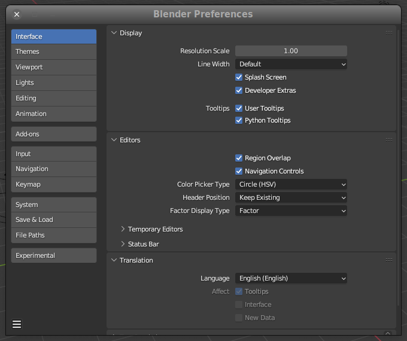
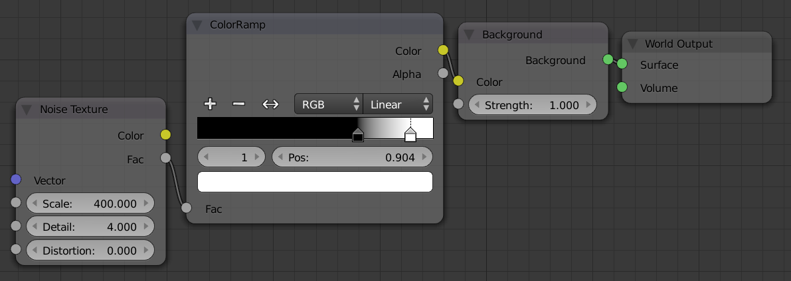

## Introducción a Blender

Blender es un programa informático multiplataforma, dedicado especialmente al
modelado, iluminación, renderizado, la animación y creación de gráficos
tridimensionales. También de composición digital utilizando la técnica procesal
de nodos, edición de vídeo, escultura (incluye topología dinámica) y pintura
digital. 


## Ajustes iniciales para desarrollar con Blender/Python

Activar, en `Preferencias` -> `Interfaz`, las opciones de `Developer extra` y
`Python tooltips`. 



Con estos cambios conseguiremos varias ventajas:

- Completado automático en la consola Python

- Los controles muestran un _tooltip_ con el nombre y parámetros de la
  función asociada.

- Igualmente, los menús emergentes enlazan con la web de documentación de la
  API correspondiente.

## Dónde encontrar ejemplos de Python/Blender

Blender incorpora varios _scripts_ útiles para aprender:

- `scripts/startup/bl_ui` para intarfaz de usuario.

- `scripts/startup/bl_operators` para operadores.

## Como ejecutar código Python en Blender

Las dos formas máß habituales son o usar el editor incorporado, o mediante la
consola. Las dos son tpos de ventanas que podemos seleccionar en cualquier
espacio de BLender (Hay una configuración predeterminada para desarrollo
con estas ventanas ya activas en el _workspace_ `Scripting`.

En el editor de texto podemos cargar ficheros `.py` o pegar el código
desde el portapapeles. La consola se usa más normalemente para pequeñas 
pruebas o para cunsultar la documentación.

Otra forma posible es al invocar a Blender desde la línea de comandos.

## Conceptos claves para usar Python en Blender

### Acceso a datos

Se puede acceder desde Python a cualquier cosa que se pueda hacer con un botón
en Blender. El acceso a los datos de la escena actual se realiza con el módulo
`bpy.data`. Algunos ejemplos:

En `bpy.data.objects` tenemos una colección de todos los objetos definidos en la
escena. Si estamos en la escena inicial que carga Blender por defecto,
tendremos tres objetos: El cubo, la cámara y una luz.

```python
>>> bpy.data.objects[0]
bpy.data.objects['Camera']

>>> bpy.data.objects[1]
bpy.data.objects['Cube']

>>> bpy.data.objects[2]
bpy.data.objects['Light']
```

En `bpy.data.scenes`, tenemos una colección de escenas. Si acabamos de arrancar
Blender, lo normal es que solo tengamos una escena, que será, logicamente, la
activa.

```python
>>> for s in bpy.data.scenes:
...     print(s)
...     
<bpy_struct, Scene("Scene") at 0x7fcc93211008>
```

En `bpy.data.materials` tenemos todos los materiales definidos en la escena.
bpy.data.materials
<bpy_collection[1], BlendDataMaterials>


## Cómo hacer niebla dinámica usando un _Volumetric Cube_

tldr: The scene is covered by a large Volumetric Cube, we change density inside
different parts of cube using a texture, this makes it looks like fog and
finally we use those parameters to animate it.

1. **Adding a Volume**

Add a Cube by clicking `Add` > `Mesh` > `Cube`.

Increase the size of the Cube so that it covers the scene. The cube can be
resized using the Scale tool on the toolbar.

Pulsa `Alt` + `Z` para poder ver a traves del _mesh_

Switch to the Shading tab for the Ribbon. This tab has two windows, one is 3D
viewport, which is the workspace and the other is Shader Editor, it is used to
apply materials and textures onto a model.

Selecciona el cubo y añade y un nuevo material. Normalmente este material
sera de tipo superficial _surface_, y necesitamos que sea volumétrico. Borramos
el _Principled BSDF_ que pone por defecto y añadimos un _Principled Volume_
pulsando `Add` > `Shader` > `Principled Volume`. Conectamos el nuevo nodo
 a la entrada _Volume_ del nodo _Material Output_.

Si activamos ahora la vista _Rendered_ deberiamos poder ver el efecto en forma
de una niebla muy densa.

2. **Changing Density using texture to make the Volume look like fog**

We want the scene to have a fog like effect, to do this, we are going to have
some parts of the volume have higher density than the others. This can be done
using a texture. To adjust the density of the fog we will use a ColorRamp node.

Add a ColorRamp node by clicking Add > Converter > ColorRamp. Connect the Color
output to the Density input of the Principled Volume node.

We will add a Noise texture, click Add > Texture > Noise Texture. Connect the
Color output to the Fac Input of the ColorRamp.

You will now see some patches of the fog on your screen. You may scale the
texture appropriately using the Scale parameter on the Noise Texture.

Note that, to adjust the density of the fog, you will need to use color ramp.
The black color represents the number 0 which means no fog. while the white
presents the number 1, means thick fog.

You will need to adjust the slider of the both colors to achieve the desired
result. You may also add more colors that are between black and white.

3. **Animating the fog**

To animate the fog, we will need to define a coordinate system and then move
it. We are going to add two nodes for both of these.

Add a _Mapping node_ by clicking `Add` > `Vector` > `Mapping`. Conmect Vector
output to the Vector input of the _Noise Texture_. This node will be used for
animating.

Add a _Texture Coordinate_ node by clicking `Add` > `Input` > `Texture
Coordinate`. This node will define the coordinate type. We will use
`Generated`.  It generates coordinates without deforming mesh or the texture.
Connect Generated output to the Vector input of the Mapping node.

Switch to the Animation tab from the ribbon. There will be two 3D Viewports
there, change one to the Shader Editor. We are going to use Timeline to
animate. For this tutorial, we have animated only upto 100 frames. But, the
number can be increased.

Select the mapping node, and press Right Mouse Button on the X parameter under
Location of the mapping node. A menu will pop up, click Insert Single Keyframe.
We have inserted a keyframe thus, the value is stored on this particular
keyframe. Now, drag the Timeline cursor to the end frame (in this case,100),
and change the X location to 0.1 m, and then again insert a keyframe by
pressing `Right Mouse Button`.

- Sources:

    - [Make Volumetric fog animation in Blender using Eevee - Part 1](https://usamababar.com/make-volumetric-fog-animation-in-blender-using-eevee/)
    - [Make Volumetric fog animation in Blender using Eevee - Part 2](https://usamababar.com/make-volumetric-fog-animation-in-blender-using-eevee/2/)


## Cómo unir dos vértices en uno solo

Selecciona los vértices a unificar y pulsar ++m++ (++alt+m++ en versiones
anteriores a la 2.8) y seleccionar entre las opciones que se nos ofrecen: Las
opciones **At First** y **At Last** unifican todos los vértices en el primer o
último seleccionado, respectivamente. Con **At Center** todos los vértices se
unifican en uno situado en el centro geométrico de los seleccionados. **At
cursor** hace lo mismo pero unificando los vértices en la posición del cursor.

Si queremos unificar automáticamente los vértices que estén muy próximos entre
si (Dada una distancia mínima entre ellos) tenemos que, en modo Edición, usar
el menú _Mesh -> AutoMerge Editing_.

Fuente:

- [Modeling - How to merge vertices in Blender? - Blender Stack Exchange](https://blender.stackexchange.com/questions/34037/how-to-merge-vertices-in-blender)

## Como copiar los datos de animación desde un objeto a otro

Primero, seleccionar el objeto que queremos animar, después seleccionar el
objeto cuya animación queremos copiar. Ahora, podemos usar un menú o un atajo
de teclado:

- Usando el menú: Ir a _Object → Link/Transfer Data → Link Animation Data_. Los
  datos de la animación están ahora _enlazados_ 
  
- El atajo de teclado: Pulsar ++ctrl+l++, y en el menú emergente, seleccionar
  _Link Animation Data_

Los datos de animación están _enlazados_, lo que significa que si cambiamos la
animación en uno de los objetos, los cambios se reflejan en otro. Si no es esto
lo que queremos, podemos copiar los datos de la animación a `Single User`: En
el menú superior, seleccionar _Object → Relations → Make Single User → Object
Animation_. Ahora las dos animaciones son diferentes y se pueden modificar una
sin que afecte a la otra.

Fuente:

- [How to copy animation data from one object to another - Gachoki studios](https://gachokistudios.com/how-to-copy-animation-data-from-one-object-to-another-in-blender/)


## How to use an array modifier to create individually manipulatable objects

I often use an array modifier (or two) to quickly create a grid of identical or
symmetric objects, which can be really useful when modeling all sorts of
man-made objects. Once I\'ve made the grid, though, is there any way for me to
make it so that each of the objects are individually manipulatable?

Simply applying the modifier does not seem to be the full answer, since it
still only allows me to select the grid-of-objects as a whole in object mode.
Is there any way to separate them so I work with them each individually?

This is the way:

1. Apply the modifier to make the data real

2. Enter edit mode on the object and press `P` (Separate by loose parts).

3. Select all separated objects and press `Shift`+`Ctrl`+`Alt`+`C` (Origin to
   Geometry).

This will make each piece an individual object with the origin located at the
origin of the original object. Now you can manipulate them as you wish.

Source: [StackExchange - How can I use an array modifier to create individually
manipulatable objects?](https://blender.stackexchange.com/questions/109/how-can-i-use-an-array-modifier-to-create-individually-manipulatable-objects)


## Cómo poner el cursor en el centro de masas de un objeto en Blender

In Edit Mode, select all the faces. Press `Shift-S` and select "cursor
to selected", that will put the cursor at the center of the
selected faces.

1.  Switch to Object mode ++tab++

2.  Select Object -> Transform -> Origin to 3D cursor (or ++ctrl+shift+alt+c++).

Another, simplier form:

All you have to do is ++shift+s++ then ++u++. This will work in object mode
and edit mode.

Source: [Blender manual: 3D Cursor](https://docs.blender.org/manual/en/dev/editors/3dview/3d_cursor.html?highlight=cursor#using-the-snap-menu)


## Cómo hacer que la camara de Blender se oriente hacia un objeto

To point the camera towards an object, you can select the camera, add a **Track
To** constraint to it (constraints can be added in the Constraints tab), choose
the object in the Target field, `-Z` in the To field, and `Y` in the Up field.

The camera will now always point at the object no matter where it (the camera
or object) is moved to. This way isn't very efficient however and it is much
better to point the camera towards an empty and then position the empty
wherever the point of interest lies.


## Cómo resetear los atributos de rotación, escala y translación de un objeto

Con el objeto seleccionado, pulsar ++ctrl+a++ y elegir la opción adecuada
en el menú.

The simplest ways to do this are to either rotate the mesh in Edit Mode or to
rotate it in Object mode and then applying the rotation.

So you can either enter Edit mode, by pressing ++tab++, and then rotating the
mesh with ++r++; the reason this works is that, when transforms are applied in
edit mode, the object's origin is not affected.

The other possible solution is to press ++ctrl+c++ -> "Rotation", which will,
essentially do the same as above, by rotating the mesh, but not the object, and
thus not the origin, and then resseting the origin's rotation.

Source:
<https://blender.stackexchange.com/questions/33905/how-can-i-zero-an-objects-orientation-in-blender>

## Cómo usar la vista activa para definir la vista de la camara

tldr: ++ctrl+alt+0++

This feature allows you to position and orient the active camera to match your
current viewport.

Select a camera and then move around in the 3D View to a desired position and
direction for your camera (so that you are seeing what you want the camera to
see). Now press ++ctrl+alt+0++ and your selected camera positions itself to
match the view, and switches to camera view.

Source: [Blender Manuel: Camera View](http://builder.openhmd.net/blender-hmd-viewport-temp/editors/3dview/navigate/camera_view.html)


## Cómo crear un fondo de estrellas usando ruido

First you need to jump over the the Node Editor view, then select Shader
Nodes and **World**. Also make sure **Use Nodes** is checked.

Then add a **Noise Texture node** and a **Color Ramp node**. Plug thgq}e
Fac of the noise texture into the Color Ramp, and the Color of the Color
Ramp into the Color of the default Background shader.

You can then adjust the Color Ramp and Noise Texture how you would like
to create the desired starry effect.

- **Noise Texture Scale**. This controls the size and amount of stars.
  Higher scale means more, smaller stars; smaller scale means less,
  larger stars.

- **Noise Texture Detail**. This will adjust the shape and variation
  in brightness in the stars. Higher value will mean more irregularly
  shaped stars, but there will be a greater variation in the
  brightness of the stars.

- **Color Ramp Swatches**. Adjusting the color swatches on the Color
  Ramp will change the size and shape of the stars. The farther apart
  the swatches are the bigger and more irregularly shaped the stars
  will be.

This values are a good example:

-   Scale: 400

-   Detail: 4

-   Ramp color bwtween 0.7 and 0.9



## How to Set Unit Measurements in Blender

To change the units of measurement for a Blender scene, go to Scene Properties.
Expand the “units” tab and choose the unit system at the top. Then change
specific settings for Rotation, Length, Mass, Time and Temperature. 

## Atajos de teclado de Blender

- ++ctrl+z++ Deshacer la última acción

- ++a++ Seleccionar todo

- ++shift+a++ Añadir un _mesh_

- ++x++ Borrar

### Mover el objeto seleccionado

- ++g++ Mover el objeto libremente
- ++g++ y ++x++ Mover en el eje $x$
- ++g++ y ++shift+x++ Mover en el plano perpendicular
  al eje $x$, es decir, al plano $z \times y$.
- ++g++ e ++y++ Mover en el eje $y$
- ++g++ y ++shift+y++ Mover en el plano perpendicular
  al eje $y$, es decir, al plano $z \times x$.
- ++g++ y ++z++ Mover en el eje $z$
- ++g++ y ++shift+z++ Mover en el plano perpendicular
  al eje $z$, es decir, al plano $y \times x$.

Cualquier comando de mover, si se añade un número, mueve ese número de
unidades. Por ejemplo, para mover un objeto $3.2$ unidades en el eje $z$
haríamos: ++g++ ++z++ ++3++ ++period++ ++2++

### Rotar el objeto seleccionado

- ++r++ Rotar libremente

- ++r++ ++x++ Rotar alrededor del eje $x$

- ++r++ ++y++ Rotar alrededor del eje $y$

- ++r++ ++z++ Rotar alrededor del eje $z$

Cualquier comando de rotar, si se añade un número, rota ese número de
grados. Por ejemplo, para mover un objeto $45°$ en el eje $y$
haríamos: ++r++ ++y++ ++4++ ++5++

### Escalar el objeto seleccionado

- ++s++ Escalar el objeto seleccionado
- ++s++ y ++x++ Escalar el objeto seleccionado en el eje $x$
- ++s++ y ++shift+x++ Escalar el objeto seleccionado en el 
  plano perpendicular al eje $x$ (es decir, $z \times y$)
- ++s++ y ++y++ Escalar el objeto seleccionado en el eje $y$
- ++s++ y ++shift+y++ Escalar el objeto seleccionado en el 
  plano perpendicular al eje $y$ (es decir, $x \times z$)
- ++s++ y ++z++ Escalar el objeto seleccionado en el eje $z$
- ++s++ y ++shift+z++ Escalar el objeto seleccionado
  en el plano perpendicular al eje $z$ (es decir, $x \times y$x \times y$))

Cualquier comando de escalar, si se añade un número, escala por
ese número. Por ejemplo, para duplicar un objeto en el eje $x$
sería: ++s++ ++x++ ++2++.

### Entrar en _Edit Mode_

- ++tab++ Entrar en _edit Node_. Ahora estamos modificando individualmente
  los vertices (_vertexs_), bordes (_edges_) y caras (_faces_).

- ++1++ Seleccionar vértices
- ++2++ Seleccionar border
- ++3++ Seleccionar caras


## Acciones con el ratón

En la vista 3D:

- ++middle-button++ y movimiento: Rotar la cámara alrededor del centro
- ++shift+middle-button++ y movimiento: Desplazamiento lateral o vertical
- Mouse wheel -> zoom
- ++ctrl++ y mouse arriba o abajo: zoom
