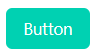
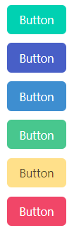
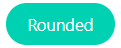

## Bulma CSS

**[Bulma.css](https://bulma.io/)** es un framework **CSS**, relativamente pequeño, que en resumidas
cuentas resulta en un único fichero `.css`:
[https://github.com/jgthms/bulma/blob/master/css/bulma.css](https://github.com/jgthms/bulma/blob/master/css/bulma.css)

Generalmente, Bulma define clases que debemos aplicar para los elementos
básicos de Html. Por ejemplo, una tabla en html no recibirá ningún trato por
parte de Bulma excepto si le añadimos la clase `table`:

```html
<table class="table">
    ...
</table>
```

## Modificadores

La mayoría de los elementos de Bulma tienes estilos alternativos. Para
aplicarlos, se usan lo que ellos llaman clases modificadoras. Todas las clases
modificadoras empiezan con `is-` p `has-`.

Por ejemplo, un botón sencillo solo necesita que le pongamos la clase `button`.

```html <button class="button">Botón</button> ``` 
Pero luego tenemos varias clases alternativas que nos darán diferentes colores,
`is-primary`, `is-link`, `is-info`, `is-success`, `is-warning` y `is-danger`: 

```html <button class="button is-primary"> Button </button> <button
class="button is-link"> Button </button> <button class="button is-info"> Button
</button> <button class="button is-success"> Button </button> <button
class="button is-warning"> Button </button> <button class="button is-danger">
Button </button> ```



Tambien tenemos modificadores para el tamaño: `is-small`, `is-medium`,
`is-large`, y para el estilo:  `is-outline`, `is-loading` y `[disabled]`. Por
supuesto, estos modificadores se pueden combinar sin problema, para tener por
ejemplo un botón grande, de tipo `danger` y bordeado:

```html <button class="button is-danger is-outlined is-large"> Button </button>
```

## Modularidad en Bulma

Podemos recompilar el fuente de Bulma, en `sass`, para incorporar solo los
módulos que nos interensen. Bula define internamente **39** módulos

## Vertical por defecto

Bulma aplica la idea de **mobile first**, y optimiza la lectura vertical. Por
defecto:

- Las columnas (`columns`) se pilan verticalmente
- El componente `level` tambien apila sus contenidos veticalmente
- El menú `nav` esta oculto

## Breakpoints

Bulma define 5 breakpoints que se refieren a 5 tamaños de pantalla

- `mobile` : Pantallas hasta 768px
-  `tablet`: A partir de 769px
-  `desktop` : A partir de 1024p
-  `widescreen` : A partir de 1216px
- `fullhd` : A partir de 1408px

## Formularios

Bulam define las siguientes clases para formularios:

-   `.button`
-   `.input`
-   `.select`
-   `.file-cta` `.file-name`
-   `.pagination-previous` `.pagination-next` `.pagination-link`
    `.pagination-ellipsis`

## Columnas

Usar columnas en Bulma es fácil, usaremos un contenedor de la clases `columns`,
y dentro tantos elementos de la clase `column` como queramos. Por defecto todas
las columnas tendran el mismo ancho.

Si queremos cambiar el tamaño relativo de las columnas, se definen estos tipos:

-   `is-three-quarters`
-   `is-two-thirds`
-   `is-half`
-   `is-one-third`
-   `is-one-quarter`
-   `is-full`

o usar multiplos del 20%:

-   `is-four-fifths`
-   `is-three-fifths`
-   `is-two-fifths`
-   `is-one-fifth`

Las demás columnas se ajustarán automáticamente al resto del espacio.

Si queremos teren varias filas podemos cerrar un contendor `columns` y abir
otro inmediatamente debajo. Pero también existe la posibilidad de usar el
modificador `is-multiline`,  que hace que las columnas que sobrepasen el
espacio disponible pasan a otra fila.

## GRID de 12 columnas

Tambien podemos usar el sistema de rejilla. En este sistema, tenemos 12
columnas predefinidas y definimos cuantas de estas columnas usaremos para el
ancho.

- `is-1`
- `is-2`
- `is-3`
- `is-4`
- `is-5`
- `is-6`
- `is-7`
- `is-8`
- `is-9`
- `is-10`
- `is-11`
- `is-12`

Cada una de estas clases define cuantas columnas base usará de ancho. Por
ejemplo `is-7` ocupará 7 columnas base de ancho.

Por ejemplo:

```html <div class="columns"> <div class="column is-3">3 columnas básicas de
ancho</div> <div class="column is-7">7 columnas básicas de ancho</div> </div>
```

Tambien se definen clases `is-offset-x` que nos dejarian columns base vacias
antes de la actual.

```html <div class="column is-half is-offset-one-quarter">Centrado y con un
cuarto del espacio a cada lado</div> ```

La clase `is-narrow` hace que la columna sea lo más estrecha posible, y el resto del espacio es ocupado por las demas columnas. Se puede combinar con los _breakpoints_ que vimos antes:

-   `.is-narrow-mobile`
-   `.is-narrow-tablet`
-   `.is-narrow-touch`
-   `.is-narrow-desktop`
-   `.is-narrow-widescreen`
-   `.is-narrow-fullhd`

## Adaptación al tamaño de la pantalla

Por dejecto, las columnas solo se disponen en horizontal para los tamaños o _breakpoints_ de `tablet` en adelante. Para tamaños interiores se disponen en vertical. Podemos forzar a las columnas a que se puestren en horizontal incluso en tamaños pequeños con las clases `is-mobile`

```html
<div class="columns is-mobile">
  <div class="column">1</div>
  <div class="column">2</div>
  <div class="column">3</div>
  <div class="column">4</div>
</div>
```
Si solo queremos columnas a partir del _breapoint_ _desktop_, podemos uasr la clase `is-desktop`:

```html
<div class="columns is-desktop">
  <div class="column">1</div>
  <div class="column">2</div>
  <div class="column">3</div>
  <div class="column">4</div>
</div>
```
Combinado las clases y los breakpoints, podemos definir tamaños de columna diferentes para cada tamaño, por ejemplo:

```html
<div class="columns is-mobile">
  <div class="column is-three-quarters-mobile is-two-thirds-tablet is-half-desktop is-one-third-widescreen is-one-quarter-fullhd">
    <code>is-three-quarters-mobile</code><br>
    <code>is-two-thirds-tablet</code><br>
    <code>is-half-desktop</code><br>
    <code>is-one-third-widescreen</code><br>
    <code>is-one-quarter-fullhd</code>
  </div>
  <div class="column">2</div>
  <div class="column">3</div>
  <div class="column">4</div>
  <div class="column">5</div>
</div>
```
## Anidando columnas

Para mayor flexibilidad, las columnas se pueden anidar, solo hay que repetir la estructura `columns` -> `column` -> `columns` -> `column`.

## Hueco o gap entre columnas

Se define en la variable `$column-gag`, y el valor por defecto es
$0.75 rem$. Como se define el gap a ambos lados de la columna, esto significa que el espacio entre dos columnas será de $1.5 rem$. Con el modificador `is-gapless` aplicado al contendor con la clase `columns` podemos eliminar el gap de todas las columnas hijas.

Se puede controlar aun más el tamaño del gap con las clases `is-0` a `is-8`. El modificador `is-0` es equivalente a eliminar el gap, similar a `is-gapless`. El valor `is-2` es equivalente al valor por defecto, es decir $0.75 rem$ si no ha sido modificado. El valor `is-8` sería el máximo y equievale a $2 rem$ por defecto. Para que estos modificadores funcionen tenemos que añadir a la clase contenedora, la que tiene la clase `columns`, el modificador `is-variable`.

El _gap_ también se puede variar segun el _breakpoint_. Por example: `is-variable is-2-mobile is-0-tablet is-3-desktop is-8-widescreen is-1-fullhd`

## Alineación vertical de las columnas

Se puede especificar como se alinean veticalmente las columnas. Por ejemplo, si añadimos el modificador `is-centered` al contendor `columns` las columnas dentro de una fila se alinearan centradas.

```html
<div class="columns is-vcentered">
  <div class="column is-8">
    <p class="bd-notification is-primary">First column</p>
  </div>
  <div class="column">
    <p class="bd-notification is-primary">Second column with more content. This is so you can see the vertical alignment.</p>
  </div>
</div>
```

## Cómo centrar columnas

Aunqe podemos usar el truco de definir un `offset`, es más sencillo usar
`is-centered` en el contendor:

```html
<div class="columns is-mobile is-centered">
  <div class="column is-half">
    <p class="bd-notification is-primary">
      <code class="html">is-half</code><br>
    </p>
  </div>
</div>
```

## Bloques

La clase `block` es una herramienta de espaciado. Facilita ue los elementos que
están al mismo nivel tengan un espaciado consistente. Aplica un margen
inferior a todos los elementos excepto al último. En realidad la mayoría de los
componentes de bulma incluyen las propiedades de este componente, asi que al
usar los siguientes componentes heredamos este comportamiento:

-   `breadcrumb`
-   `level`
-   `message`
-   `pagination`
-   `tabs`
-   `box`
-   `content`
-   `notification`
-   `other`
-   `progress`
-   `table`
-   `title`

## Cómo usar el componente Box

Los componente `box` solo son contendores con un fondo blanco, un _padding_ y un efecto de sombra.

```html
<div class="box">
  I'm in a box.
</div>
```

Como contendor que es, resulta muy util para englobal otros componentes, como
por ejemplo, un formulario.

```html
<form class="box">
  <div class="field">
    <label class="label">Email</label>
    <div class="control">
      <input class="input" type="email" placeholder="menganito@invented-email.com">
    </div>
  </div>

  <div class="field">
    <label class="label">Password</label>
    <div class="control">
      <input class="input" type="password" placeholder="********">
    </div>
  </div>

  <button class="button is-primary">Sign in</button>
</form>
```

o un `media`:

```html
<div class="box">
  <article class="media">
    <div class="media-left">
      <figure class="image is-64x64">
        
      </figure>
    </div>
    <div class="media-content">
      <div class="content">
        <p>
          <strong>John Smith</strong> <small>@johnsmith</small> <small>31m</small>
          <br>
          Lorem ipsum dolor sit amet, consectetur adipiscing elit. Aenean efficitur sit amet massa fringilla egestas. Nullam condimentum luctus turpis.
        </p>
      </div>
      <nav class="level is-mobile">
        <div class="level-left">
          <a class="level-item" aria-label="reply">
            <span class="icon is-small">
              <i class="fas fa-reply" aria-hidden="true"></i>
            </span>
          </a>
          <a class="level-item" aria-label="retweet">
            <span class="icon is-small">
              <i class="fas fa-retweet" aria-hidden="true"></i>
            </span>
          </a>
          <a class="level-item" aria-label="like">
            <span class="icon is-small">
              <i class="fas fa-heart" aria-hidden="true"></i>
            </span>
          </a>
        </div>
      </nav>
    </div>
  </article>
</div>
```


## Cómo usar los botones

La clase a usar es `button`, y se puede aplicar a elemtos `a`, `button` `<input
type="submit">`. Como ya se vio, tenemos opciones para los colores básicos:

```html
<button class="button is-white">White</button>
<button class="button is-light">Light</button>
<button class="button is-dark">Dark</button>
<button class="button is-black">Black</button>
<button class="button is-text">Text</button>
<button class="button is-ghost">Ghost</button>

<button class="button is-primary">Primary</button>
<button class="button is-link">Link</button>

<button class="button is-info">Info</button>
<button class="button is-success">Success</button>
<button class="button is-warning">Warning</button>
<button class="button is-danger">Danger</button>
```

Además, todos vienen con unas version _light_ o pastel, añadiendo el modificador `iis-light`.

También tenemos diferentes tamaños:

-   small
-   normal
-   medium
-   large

Siendo el tamaño por defecto, lógicamente,  `normal`.

Se puede cambiar el tamaño de varios botones a la vez, poniendolos dentro de un
contenedor con la clase `buttons` y una los tres modificadores siguientes:

-   `buttons are-small`
-   `buttons are-medium`
-   `buttons are-large`

Tambien se puede tener tamaños distintos dependiendo de los _breakpoints_,
usando el modificador `is-reponsive`.

Con el modificador `is-outlined` el botón se representa con un borde, en vez de
usar un color para el fondo. Con `is-rounded` los bordes de los botones están
redondeados.

```html
<button class="button is-primary is-rounded">Rounded</button>
```




## Grupos de botones

Podemos asegurar que una serie de botones permanencen en una sola línea con el
modificado `is-grouped` dentro de un contendor de clase `field`.

 ```html
<div class="field is-grouped">
  <p class="control">
    <button class="button is-link">
      Save changes
    </button>
  </p>
  <p class="control">
    <button class="button">
      Cancel
    </button>
  </p>
  <p class="control">
    <button class="button is-danger">
      Delete post
    </button>
  </p>
</div>
```

Otra forma es crear un contendor con la clase `buttons`. Si la lista es
demasiado larga, la dispondrá en múltiples líneas, pero manteniendo los botones
separados de forma consistente. También podemos añadir las clases `is-centered`
o `is-right` para modificar la alineación de los botones.

## Cómo incluir código HTML que no usa las clases de Bulma

Simplemente incluirlo dentro de un contendor con la clase `content`.


## Como obtener un icono de cierre o _close_

Bulma define una clase `delete` especificamente para obtener un boton pequeño,
circular, con una X dentro:

```html
<button class="delete"></button>
```
## Notificaciones

las notificaciones son cajas de color, pensadas para atraer la atencion del usuario. Suelen usarse en combinacin con el boton de borrado.

```html
<div class="notification">
  <button class="delete"></button>
  Lorem ipsum dolor sit amet, consectetur
  adipiscing elit lorem ipsum dolor. <strong>Pellentesque risus mi</strong>, tempus quis placerat ut, porta nec nulla. Vestibulum rhoncus ac ex sit amet fringilla. Nullam gravida purus diam, et dictum <a>felis venenatis</a> efficitur.
</div>
```
Pueden usar los modificadores de color, como `is-warning`, por ejemplo, asi como el modificador `is-light`. 

Bulma no viene con Javascript, es solo CSS, pero es fcil añadir cdigo para borrar dinámicamente estas notificaciones:

```html
<div class="notification">
  <button class="delete"></button>
  Lorem ipsum
</div>
```

El siguiente código Javascript debería funcionar

```javascript
document.addEventListener('DOMContentLoaded', () => {
  (document.querySelectorAll('.notification .delete') || []).forEach(($delete) => {
    const $notification = $delete.parentNode;

    $delete.addEventListener('click', () => {
      $notification.parentNode.removeChild($notification);
    });
  });
});
```

## Como usar una barra de progreso

Bulma simplemte redefine el elemento HTML correspondiente a la barra de prograso

```html
<progress class="progress" value="15" max="100">15%</progress>
```

Podemos usar los modificadores de color y  tamaño habituales. 

El valor especial `indeterminado` muestra la barar de progreso con una animacion predefinida.

## Tablas

Simplemnte usar la case `table` en la etiqueta:  `<table class="table">`. Se puuede resaltar una fila de la tabla como seleccionada con la clase `is-selected`. También hay otros modificadores que se pueden usar con las tablas:

- `is-bordered` : para añadir bordes a la tabla
- `is-striped` : para añadir un sombreado alterno en las filas pares/impares
- `is-narrow` : Para hacer la tabla más estrecha
- `is'hoverable` : Para añadir un efecto cuando se pasa por encima de las filas
- `is-fullwidth` : La tabla usara todo el ancho disponible

Si la tabla es demasido grande, especialmente en anchura, podemos poner la tabla dentro de un contenedor con la clase `table-container`, y esto le añadira una barra de desplazamiento.


## Etiquetas o _tags_

Por defecto, un _tag_ es un contendor pequeño, util para añadir información contextual a otros elementos. Por defecto, una etiqueta tiene una altura de $1.5\ rem$.  Acepta los modificadores de color, incluyendo `is-light` y tamaños. El modificador `is-rounded` hace la etiqueta aun más redondeada. Se le puede añadir un componente `delete`. Si queremos crear varias etiquetas, lo mejor es ponerlas en un contendor `tags`.

## Títulos

Hay dos clases `title` y `subtitle`. Acepta también seis tamaños distintos con los modificadores `is-1` a `is-6`. Si combinamos un `title` con un `subtitle`, los dos componentes se agrupan automáticamente. Si se usan espacios la recomendacion es que entre el título y el subtítulo haya al menos dos unidades de diferencia.

## Breadcrumbs

Un contendor con la clase `breadcrumbs` que contenga una lista `ul`. Los separadores son colocados automáticamente con la pseudo-clase `::before`.

```html
<nav class="breadcrumb" aria-label="breadcrumbs">
  <ul>
    <li><a href="#">Bulma</a></li>
    <li><a href="#">Documentation</a></li>
    <li><a href="#">Components</a></li>
    <li class="is-active"><a href="#" aria-current="page">Breadcrumb</a></li>
  </ul>
</nav>
```

Podemos usar `is-active` para indicar el nodo activo, normalmente el último.

Se puede cambiar la alineación (Por defecto es ala izquierda), con `is-cemtered` o `is-right`.

Viene con cuatro tipos de separador por defecto, que podemos especificar con los modificadores: `has-arrow-separator`, `has-bullet-separator`, `has-dot-separator` y `has-succeeds-separator`.


## Cómo usar tarjetas o _Cards_

Una contendor `card` es un contendor con una estructura más compleja. Un elemento `card` puede contener

-   `card`: el contendor principal
    -   `card-header`: Una cabecera separa por una linea oscura
        -   `card-header-title`: Un texto en negrita alineado a la izquierda
        -   `card-header-icon`: Un icono, alineado a la derecha
    -   `card-image`: un contendero para una imagen que ocupa todo el ancho
    -   `card-content`: un contendor multiproposito
    -   `card-footer`: Una cabecera, en forma de lista
        -   `card-footer-item`: Cada uno de los elementos del _footer_

Se puede centrar el titulo del _card_ con el modificador `is-centered`.

```html
<div class="card">
  <header class="card-header">
    <p class="card-header-title">
      Card header
    </p>
    <button class="card-header-icon" aria-label="more options">
      <span class="icon">
        <i class="fas fa-angle-down" aria-hidden="true"></i>
      </span>
    </button>
  </header>
</div>
```

Ejemplo de `card-image`:

```html
<div class="card">
  <div class="card-image">
    <figure class="image is-4by3">
      
    </figure>
  </div>
</div>
```

Ejemplo de `card-content`:

```html
<div class="card">
  <div class="card-content">
    <div class="content">
      Lorem ipsum leo risus, porta ac consectetur ac, vestibulum at eros. Donec id elit non mi porta gravida at eget metus. Cum sociis natoque penatibus et magnis dis parturient montes, nascetur ridiculus mus. Cras mattis consectetur purus sit amet fermentum.
    </div>
  </div>
</div>
```

Ejemplo de `card-footer`:

```html
<div class="card">
  <footer class="card-footer">
    <a href="#" class="card-footer-item">Save</a>
    <a href="#" class="card-footer-item">Edit</a>
    <a href="#" class="card-footer-item">Delete</a>
  </footer>
</div>
```

## Dropdown

Un componente para agrupar un menu

-   `dropdown` El contendor principal
    -   `dropdown-trigger` Contendor para el `button` que despliega
    -   `dropdown-menu` El menú, oculto por defecto
        -   `dropdown-content` Básicamente un **box** con el menu,
            -   `dropdown-item` Cada elemento individual del menu. PUede ser un elemento `a` o un `div`
            -   `dropdown-divider` Un separador entre opciones del menú

Ejemplo:

```html
<div class="dropdown is-active">
  <div class="dropdown-trigger">
    <button class="button" aria-haspopup="true" aria-controls="dropdown-menu">
      <span>Dropdown button</span>
      <span class="icon is-small">
        <i class="fas fa-angle-down" aria-hidden="true"></i>
        V
      </span>
    </button>
  </div>
  <div class="dropdown-menu" id="dropdown-menu" role="menu">
    <div class="dropdown-content">
      <a href="#" class="dropdown-item">
        Dropdown item
      </a>
      <a class="dropdown-item">
        Other dropdown item
      </a>
      <a href="#" class="dropdown-item is-active">
        Active dropdown item
      </a>
      <a href="#" class="dropdown-item">
        Other dropdown item
      </a>
      <hr class="dropdown-divider">
      <a href="#" class="dropdown-item">
        With a divider
      </a>
    </div>
  </div>
</div>
```

Este componente tiene moificadores:

- `is-hoverable`: El menu aparecerá simplemente pasando el ratón por encima, no hara flata hacer _click_
- `is-active`: El menú se muestra todo el tiempo.
- `is-up`: hace que el menú se despliegue hacia arriba.

## Menu

Para menús más complicados, verticales, Consta de:

- `menu` como contendor principal
- Etiquetas informativas con la clase `menu-label`
- opciones interactivas con `menu-list`, anidados hasta dos niveles.

```html
<aside class="menu">
  <p class="menu-label">
    General
  </p>
  <ul class="menu-list">
    <li><a>Dashboard</a></li>
    <li><a>Customers</a></li>
  </ul>
  <p class="menu-label">
    Administration
  </p>
  <ul class="menu-list">
    <li><a>Team Settings</a></li>
    <li>
      <a class="is-active">Manage Your Team</a>
      <ul>
        <li><a>Members</a></li>
        <li><a>Plugins</a></li>
        <li><a>Add a member</a></li>
      </ul>
    </li>
    <li><a>Invitations</a></li>
    <li><a>Cloud Storage Environment Settings</a></li>
    <li><a>Authentication</a></li>
  </ul>
  <p class="menu-label">
    Transactions
  </p>
  <ul class="menu-list">
    <li><a>Payments</a></li>
    <li><a>Transfers</a></li>
    <li><a>Balance</a></li>
  </ul>
</aside>
```

## Mensajes

Contenedor para mensajes al susuario:

- El contendr princiapl con la clase `message`
- Opcionalmente, un contendor con la clase `message-header`. Dentro puede tener un ciono  `delete`
- un contendor `message-body`

```html
<article class="message">
  <div class="message-header">
    <p>Hello World</p>
    <button class="delete" aria-label="delete"></button>
  </div>
  <div class="message-body">
    Lorem ipsum dolor sit amet, consectetur adipiscing elit. <strong>Pellentesque risus mi</strong>, tempus quis placerat ut, porta nec nulla. Vestibulum rhoncus ac ex sit amet fringilla. Nullam gravida purus diam, et dictum <a>felis venenatis</a> efficitur. Aenean ac <em>eleifend lacus</em>, in mollis lectus. Donec sodales, arcu et sollicitudin porttitor, tortor urna tempor ligula, id porttitor mi magna a neque. Donec dui urna, vehicula et sem eget, facilisis sodales sem.
  </div>
</article>
```

Se pueden usar los modificadores de color y tamaño.

## Barra de navegacion o NavBar

Barra de navegación, con la siguiente extructura:

-   `navbar` el contendor principal
    -   `navbar-brand` Situado a la izquierda, siempre visible. Normal,ente contiene el logo y algunos enlaces o iconos.
        -   `navbar-burger` El icono de hamburguesa, que muestra-oculta la barra de navegación
    -   `navbar-menu` Situado a la derecha, es invisible en dispositivos móvles, visible a partir del _breakpoint_ `desktop`.
        -   `navbar-start` La parte izquierda del menú, al lado del `navbar-brand`
        -   `navbar-end` La parte derecha del menú, aparece al final del _navbar_.
            -   `navbar-item` Cada elemento individual del _navbar_, puede ser un elemento `a` o un  `div`:
                -   `navbar-link` Un enlace como acompañante de un `dropdown`, con una flacha.
                -   `navbar-dropdown` Un menú tipo `dropdown`.
                    -   `navbar-divider` Una línea horizonta. que separa las opciones del menú.

Ejemplo completo:

```html
<nav class="navbar" role="navigation" aria-label="main navigation">
  <div class="navbar-brand">
    <a class="navbar-item" href="https://bulma.io">
      
    </a>

    <a role="button" class="navbar-burger" aria-label="menu" aria-expanded="false" data-target="navbarBasicExample">
      <span aria-hidden="true"></span>
      <span aria-hidden="true"></span>
      <span aria-hidden="true"></span>
    </a>
  </div>

  <div id="navbarBasicExample" class="navbar-menu">
    <div class="navbar-start">
      <a class="navbar-item">
        Home
      </a>

      <a class="navbar-item">
        Documentation
      </a>

      <div class="navbar-item has-dropdown is-hoverable">
        <a class="navbar-link">
          More
        </a>

        <div class="navbar-dropdown">
          <a class="navbar-item">
            About
          </a>
          <a class="navbar-item">
            Jobs
          </a>
          <a class="navbar-item">
            Contact
          </a>
          <hr class="navbar-divider">
          <a class="navbar-item">
            Report an issue
          </a>
        </div>
      </div>
    </div>

    <div class="navbar-end">
      <div class="navbar-item">
        <div class="buttons">
          <a class="button is-primary">
            <strong>Sign up</strong>
          </a>
          <a class="button is-light">
            Log in
          </a>
        </div>
      </div>
    </div>
  </div>
</nav>
```


