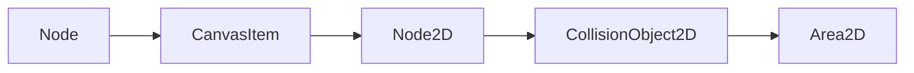
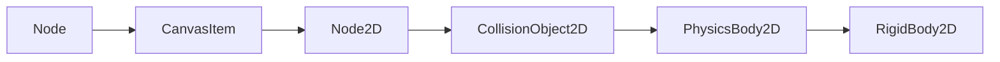
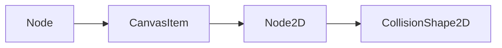
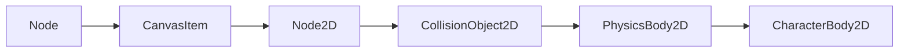

## Sobre Godot

Godot es un motor de videojuegos 2D y 3D multiplataforma, libre y de
código abierto, publicado bajo la Licencia MIT y desarrollado por la
comunidad de Godot. El motor es funcional en sistemas Windows, OS X,
Linux y BSD. Permite exportar los videojuegos creados a PC (Windows, OS
X y Linux), teléfonos móviles (Android, iOS), y HTML5. 

En Godot se puede programar en varios lenguajes, pero el recomendado
para empezar es **GDScript**, que es un lenguaje con una gran
influencia de **Python**, y con una fuerte integración con el motor.

Godot es si está escrito en **C++**, y es posible escribir extensiones
en este lenguaje para conseguir aun más rendimiento y control del motor,
pero en general esto no es necesario, especialmente al principio.

## Nodos

Los **nodos** son el componente básico de Godot. Hay muchos tipos
diferentes de nodos, cada uno de ellos especializado en realizar un
determinada función dentro de un juego. Un tipo de nodo, por ejemplo, se
especializa en mostrar una imagen en pantalla, otro puede encargarse de
realizar una animación, otra puede representar un modelo 3D de un
objeto.

Los nodos tienen **propiedades**, que permiten definir y personalizar su
comportamiento. El sistema es modular, de forma que añades al juego solo
los nodos que necesites. Esto es bueno porque podemos empezar a hacer
juegos sin tener que conocer todos los tipos de nodos existentes.

En un proyecto, los nodos se organizan en un [**árbol
jerárquico**](https://es.wikipedia.org/wiki/%C3%81rbol_(inform%C3%A1tica)).
Todos los nodos son hijos de otros nodos, excepto el nodo raíz. Los
nodos pueden tener múltiples hijos, o no tener ninguno, pero solo pueden
tener un padre.

## Escenas

El conjunto de nodos agrupados en forma de árbol jerárquico forma lo que
denominamos una **escena**. El árbol de nodos se conoce normalmente como
**àrbol de la escena**.

Que el nombre no nos confunda, las escenas no son _solo_ las
escenas que podríamos pensar como fases de un juego, que lo son, pero
también pueden ser **cualquier agrupación de nodos en forma de árbol**
que nos interese agrupar como una escena. Por ejemplo, podemos tener una
escena solo para el personaje que controle el jugador. Otra escena
podría ser un laberinto. Una fase del juego sería otra escena, que
incluiría en su árbol la escena del jugador y la escena del laberinto.

Un aspecto muy importante de los nodos es que, además de las
propiedades, podemos **asigna a un nodo un _script_ o programa que
controle su comportamiento**.

## Como eliminaar un nodo de una escena

**tl/dr**: `self.queue_free()`

La forma correcta es llamando al método `queue_free()` del propio nodo. 

Si el nodo no está en una escena (lo cual es raro,pero podría pasar)
se puede elminar simplemente con el método `free()`.

## Como convertir una sub rama del arbol de nodos en una escena

Simplemente hay que arrastrar el nodo de la rama que queremos que sea la
raíz de la nueva escena a la sección de Recursos (`FileSystem`), en la esquina
inferior izquierda.

## Cómo cargar una escena en Godot

Usando `get_tree()` podemos obtener el nodo raíz de la escena actual, y luego,
sobre ese nodo llamar al método `change_scene_to_file(file_path)` para cargar
la nueva escena.

Ejemplo:

```gdscript
get_tree().change_scene_to_file("res://Physics/Main.tscn")
```

## Cómo cambiar el gris oscuro de fondo por defecto de las escenas

En `Project` --> `Settings`, ir a `Environemnt` y cambiar el color
etiquetado como `Default Clear Color`.

## Cómo trabajar con numeros aleatorios

En el espacio global tenemos el método `randomize()`. Este método solo debe
ser ejecutado al principio, para inicializar el generador de numero
pseudo-aleatorios con una semilla diferente, basado en el momento en que
ejecuta. También podemos fijar la semilla con `seed(int)`.

- La función `randi() -> int` devuelve un número entero al azar entre $0$ y
  $2^{32-1}$.

- La función `randf() -> float` devuelve un número flotante al azar entre $0$ y
  $1$.

- La función `randfn(float mean, float deviation) -> float` devuelve un número
  flotante basado en una distribución normal, con media `mean` (Por defecto
  $0$) y desviación estandar `deviation` (Por defecto $1.0$).

- La función `randf_range(float from, float to) -> float` devuelve un valor en
  coma flotante comprendia entre los valores `from` y `to`, ambos inclusive.

- La función `randi_range(int from, int to) -> int` devuelve un entero
  comprendido entre los valores `from` y `to`, ambos inclusive.


## El nodo Area2D

La herencia es:



El objetivo de un objeto `Area3D` es principalmente reaccionar a
colisiones.  Para ellos requiere de un `CollisionShape` que define la
superficie o área de colisión. Mientras que  `CollisionShape`
simplemente define un área de colisión estática,  `Area2D` está buscando
activamente colisiones que se produzcan en esa área.

## El nodo RigidBody2D



El node **`RigidNode2D`** es un nodo que puede ser afectado pr fuerzas y
quepuede ser afectado por otros, reacciona a colisiones, tiene una masa, tiene
inercia, etc. Es básicamente lo que se podría esperar de un modelo de un objeto
"real".

Por ejemplo, se le supone sujeto a la fuerza de la gravedad, así que su
comportaiento por defecto será "caer" en el sentido en que esté configurada la
gravedad del motor de fisicas.

Necesita un nodo de tipo `CollisionShape2D` para definir su área de
interaccción. Con la propiedad lineal -> Damp podemos definir el rozamiento que
le afecta en su movimiento. Por defecto está a cero, así que cualquier fuerza
aplicada provoca un movimiento continuo. 

Podemos usar el método `apply_force` para aplicar una fuerza sobre el cuerpo.


## El nodo CollisionShape2D

La herencia es:



A la hora de usar `Area2D`, o alguno de los otros nodos que se usan para
detectar colisiones, es necesario definir la forma del área usada para
las colisiones. Esta es la función principal de este nodo, definir dicho
área. La forma en si está definida como un objeto de tipo `Shape3D`, que
incluye formas geométricas como rectángulos, círculos y polígonos, entre
otras.

## El nodo CharacterBody2D

La herencia de este nodo es:



El node **`CharacterBody2D`** un objeto especializado en representar personajes
2D controlados por un _script_. Sus movimiento no se ven afectados por la
física, pero ellos si que pueden afectar físicamente a otros cuerpos físicos
que se encuentren por el camino.

Proporciona una API de alto nivel para mover objetos que queremos que
detecten muros y reaccionen a pendientes (Véase el método
[`move_and_slide`](https://docs.godotengine.org/en/stable/classes/class_characterbody2d.html#class-characterbody2d-method-move-and-slide)).
Es usado a menudo para los personajes controlados por el jugador.

Para elementos del juego que no requieran movimientos complicados ni
detección de colisiones, como por ejemplo, plataformas móviles en un
juego de plataformas, es más sencillo de usar y configurar el nodo
[`AnimatableBody2D`](https://docs.godotengine.org/en/stable/classes/class_animatablebody2d.html#class-animatablebody2d)

## Gestionando la entrada con `InputEvent`

Las entradas en los juegos son complicadas, como ya vimos en su día. Los
eventos, representados en Godot Engine con objetos de la clase
`InputEvent` nos permiten detectar cosas como pulsaciones del teclado,
movimiento del _joystick_, ratón, etc. Los eventos pueden ser recibidos
en múltiples lugares, dependiendo de su proposito.

Por ejemplo, podemos añadir una función para cerrar el juego si se pulsa
la tecla `escape` con el siguiente código:

```gdscript
func _unhandled_input(event):
    if event is InputEventKey:
        if event.pressed and event.scancode == KEY_ESCAPE:
            get_tree().quit()
```

Sin embargo, hay un sistema más flexible, que usa un mecanismo llamado
`InputMap`. Con este sistema, definimos las acciones de entrada que
queremos usar y las asignamos a múltiples eventos del sistema. Por
ejemplo, podemos crear el evento `ir_a_la_izquierda` y asignarlo a la
tecla `A`, a la tecla con la flecha hacia la izquierda y a determinada
tecla del _gamepad_. De esta forma se puede cambiar estas
correspondencias en los ajustes del proyecto sin tener que modificar el
código, e incluso permitir, dentro del juego, cambiar estas asignaciones
a gusto del jugador.

Para cambiar los ajustes, hay que ir al menú 
    
    Project > Project Settings > Input Map

Y luego usar las acciones que hay predefinidas, o creadas por uno mismo,
por ejemplo así:

```gdscript
func _process(delta):
    if Input.is_action_pressed("ui_right"):
        # Move right
```

## Qué ficheros de Godot debemos mantener bajo control de versiones

La lista de ficheros a excluir difiere entre las versiones 3 y 4 de
Godot.

El **directorio** `.import` está lleno de ficheros binarios, creados
automáticamente y regenerados cada vez que un usuario importa un
proyecto. Son ficheros grandes y generados automáticamente, así que no
tiene sentido almacenarlos en el sistema de control de versiones.

Los **ficheros** con extensión `.import` almacenan las especificaciones
sobre la forma en que se deben importar determinados ficheros /Sonidos,
imágenes, etc...). Estos ficheros se generan automáticamente, si no
existen, pero se pueden personalizar para controlar determinados
aspectos de la importación, por ejemplo, se puede hacer que al importar
una determinada textura, se desactive el filtrado.

En resumen:

Asegúrate de incluir:

- Los ficheros '.gs', '.cs' (Scripts)
- Los ficheros `.tscn` (Escenas)
- Todos los _assets_: Ficheros de imánenes (`.bmp`, '.png`, '.jpg`,
  etc.), audio (`.wav`, `.mp3`, `.ogg`, etc.), vídeo (`.mov`, `.avi`,
  `.mpg`, etc.)
- incluir **los ficheros `.import`** pero **no incluir el directorio
  `.import`**.

Si tenemos dudas en algún tipo de fichero, debemos incluirlo, excepto
para los siguientes casos:

- Excluir la carpeta `.godot`. Es donde Godot almacena resultados
  intermedios.

- Excluir los ficheros `*.translation`. Son ficheros binarios de
  traducción generados automáticamente a partir de ficherosa partir de
  ficheros  `.csv`. 
