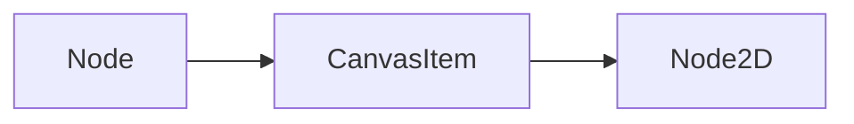
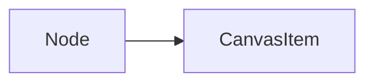
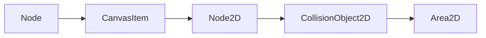
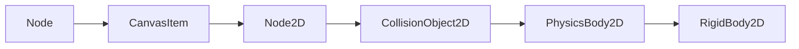
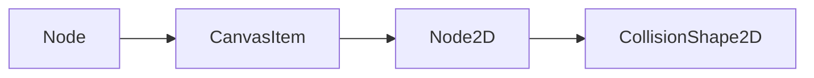
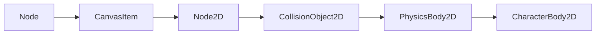
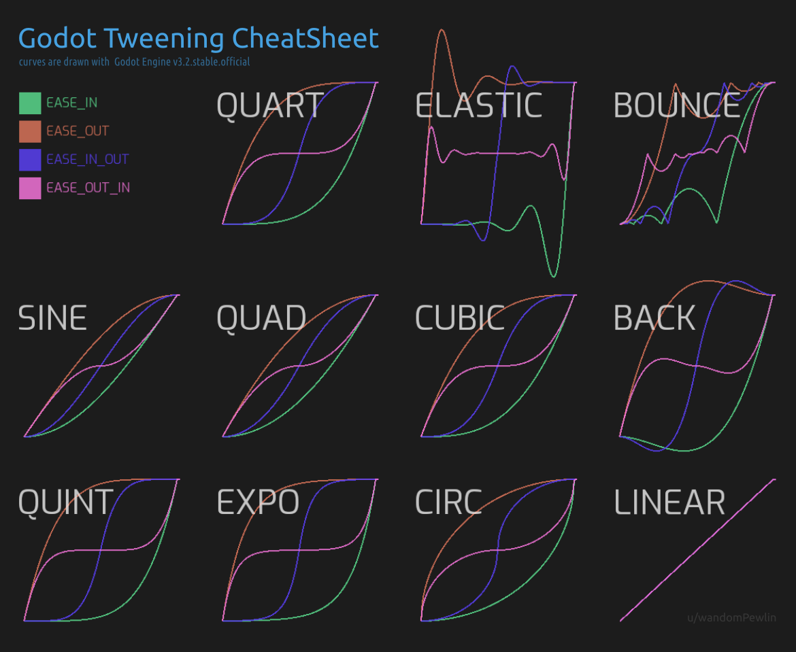

## Sobre Godot

Godot es un motor de vídeo juegos 2D y 3D multi-plataforma, libre y de código
abierto, publicado bajo la Licencia MIT y desarrollado por la comunidad de
Godot. El motor es funcional en sistemas Windows, OS X, Linux y BSD. Permite
exportar los video juegos creados a PC (Windows, OS X y Linux), teléfonos móviles
(Android, iOS), y HTML5. 

En Godot se puede programar en varios lenguajes, pero el recomendado para
empezar es **GDScript**, que es un lenguaje con una gran influencia de
**Python**, y con una fuerte integración con el motor.

Godot es si está escrito en **C++**, y es posible escribir extensiones en este
lenguaje para conseguir aun más rendimiento y control del motor, pero en general
esto no es necesario, especialmente al principio.

## Nodos

Los **nodos** son el componente básico de Godot. Hay muchos tipos diferentes de
nodos, cada uno de ellos especializado en realizar un determinada función dentro
de un juego. Un tipo de nodo, por ejemplo, se especializa en mostrar una imagen
en pantalla, otro puede encargarse de realizar una animación, otra puede
representar un modelo 3D de un objeto.

Los nodos tienen **propiedades**, que permiten definir y personalizar su
comportamiento. El sistema es modular, de forma que añades al juego solo los
nodos que necesites. Esto es bueno porque podemos empezar a hacer juegos sin
tener que conocer todos los tipos de nodos existentes.

En un proyecto, los nodos se organizan en un [**árbol
jerárquico**](https://es.wikipedia.org/wiki/%C3%81rbol_(inform%C3%A1tica)).
Todos los nodos son hijos de otros nodos, excepto el nodo raíz. Los nodos pueden
tener múltiples hijos, o no tener ninguno, pero solo pueden tener un padre.

## Escenas

El conjunto de nodos agrupados en forma de árbol jerárquico forma lo que
denominamos la **escena**. El árbol de nodos se conoce normalmente como el
**árbol de la escena**.

Que el nombre no nos confunda, las escenas no son _solo_ las escenas que
podríamos pensar como fases de un juego, que lo son, pero también pueden ser
**cualquier agrupación de nodos en forma de árbol** que nos interese agrupar
como una escena. Por ejemplo, podemos tener una escena solo para el personaje
que controle el jugador. Otra escena podría ser un laberinto. Una fase del juego
sería otra escena, que incluiría en su árbol la escena del jugador y la escena
del laberinto.

Un aspecto muy importante de los nodos es que, además de las propiedades,
podemos **asignarles un _script_ o programa** que controle su comportamiento.


## Como eliminar un nodo de una escena

**tl/dr**: `self.queue_free()`

La forma correcta es llamando al método `queue_free()` del propio nodo. 
Si el nodo no está en una escena (lo cual es raro, pero podría pasar)
se puede eliminar simplemente con el método `free()`.


## Como convertir una rama del árbol de nodos en una escena

Simplemente hay que arrastrar el nodo de la rama que queremos que sea la
raíz de la nueva escena a la sección de Recursos (`FileSystem`), en la esquina
inferior izquierda.

## La función `get_tree()`

La función **`get_tree()`** nos da acceso al árbol completo de la escena
actual, en forma de un objeto de tipo
[SceneTree](https://docs.godotengine.org/en/4.4/classes/class_scenetree.html).
Esto nos permite controlar la escena en sí, el _viewport_, y el _game
loop_. 

Se usa normalmente para cambiar, reiniciar o salir de niveles, para
añadir dinámicamente nodos, o para pausar el juego.

Métodos de uso frecuente:

- `reload_current_scene()` : Carga de nuevo la escena actual

- `change_scene_to_file(filename)` : Carga una nueva escena, desde un
  fichero. 

- `quit()` : Sale del programa


## Cómo cargar una escena en Godot

Usando `get_tree()` podemos obtener el nodo raíz de la escena actual, y luego,
sobre ese nodo llamar al método `change_scene_to_file(file_path)` para cargar
la nueva escena.

Ejemplo:

```gdscript
get_tree().change_scene_to_file("res://Physics/Main.tscn")
```

## Cómo cambiar el gris oscuro de fondo por defecto de las escenas

En `Project` --> `Settings`, ir a `Environemnt` y cambiar el color
etiquetado como `Default Clear Color`.


## Cómo trabajar con números aleatorios

En el espacio global tenemos el método `randomize()`. Este método solo debe
ser ejecutado al principio, para inicializar el generador de numero
pseudo-aleatorios con una semilla diferente, basado en el momento en que
ejecuta. También podemos fijar la semilla con `seed(int)`.

- La función `randi() -> int` devuelve un número entero al azar entre $0$ y
  $2^{32-1}$.

- La función `randf() -> float` devuelve un número flotante al azar entre $0$ y
  $1$.

- La función `randfn(float mean, float deviation) -> float` devuelve un número
  flotante basado en una distribución normal, con media `mean` (Por defecto
  $0$) y desviación estándar `deviation` (Por defecto $1.0$).

- La función `randf_range(float from, float to) -> float` devuelve un valor en
  coma flotante comprendido entre los valores `from` y `to`, ambos inclusive.

- La función `randi_range(int from, int to) -> int` devuelve un entero
  comprendido entre los valores `from` y `to`, ambos inclusive.


## El nodo `Node2D`

Un nodo **`Node2d`** representa un objeto pensado para ser usado en un
juego 2D.  Tiene una posición, una rotación (aplicada en el eje Z), una
escala para cada eje y una deformación de torsión o _skew_.

La herencia es:



Todos los demás objetos de tipo 2D, como objetos físicos, _sprites_,
etc. heredan de este tipo. Un uso habitual de `Node2D` es como nodo
padre de otros nodos 2D, ya que así todos los hijos heredan la posición,
rotación, escala, etc. También nos permite controlar de forma sencilla
el orden de _renderizado_. Los nodos de tipo `Control` también heredan
de la misma base que `Node2D`, `CanvasItem`, por lo que heredan
otras propiedades interesantes como `z_index` y `visible`.

### Métodos de `Node2D`

Methods

- `apply_scale(ratio: Vector2)` : Cambia la escala

- `get_angle_to(point: Vector2) -> float` : Obtiene el angulo entre el
  nodo y el punto indicado `point`.

- `get_relative_transform_to_parent(parent: Node) -> Transform2D` :
  Obtiene la transformación aplicada (En forma de matriz $2\times 3$) entre el nodo antecesor, indicado
  con `parent` y el nodo actual.

- `global_translate(offset: Vector2)` : Añade una diferencia u _offset_ a la posiciøn global del nodo.

- `look_at(point: Vector2)` : Rota el nodo de forma queel eje local
  $x$ del nodo se oriente hacia el punto indicado, que debe estar
  expresado en el espacio global de coordenadas.


## El nodo `CanvasItem`

La herencia es:



**`CanvasItem`** es una clase abstracta de la que deriva cualquier componente en
el espacio 2D, como por ejemplo `Control` para nodos relacionados con la
interfaz de usuario o `Node2D` para elementos en juegos de dos dimensiones.

Cualquier objeto que herede de `CanvasItem` puede dibujar en pantalla. El
motor realiza una llamada a `queue_redraw()`, que forzará a todos los nodos
a volver a dibujarse. A causa de esto, el control **no tiene** que volver a pintarse
obligatoriamente en cada _frame_, lo que mejora el rendimiento de forma
significativa. Hay muchos métodos de dibujo disponibles, cuyos nombres empiezan
por `draw_*`, como por ejemplo `draw_circle`, pero estos métodos **solo pueden ser usados dentro del método
especial `_draw()`, `_notificacion()` (con el valor `NOTIFICATION_DRAW`) o
métodos que esten conectados con la señal de `draw`**.

- [CanvasItem](https://docs.godotengine.org/en/stable/classes/class_canvasitem.html)
- [draw_circle()](https://docs.godotengine.org/en/stable/classes/class_canvasitem.html#class-canvasitem-method-draw-circle)

## El nodo `Area2D`

La herencia es:



El objetivo de un objeto **`Area3D`** es principalmente reaccionar a
colisiones.  Para ellos requiere de un `CollisionShape` que define la
superficie o área de colisión. Mientras que  `CollisionShape`
simplemente define un área de colisión estática,  `Area2D` está buscando
activamente colisiones que se produzcan en esa área.


## El nodo `RigidBody2D`



El node **`RigidNode2D`** es un nodo que puede ser afectado por fuerzas y
que puede ser afectado por otros, reacciona a colisiones, tiene una masa, tiene
inercia, etc. Es básicamente lo que se podría esperar de un modelo de un objeto
"real".

Por ejemplo, se le supone sujeto a la fuerza de la gravedad, así que su
comportamiento por defecto será "caer" en el sentido en que esté configurada la
gravedad del motor de físicas.

Necesita un nodo de tipo `CollisionShape2D` para definir su área de
interacción. Con la propiedad lineal -> Damp podemos definir el rozamiento que
le afecta en su movimiento. Por defecto está a cero, así que cualquier fuerza
aplicada provoca un movimiento continuo. 

Podemos usar el método `apply_force` para aplicar una fuerza sobre el cuerpo.


## El nodo `CollisionShape2D`

La herencia es:



A la hora de usar `Area2D`, o alguno de los otros nodos que se usan para
detectar colisiones, es necesario definir la forma del área usada para
las colisiones. Esta es la función principal de este nodo, definir dicho
área. La forma en si está definida como un objeto de tipo `Shape3D`, que
incluye formas geométricas como rectángulos, círculos y polígonos, entre
otras.

## El nodo `AnimationPlayer`

Un nodo **`AnimationPlayer`** sirve para crear animaciones de tipo general,
permitiendo animar (casi) cualquier característica del **nodo que lo contenga**.
Contiene un diccionario de recursos de tipo `AnimationLibrary`, al que se puede
acceder por el nombre de la animación. Para animaciones más sencillas puede ser
más sencillo usar `tweens`.

En Godot podemos animar cualquier cosa que esté accesible desde el Inspector,
como las transformaciones de un nodo, _sprites_, elementos de interfaz de
usuario, partículas, visibilidad, color de los materiales, etc. También se
pueden modificar valores de variables e incluso llamar a funciones.

Para poder trabajar con las animaciones lo primero es crear un nodo de tipo
`AnimationPlayer`. Este nodo sirve como contenedor de una o más animaciones.
Un nodo de tipo `AnimationPlayer` puede contener múltiples animaciones, que
pueden además transicionar de una a otra.

Después de crear el nodo, hay que pulsar el botón `Animation` en la parte inferior
del _viewport_. Aparecerá el panel de animaciones, que consta de cuatro partes:

- Los controles de animación, que permiten añadir, cargar, salvar o borrar
  animaciones

- Las lista de animaciones, o **_tracks_**

- La **línea temporal** o **_timeline_**, con _frames_ claves o _keyframes_

- Los controles del _timeline_ y de los _tracks_

La animación por ordenador se basa en el concepto de _keyframes_. Un _keyframe_
define el valor de una propiedad en un momento determinado. Se representan en
forma de diamante en cada pista. Si hay una línea entre dos diamantes, significa
que los dos _keyframes_ tienen el mismo valor, es decir, que no se produce ningún
cambio entre ellos. En el resto de los casos, es decir, cuando los valores son
diferentes, se calculan de forma automática los valores intermedios.


A keyframe defines the value of a property at a point in time.

El uso de `AnimationPlayer` está orientado a animaciones más complejas que las que
se pueden hacer usando solo `tweens`. Puede ser también más cómodo usar la pista
de animaciones, que es un entorno interactivo, que definir la animación en
código.


## El nodo `CharacterBody2D`

La herencia de este nodo es:



El nodo **`CharacterBody2D`** un objeto especializado en representar personajes
2D controlados por un _script_. Sus movimiento no se ven afectados por la
física, pero ellos si que pueden afectar físicamente a otros cuerpos físicos
que se encuentren por el camino.

Proporciona una API de alto nivel para mover objetos que queremos que
detecten muros y reaccionen a pendientes (Véase el método
[`move_and_slide`](https://docs.godotengine.org/en/stable/classes/class_characterbody2d.html#class-characterbody2d-method-move-and-slide)).
Es usado a menudo para los personajes controlados por el jugador.

Para elementos del juego que no requieran movimientos complicados ni
detección de colisiones, como por ejemplo, plataformas móviles en un
juego de plataformas, es más sencillo de usar y configurar el nodo
[`AnimatableBody2D`](https://docs.godotengine.org/en/stable/classes/class_animatablebody2d.html#class-animatablebody2d)

## Gestionando la entrada con `InputEvent`

Las entradas en los juegos son complicadas. `Los eventos, representados en Godot
Engine con objetos de la clase `InputEvent` nos permiten detectar cosas como
pulsaciones del teclado, movimiento del _joystick_, ratón, etc. Los eventos
pueden ser recibidos en múltiples lugares, dependiendo de su proposito.

Por ejemplo, podemos añadir una función para cerrar el juego si se pulsa la
tecla `escape` con el siguiente código:

```gdscript
func _unhandled_input(event):
    if event is InputEventKey:
        if event.pressed and event.scancode == KEY_ESCAPE:
            get_tree().quit()
```

Sin embargo, hay un sistema más flexible, que usa un mecanismo llamado
`InputMap`. Con este sistema, definimos las acciones de entrada que queremos
usar y las asignamos a múltiples eventos del sistema. Por ejemplo, podemos crear
el evento `goLeft` y asignarlo a la tecla `A`, a la tecla con la flecha hacia la
izquierda y a determinada tecla del _gamepad_. De esta forma se puede cambiar
estas correspondencias en los ajustes del proyecto sin tener que modificar el
código, e incluso permitir, dentro del juego, cambiar estas asignaciones a gusto
del jugador.

Para cambiar los ajustes, hay que ir al menú 
    
    Project > Project Settings > Input Map

Y luego usar las acciones que hay predefinidas, o creadas por uno mismo,
por ejemplo así:

```gdscript
func _process(delta):
    if Input.is_action_pressed("ui_right"):
        # Move right
```

## Qué ficheros de Godot debemos mantener bajo control de versiones

La lista de ficheros a excluir difiere entre las versiones 3 y 4 de
Godot.

El **directorio** `.import` está lleno de ficheros binarios, creados
automáticamente y regenerados cada vez que un usuario importa un
proyecto. Son ficheros grandes y generados automáticamente, así que no
tiene sentido almacenarlos en el sistema de control de versiones.

Los **ficheros** con extensión `.import` almacenan las especificaciones
sobre la forma en que se deben importar determinados ficheros /Sonidos,
imágenes, etc...). Estos ficheros se generan automáticamente, si no
existen, pero se pueden personalizar para controlar determinados
aspectos de la importación, por ejemplo, se puede hacer que al importar
una determinada textura, se desactive el filtrado.

En resumen:

Asegúrate de incluir:

- Los ficheros '.gs', '.cs' (Scripts)
- Los ficheros `.tscn` (Escenas)
- Todos los _assets_: Ficheros de imágenes (`.bmp`, '.png`, '.jpg`,
  etc.), audio (`.wav`, `.mp3`, `.ogg`, etc.), vídeo (`.mov`, `.avi`,
  `.mpg`, etc.)
- incluir **los ficheros `.import`** pero **no incluir el directorio
  `.import`**.

Si tenemos dudas en algún tipo de fichero, debemos incluirlo, excepto
para los siguientes casos:

- Excluir la carpeta `.godot`. Es donde Godot almacena resultados
  intermedios.

- Excluir los ficheros `*.translation`. Son ficheros binarios de
  traducción generados automáticamente a partir de ficherosa partir de
  ficheros  `.csv`. 

## Cómo detectar colisiones

En general hay colisiones cuando utilizamos el motor de físicas,
movimientos propios, etc. El sistema de colisiones de Godot funciona
añadiendo formas o zonas de colisión (`CollisionShape2D` para dos
dimensiones, `CollisionShape3D` par tres) a áreas.  Por ejemplo, en 2D,
se utiliza un nodo padre de tipo `Area3D`, con uno o más hijos de tipo
`CollisionShape2D`, que define donde se pueden producir y detectar las
colisiones.

Para poder gestionar un sistema que nos permite determinar que cosas
colisionan con que otras, se pueden definir los **capas de colisión**
(_collision mask_) y **máscaras de colisión** (_collision mask_). La
idea para entender esto es que si un objeto pertenece a una determinada
capa, solo colisionará con los objetos que estén situados en la misma
capa.

## Cómo funcionan las capas y las máscaras de colisión

- Las **Collision Layers** básicamente especifican a que categoría o
  categorías pertenece un objeto. Por decirlo de otra manera, los
  objetos solo existen en las capas o _layers_ que se indican.

- Las **Collision Masks**, por otro lado, determinan la _interacción_
  entre objetos. Los objetos solo interactuan con los objetos que esten
  en los niveles definidos en la máscara.

Esto permite un control muy preciso sobre qué objetos pueden
interaccionar con que otros.

Como ejemplo de la utilidad de estas capas, supongamos un juegos de
aviones, en el que queremos que los aviones del jugador `A` colisionen
con los del jugador `B`, y viceversa, pero que los aviones de `A` no
colisiones con los propios, ni los de `B` con los suyos. Además, tenemos
balas, que pueden colisionar con cualquier avión (Es decir, es válido el
fuego amigo).

Podríamos resolver este caso usando tres capas o _layers_, una (1) para
los aviones de `A`, otra (2) para los aviones de `B`. Las balas irían en
un tercer _layer_, (3).

Los aviones de `A` irían en la capa 1, pero la mascara se ajustaría para
detectar solo los objetos en la capa 2 (Aviones enemigos, en este caso
de `B`) y 3 (Balas, de quien sea). La configuración para los aviones de
`B` sería la contraría, los aviones estarían en la capa 2 pero su
máscara tendría solo la capa 1 (Aviones enemigos, en este caso de `A`) y
3 (balas, de quien sea).

Nota: Se le pueden asignar nombres a las capas en _Project settings_ ->
_General_ -> Layer Names

- Fuente:  [Collision Layers and Masks in Godot 4 - Tutorial](https://www.gotut.net/collision-layers-and-masks-in-godot-4/)


## Cómo ver las áreas de colisión de forma fácil

Solo hay que ir al menú de _Debug_ y habilitar el _checkbox_
de _Visible Collision Shapes_.


## Cómo usar los _Timers_ en Godot

Un **_Timer_** en Godot es un nodo que realiza una cuenta atrás a partir de un
valor predeterminado, y que cuando llega a cero emite una señal, que nosotros
podemos capturar para realizar cualquier acción en nuestro juego.

Usos típicos son, entre otros:

- Una cuenta atrás antes de empezar una carrera

- Retrasar la activación de un _power-up_

- Activar oleadas de enemigos de una forma estructurada

Después de que un nodo tipo _Timer_ entra en el árbol, puede ser arrancado
manualmente llamando al método `start()`. También puede arrancar automáticamente
si se ha puesto el atributo `autostart` a `true`.

Sin necesidad de escribir código, desde el editor podemos añadir el nodo,
especificar el valor de la cuenta atrás y vincular el evento de fin de cuenta
atrás con una función.

- [Clase Timer](https://docs.godotengine.org/en/stable/classes/class_timer.html)

## Cómo hacer un nodo visible / invisible

Se puede usar o bien el método `set_visible(false|true)` o bien asignar a la
propiedad `visible`. Por ejemplo `visible = false` oculta el objeto. La
propiedad y el método están definidos en la clase `CanvasItem`, que es base de
cualquier nodo que se pinte en 3D.

Solo hay que configurar la visibilidad del nodo raíz, todos los nodos
descendientes heredan la visibilidad del padre.

- [CanvasItem](https://docs.godotengine.org/en/stable/classes/class_canvasitem.html)


## Cómo hacer animaciones sencillas con _tweens_

Un **`Tween`** es un objeto ligero usado para crear desde programación
animaciones sencillas. Funciona modificando un valor numérico e
interpolando su valor hasta llegar a un valor final. El nombre proviene
de _in betweening_, una técnica de animación en la que se especifican
valores claves y el ordenador calcula los _frames_ intermedios.

Su uso es habitual cuando desconocemos los valores finales con
antelación. Por ejemplo, interpolar el nivel de zoom de una cámara es
sencillo con un _Tween_, y más complicado usando un `AnimationPlayer`.
Además, consumen menos recursos que `AnimationPlayer`, por lo que están
orientados a animaciones sencillas. Se usan con un patrón de **dispara y
olvídate** (_Fire and forget_).

Nota: Un objeto de la clase `Tween` puede ser creado de dos maneras,
llamando a `SceneTree.create_tween()` o a `Node.create_tween()`. Los
_Tweens_ creados manualmente, es decir, usando `Tween.new()` **son
inválidos** y no se deben utilizar.

La animación en sí es creada añadiendo _tweeners_ al onjeto `Tween`,
usando alguno de los métodos `tween_property()`, `tween_interval()`,
`tween_callback()` o `tween_method()`:

```gdscript
var tween = get_tree().create_tween()
tween.tween_property($Sprite, "modulate", Color.RED, 1)
tween.tween_property($Sprite, "scale", Vector2(), 1)
tween.tween_callback($Sprite.queue_free)
```

La secuencia anterior hará que el nodo `$Sprite` adquiera un todo rojo
en el primer segundo, luego reduce su tamaño hasta desaparecer (escala
0) en el siguiente segundo, y finalmente llama a `$Sprite.queue_free`
para borrarse automáticamente. Podría valer para hacer desaparecer un
enemigo en un juego. En principio, los _tweeners_ se ejecuta de forma
secuencial, cuando termina una empieza el siguiente, pero esto se puede
modificar y controlar con `parallel`, que hace que el siguiente
_tweener_ se ejecute en paralelo con el previo, y `set_parallel`, que si
se llama con `true`, hace que todos los _tweeners_ se ejecuten en
paralelo.

Una vez creado un _tweener_, se puede usar `.set_trans`, que es un método que
esta pensado para ser usado en cascada, y que permite modificar la
transición característica del _tweener_. Por ejemplo, podemos cambiar de una
animación lineal (por defecto) a otro tipo:

```gdscript
var tween = get_tree().create_tween()
tween.tween_property($Sprite, "modulate", Color.RED, 1).set_trans(Tween.TRANS_SINE)
tween.tween_property($Sprite, "scale", Vector2(), 1).set_trans(Tween.TRANS_BOUNCE)
tween.tween_callback($Sprite.queue_free)
```

Figure: Esta imagen está sacada de este proyecto: 
[godotTweeningCheatSheet](https://github.com/wandomPewlin/godotTweeningCheatSheet)



De forma similar, tenemos el método `set_ease`, que acepta contantes
definidas en la clase `Trans` como `EASE_IN`, `EASE_OUT`, `EASE_IN_OUT`
y `EASE_OUT_IN`.

Podemos pasar parámetros a la función a invocar con `tween_callback`
usando  `bind` en la función:

````gdscript
    var tween = get_tree().create_tween()
    tween.tween_property(slot, "modulate", Color(1, 0, 0, 1.0), 0.5)
    ...
    tween.tween_callback(print.bind(self.transform))
```


