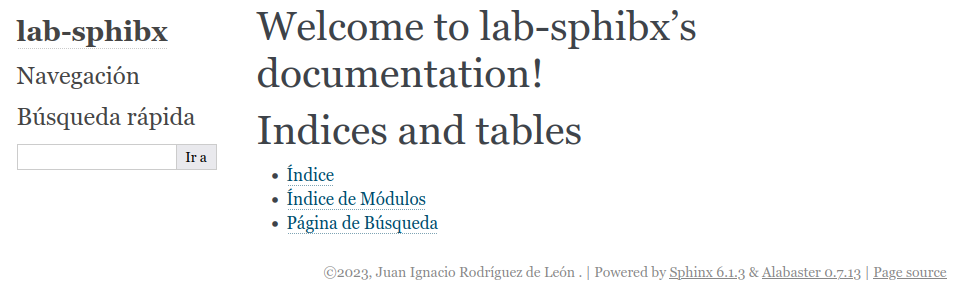

## Sobre Sphinx

**Sphinx** es una conjunto de utilidades/libreria para crear
documentación atractiva. Algunas de sus características más interesantes
son:

- Múltiples formatos de salida: Html, Latex/Pdf, ePub, Texinfo, manual
  pages o texto plano.

- Referencias cruzadas, enlaces automáticos a funciones, clases,
  glosario de términos, etc.

- Estructura jerárquica. Documentación en forma de árbol con enlaces
  automáticos a páginas hermanas, padres e hijos.

- Índices automáticos

- Coloreado sintáctico del código, usando [Pygments](https://pygments.org/)

- [Extensiones](https://www.sphinx-doc.org/en/master/usage/extensions/index.html),
  que amplían enormemente las posibilidades de Sphinx.  Algunos ejemplo
  pudrían ser: Testeo automático de fragmentos de código, inclusión de
  las _docstrings_ en el caso de Python, y muchas otras [extensiones de
  terceros](https://github.com/sphinx-contrib/). La mayoría de las
  extensiones se pueden instalar con `pip`. También podemos [escribir
  nuestras propias
  extensiones](https://www.sphinx-doc.org/en/master/development/index.html).

Sphinx por defecto utiliza el formato
[reStructuredText](https://docutils.sourceforge.io/rst.html) (normalmente
abreviado como ReST), pero puede también trabajar con [MyST
markdown](https://jupyterbook.org/en/stable/content/myst.html) --que es un
superconjunto de Markdown--, usando una extensión (ver [nota
correspondiente](#como-usar-markdown-en-sphinx)).


## Empezar un projecto con Sphinx

Conviene crear un entorno virtual para eso, con la herramienta que
prefieras. Aquí vamos a usar `venv`, disponible en la librería estándar
de Python desde la versión 3.3:

```python
python -m venv .venv
source .venv/bin/activate
python -m pip istall sphinx
```

Podemos verificar la instalación con:

```shell
sphinx-build --version
```

Agora podemos empezar escribiendo un fichero `README.rst` con la descripción del proyecto.
Por ejemplo:

```rest
Ejemplo de documento con Sphinx
===============================

Con **Sphinx** Podemos crear una documentación fat-tas-ti-bu-lo-sa.
```

El siguiente paso es crear el proyecto Sphinx en si. Usaremos el comando
`sphinx-quickstart <carpeta>`, por ejemplo:

```shell
sphinx-quickstart docs
```

Este _script_ nos preguntará una serie de datos:

- Si queremos carpetas separadas para la documentación y las salidas (Por defecto no, pero
  se recomienda que si)

- El nombre del proyecto

- El nombre del autor

- La versión, por ejemplo `0.1`

- El lenguaje del proyecto (Usar `es` para Español)

Después de contestar, nos habrá creado una estructura similar a esta:

```
├── docs
│   ├── build
│   ├── make.bat
│   ├── Makefile
│   └── source
│       ├── conf.py
│       ├── index.rst
│       ├── _static
│       └── _templates
└── README.rst
```

Cuyas carpetas y ficheros sirven para diferentes propósitos:

- `build` es la carpeta donde se generarán los productos finales producidos, sean
  estos ficheros _html_, _latex_, _epub_, etc.

- `make.bat` y `Makefile` son para ser usados con la herramienta `make`

- `source/conf.py` es el fichero de configuración del proyecto

- `source/index.rst` es el fichero inicial o raiz, a partir del cual se genera
  todo el árbol de documentación

Con este esquema inicial, ya podemos generar nuestra primera versión de la documentación:

```shell
sphinx-build -b html docs/source docs/build/html
```

Que debe producir una salida similar a:

```
Ejecutando Sphinx v6.1.3
cargando traducciones [es]... hecho
creando directorio de salida... hecho
compilando [mo]: los objetivos para 0 los archivos po que estan desactualizados
escribiendo salida... 
compilando [html]: los objetivos para 1 los archivos fuentes que estan desactualizados
actualizando ambiente: [nueva configuración] 1añadido, 0 cambiado, 0 removido
leyendo fuentes... [100%] index                                                                                  
buscando por archivos no actualizados... no encontrado
preparando ambiente... hecho
verificando consistencia... hecho
preparando documentos... hecho
escribiendo salida... [100%] index                                                                               
generando índices... genindex hecho
escribiendo páginas adicionales... search hecho
copiar archivos estáticos... hecho
copiando archivos extras... hecho
volcar el índice de búsqueda en Spanish (code: es)... hecho
volcar inventario de objetos... hecho
construir éxitoso.
```

Ahora podemos abrir con nuestro navegador favorito las páginas en
`docs/build/html/index.html`. Debería verse algo como:



El fichero `index.rst` ha sido creado automáticamente, podemos editarlo. Aquí podemos
ver el uso de algunas de las características de ReEstructuredText:

```rest
.. lab-sphibx documentation master file, created by
   sphinx-quickstart on Fri Mar 17 11:43:17 2023.
   You can adapt this file completely to your liking, but it should at least
   contain the root `toctree` directive.

Welcome to lab-sphibx's documentation!
======================================

.. toctree::
   :maxdepth: 2
   :caption: Contents:

Indices and tables
==================

* :ref:`genindex`
* :ref:`modindex`
* :ref:`search`
```

Aquí podemos ver:

- Una cabecera de sección usando `===` debajo de la línea

- Uso de la **directiva** `toctree` para crear el índice o tabla de contenidos.

- Una nota de aviso, en forma de una de las **directivas** disponibles.

- Un enlace a una página externa

- Dos ejemplos de marcado: Énfasis fuerte (normalmente con negritas) usando `**`
  y énfasis normal (normalmente itálicas) con `*`. 

- Tres ejemplos de un **rol**, `ref`.


## Qué es un rol

Un **rol** es un mecanismo que proporciona ReST para poder ser extendido, igual
que las directivas. En el caso de rol, estaríamos trabajando a nivel de elemento
en línea. Normalmente se ejecutan como:

```
:rolename:`content`
```

Por ejemplo, para incluir un fragmento de texto en línea que queremos en formato
de código usaremos el rol `code`:

```
Si queremos incrementas la variable :code:`a`, haremos :code:`a = a + 1`.
```

Existen múltiples roles predefinidos ya en Sphinx, como `math` para incluir
expresiones matemáticas, `abbr` para abrebiaturas...


## Secciones o estructura en Sphinx / RestructuredText

Las secciones se definen con una serie de caracteres a modo de subrayado (Y, a
veces, también a modo de superrayado) del texto de la sección. La longitud
de la línea de subrayado / superrayado debe ser como mínimo igual a la del
texto de la sección.

Este sería un ejemplo:

```ReST
=================
This is a heading
=================
```

Hay que tener en cuenta que no hay una jerarquía definida de secciones, sino que
la estructura se determina dinámicamente a medida que se van sucediendo las
secciones. Existe una convención, usada en la documentación de Python, que mucha
gente usa:

- ``#`` tanto por encima como por debajo del texto, para las **partes**.

- ``*`` tanto por encima como por debajo, para **capítulos**.

- ``=`` por debajo, para secciones

- ``-`` por debajo, para sub-secciones

- ``^`` por debajo, para sub-sub-secciones

- ``"`` por debajo para párrafos

Por supuesto, esta es solo una recomendación, puede usarse la convención que se
desee, con más o menos niveles, usando diferentes caracteres, etc. (Ver la
documentación de reStructuredText para ver qué caracteres son válidos).

Téngase en cuenta, en todo caso, que formatos como Html o Epub tienen una
limitación en en número de niveles.


## Cómo generar la documentación usando sphinx

El comando viene a ser:

```
sphinx-build -W -c docs/ -b html ./docs ./html
```

Donde los parámetros significan:

- `W` : convertir advertencias en errores

- `-c docs` : Directorio donde buscar el fichero de configuracion `conf.py`

- `-b html` : Usar el _builder_ (de ahí la `b`) para html

- `./docs` : Directorio de origen

- `./html` : Directorio de destino


## Qué es una directiva en Sphinx?

Las directivas son la forma mas potente de ampliar las posibilidades de
ReEstructuredText.

Un ejemplo de directiva es `.. toctree::`, que se genera en la pagina de
`index.rst` por defecto al crear el proyecto. Todas las directivas se
ejecutan escribiendo antes los dos puntos (No el carácter `:`, sino dos
veces el carácter `.`), un espacio, el nombre de la directiva y dos
veces el carácter "dos puntos" (Ahora sí, el carácter `:`). Suena más
 confuso de lo que es; si quieremos ejecutar `toctree`, escribimos::


```
.. toctree::
```

Esta es la forma general de uso de una directiva:

```
.. <nombre de la directiva>::[ <argumento_1> <argumento_2> ...  <argumento_n>]
    [opcion_1: valor1]
    [opcion_2: valor 2]
    ...
    [opcion_n: valor n]

    <contenido>
```

Las características principales de las directivas son:
 
- Tiene un **nombre único** que sirve para identificarlas.

- Pueden aceptar un **número arbitrario de argumentos** (incluyendo
  ninguno).  Cada directiva define los argumentos que acepta. En caso de
  que se definan, estos argumentos son obligatorios, y deben
  especificarse después del nombre de la directiva, en el orden
  adecuado. Vendrían a ser el equivalente a los parámetros por orden en
  una función Python.

- Pueden tener un **número arbitrario de opciones** (Incluyendo
  ninguna). Las opciones, si se definen, vendrían en la o las líneas
  justo a continuación, en forma de "lista de campos" o cadenas con la
  forma `<nombre>: <valor>`. Por ejemplo, `maxtree` es un ejemplo de
  opción para la directiva `toctree`.  Vendrían a ser el equivalente a
  los parámetros por nombre en una función Python.

- Pueden, o no, tener un contenido. En este último caso, tiene que haber
  obligatoriamente **una línea en blanco que separe la directiva del
  contenido**. Además, el contenido (si existe) tiene que estar
  **indentado en el mismo nivel que las opciones**.

Como vemos, lo único realmente obligatorio es el nombre.

El sistema incluye un conjunto de
varias directivas predefinidas, y este conjunto puede ser ampliado con
directivas de terceras partes.


## Cómo añadir contenido a la documentación.

Debemos especifica los ficheros a incluir como parte del contenido de la
directiva `tocfree`. El siguiente ejemplo añade dos ficheros:

```
.. toctree::
   :maxdepth: 2

   usage/installation
   usage/quickstart
   ...
```

De esta forma `toctree` aprende no solo donde están los contenidos, sino el
orden en que deben ser presentados y la **estructura jerárquica** de los mismos. No
es necesario normalmente especificar la extensión del archivo, se buscara el
ficheros con extensiones como `.rst` o `.md`.


## Como crear un glosario en Sphinx

Crearemos un fichero `glosario.rst`, por ejemplo (Puede ser el nombre
que queramos, o incluso tener máß de un archivo, pero lo normal es tener
solo uno y con este nombre o similar. Necesitamos incluirlo en algún `toctree`
para que Sphinx lo integre en la documentación. Dentro de este fichero
usaremos la directiva `glossary`. El contenido de esta directiva debe
ser una lista de definiciones en formato RestructuredText, como en el
siguiente ejemplo:

```
.. glossary::
   :sorted:

   Bulbasaur

      **Bulbasaur** es un pokémon de tipo planta y veneno introducido en la
      primera generación. Es uno de los Pokémon iniciales que pueden seleccionar
      los jugadores al comenzar su aventura en la región de Kanto

   Charizard

      **Charizard** es un Pokémon de tipo fuego/volador. Es la tercera y última
      etapa de Charmander. Es uno de los Pokémon más conocidos. Aparece por
      primera vez en Pokémon Red y Blue.

   ...
```
   
Después, para referenciar el glosario, en cualquier documento
que lo necesitemos, solo hay que usar el rol `term`:

```
El pokemon más carismático es sin duda :term:`Charizard`, con sus
grandes alas y su aliento de fuego. Cuando se enfurece de verdad, la
llama de la punta de su cola se vuelve de color azul claro.
```

## Cómo usar Markdown en Sphinx

Para poder usar MarkDown, Sphinx utiliza una extensión de terceros
llamada
[**MyST-Parser**](https://myst-parser.readthedocs.io/en/latest/).

[MyST](https://myst-parser.readthedocs.io/en/latest/intro.html) es una
combinación de las sintaxis de MarkDown y rST. Es una opción muy
interesante si se está familiarizado con MarkDown, ya que ofrece la
sencillez de uso de este con la potencia de rST.

MyST-Parser es un puente (_bridge_) hacia `markdown-it-py`, un paquete
Python para parsear la variante de Markdown conocida como `CommonMark
Markdown` (MyST es un superconjunto de _CommonMArk Markdown_).
MyST-Parser requiere Sphinx 2.1 o superior.  .

Para configurar un proyecto Sphinx para que pueda usar esta variante de
MarkDown, los pasos a seguir son:

- Instala el parser `MyST-Parser`:

    ```
    pip install --upgrade myst-parser
    ```

- Ańadelo a la lista de extensiones:

    ```python
    extensions = ['myst_parser']
    ```
   
Si se quiere usar ficheros Markdown pero con extensiones diferentes a `.md`,
debemos incluir esas extensiones en la variable `source_suffix`. El siguiente
ejemplo configura Sphinx para que procese como MarkDown los ficheros con
extensiones tanto `.md` como `.txt`:

```python
    source_suffix = {
        '.rst': 'restructuredtext',
        '.txt': 'markdown',
        '.md': 'markdown',
    }
```

Se puede configurar `MyST-Parser` para permitir sintaxis personalizada que en
principio CommonMark no soportaría. Hay más información en la [documentación del
paquete MyST-Parser](https://myst-parser.readthedocs.io/en/latest/index.html).


## En que se diferencia el Myst Markdown del Markdown normal

El parser [MyST - Markedly Structured
Text](https://myst-parser.readthedocs.io/en/latest/index.html)
es un superconjunto de Markdown, por lo acepta todo el MarDown estáñdar y añade
nuevas funcionalidades (Algunas requieren añadir paquetes adicionales):

- Texto tachado, con la extensión
  [strikethrough](https://myst-parser.readthedocs.io/en/latest/syntax/optional.html#syntax-strikethrough)

- Extensiones tipográficas, con la extensión [replacements], para hacer
  transformaciones como `(c)` a `©`.

- Figuras e [Imágenes con
  atributos](https://myst-parser.readthedocs.io/en/latest/syntax/optional.html#syntax-attributes-inline)

- Matemáticas 

- Tablas

- Referencias cruzadas

## ¿Se pueden usar las directivas y los roles de Sphinx usando MyST Markdown?

La respuesta corta es si, pero no directamente.

Para los roles, cuando en ReST usaríamos:

```
:role_name:`role-content`
```

En Markdown haremos:

```
{role_name}`role_content`
```


Por ejemplo:
```
Desde Pitágoras, sabemos que {math}`a^2 + b^2 = c^2`.
```

Para las directivas, solo hay que incluirlas dentro
de un _Markdown code fence_, es decir, embeberlas entre triples comillas
inversas simple: _'\`'_.

Es decir, para los roles, lo que seria así en Rest:

```
.. directivename:: arguments
   :key1: val1
   :key2: val2

   This is
   directive content
```

Habría que ponerlo en Markdown como:

    ```{directivename} arguments
    :key1: val1
    :key2: val2

    This is
    directive content
    ```

Para casos especiales, MySt también ofrece la directiva `eval-rst`, que
parsea el contenido como ReStructuredText:

    ```{eval-rst}
    .. figure:: img/fun-fish.png
      :width: 100px
      :name: rst-fun-fish

    Party time!

    A reference from inside: :ref:`rst-fun-fish`

    A reference from outside: :ref:`syntax/directives/parsing`
    ```

Esto se integra con el resto de la documentación, así que podríamos enlazar
a la imagen desde fuera usando el nombre `rst-fun-fish`.


## Cómo poner notas a pie de página con Sphinx

Para las notas a pie de página, hay que usar `[#]_` para marcar la ubicación de
la llamada a la nota, y luego, al final del documento, añadimos una directiva
`rubric`, como en en siguiente ejemplo:

```
    Porque patatín [#]_ ... y patatán  [#]_ ...

    .. rubric:: Notas

    .. [#] Texto de la primera nota.
    .. [#] Texto de la segunda nota.

```

## Ańadir enlaces en Sphinx

Se puede incluir enlaces a localizaciones dentro del mismo documento, a otras
localizaciones en otro documento, o a sitios web externos

### Enlaces a secciones dentro del mismo documento

Se puede enlazar a cualquier encabezado del documento usando el comand `:ref:`,
usando el propio texto de la cabecera como parámetro, como en el siguiente
ejemplo:

```
:ref:`Cross-References to Locations in the Same Document`
````

Para esto tenemos que tener habilitada la extensión
`sphinx.ext.autosectionlabel`.

Si no queremos usar las secciones, podemos enlazar a cualquier parte del
documentos usando una referencia manual:

```
    Bla bla ... Bla.

    .. _Quiero referenciar aquí

    Ble ble ... ble.

    Para incluir un enlace a la referencia usando  :ref:`Quiero referenciar aquí`
```

### Enlaces a páginas externas

Para enlazar a una URL externa, podemos usar esta sintaxis:

    `Link text <link URL>`_

Por ejemplo:

    `Python <http://python.org/>`_

También podemos separar en dos el texto del enlace y la definición de la
URL destino:

    Aprende e programar en `Python`_.

    .. _Python: http://python.org/


