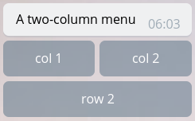

## How to add menu options to the bot

For that, you have to talk to BotFather.

In the Telegram App, open the chat with BotFather.

Send him /setcommands. He will present you with a list of your bots.

Pick the bot for which you want to set the command menu.

Compose and send the command list. Using your image as an example, these 4 lines should do:

start - Description 1
menu - Description 2
help - Description 3
stop - Description 4

Note that each line should start with lowercase, and no slashes. There should also be spaces around the - sign.

Once you complete this process, exit and kill the Telegram App. Re-open it, go to the chat with your target bot, type a / (or tab on the / button next to the text field), the command menu should come up.


## How to restart the bot with a command

The following example allows you to restart the bot from within a handler. It goes without saying
that you should protect this method from access by unauthorized users, which is why we are using a
Filters.user filter. If you want multiple users to have access the restart command, you can pass a
list of usernames as well. You can also filter by user IDs which is arguably a bit safer since they
can't change. See the docs for more information.

This example is using closures so it has access to the updater variable. Alternatively, you could
make it global.

```Python
    import os
    import sys
    from threading import Thread

    # Other code

    def main():
        updater = Updater("TOKEN")
        dp = updater.dispatcher

        # Add your other handlers here...

        def stop_and_restart():
            """Gracefully stop the Updater and replace the current process with a new one"""
            updater.stop()
            os.execl(sys.executable, sys.executable, *sys.argv)

        def restart(update, context):
            update.message.reply_text('Bot is restarting...')
            Thread(target=stop_and_restart).start()

        # ...or here...

        dp.add_handler(CommandHandler('r', restart, filters=Filters.user(username='@jh0ker')))

        # ...or here, depending on your preference :)

        updater.start_polling()
        updater.idle()


    if __name__ == '__main__'
        main()
```

## How to build a menu with Buttons

Often times you will find yourself in need for a menu with dynamic content. Use the following
`build_menu` method to create a button layout with `n_cols` columns out of a list of buttons.

    def build_menu(buttons,
                n_cols,
                header_buttons=None,
                footer_buttons=None):
        menu = [buttons[i:i + n_cols] for i in range(0, len(buttons), n_cols)]
        if header_buttons:
            menu.insert(0, header_buttons)
        if footer_buttons:
            menu.append(footer_buttons)
        return menu

You can use the `header_buttons` and `footer_buttons` lists to put buttons in the first or last row
respectively.



Or, if you need a dynamic version, use list comprehension to generate your button_list dynamically from a list of strings:

some_strings = ["col1", "col2", "row2"]
button_list = [[KeyboardButton(s)] for s in some_strings]

## Sources

 - <https://github.com/python-telegram-bot/python-telegram-bot/wiki/Code-snippets>
 - <https://core.telegram.org/bots>
 - [Bots FAQ](https://core.telegram.org/bots/faq#what-messages-will-my-bot-get)
