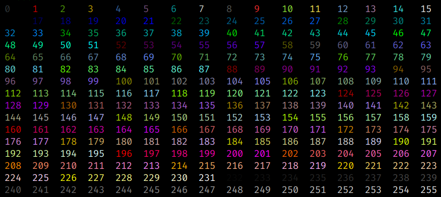
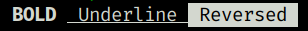

## Introducción a los códigos ANSI

The most basic Ansi escape codes are those involved in rendering text.
These let you add decorations like **colors**, **background colors** or
other Decorations to your printed text, but don't do anything fancy.
The text you print will still end up at the bottom of the terminal, and
still make your terminal scroll, just now it will be colored text
instead of the default black/white color scheme your terminal has.

## Cómo usar distintos colores para el texto

The most basic thing you can do to your text is to color it. The Ansi
colors all look like

```
Red: `\u001b[31m`
Reset: `\u001b[0m`
```

This `\u001b` character is the special character that starts off most
Ansi escapes; most languages allow this syntax for representing special
characters, e.g. Java, Python and Javascript all allow the `\u001b`
syntax.

For example here is printing the string \"Hello World\", but red:

```python
print("\u001b[31mHelloWorld")
print("Still red")
```

That is how Ansi colors work: once you print out the special code
enabling a color, the color persists forever until someone else prints
out the code for a different color, or prints out the Reset code to
disable it:

```python
print("\u001b[31mHelloWorld")
print("\u001b[0m")  # Reset code
print("Not red anymore")
```

The most basic terminals have a set of 8 different colors:

| Color   | Code         |
|---------|--------------|
| Black   | `\u001b[30m` |
| Red     | `\u001b[31m` |
| Green   | `\u001b[32m` |
| Yellow  | `\u001b[33m` |
| Blue    | `\u001b[34m` |
| Magenta | `\u001b[35m` |
| Cyan    | `\u001b[36m` |
| White   | `\u001b[37m` |
| Reset   | `\u001b[0m`  |

Most terminals, apart from the basic set of 8 colors, also support the
**bright** or **bold** colors. These have their own set of codes, mirroring the
normal colors, but with an additional `;1` in their codes:

| Color          | Code           |
|----------------|----------------|
| Bright Black   | `\u001b[30;1m` |
| Bright Red     | `\u001b[31;1m` |
| Bright Green   | `\u001b[32;1m` |
| Bright Yellow  | `\u001b[33;1m` |
| Bright Blue    | `\u001b[34;1m` |
| Bright Magenta | `\u001b[35;1m` |
| Bright Cyan    | `\u001b[36;1m` |
| Bright White   | `\u001b[37;1m` |

Lastly, after the 16 colors, some terminals support a 256-color extended
color set.

These are of the form:

```
\u001b[38;5;${ID}m
```

This Python code shows all the available colors:

```python
for i in range(16):
    for j in range(16):
        code = str(i * 16 + j)
        print(f"\u001b[38;5;{code}m {code:4}", end="")
    print("\u001b[0m")
```



## Como usar distintos colores para el fondo

The Ansi escape codes let you set the color of the text-background the same way
it lets you set the color of the foregrond. For example, the 8 background
colors correspond to the codes:

| Color              | Code         |
|--------------------|--------------|
| Background Black   | `\u001b[40m` |
| Background Red     | `\u001b[41m` |
| Background Green   | `\u001b[42m` |
| Background Yellow  | `\u001b[43m` |
| Background Blue    | `\u001b[44m` |
| Background Magenta | `\u001b[45m` |
| Background Cyan    | `\u001b[46m` |
| Background White   | `\u001b[47m` |

With the bright versions being:

| Color                     | Code           |
|---------------------------|----------------|
| Background Bright Black   | `\u001b[40;1m` |
| Background Bright Red     | `\u001b[41;1m` |
| Background Bright Green   | `\u001b[42;1m` |
| Background Bright Yellow  | `\u001b[43;1m` |
| Background Bright Blue    | `\u001b[44;1m` |
| Background Bright Magenta | `\u001b[45;1m` |
| Background Bright Cyan    | `\u001b[46;1m` |
| Background Bright White   | `\u001b[47;1m` |


## Cómo usar efectos decorativos (Negrita, subrayado, inverso)

Apart from colors, and background-colors, Ansi escape codes also allow
decorations on the text:

- Bold: `\u001b[1m`

- Underline: `\u001b[4m`

- Reversed: `\u001b[7m`

Which can be used individually:

```
print("\u001b[1m BOLD \u001b[0m\u001b[4m Underline \u001b[0m\u001b[7m Reversed \u001b[0m")
```



## Cómo haer un indicador de progreso fácil usando ANSI

The easiest thing we can do with our cursor-navigation Ansi escape codes
is to make a loading prompt:

```python
import time

def loading():
    print("Loading...", end='    ')
    for i in range(1, 101):
        time.sleep(0.1)
        print(f"\u001b[3D{i:2d}%", end="", flush=True)
    print(" \u001b[32m[OK]\u001b[0m")

loading()
```

This prints the text from `1%` to `100%`. Before printing each percentage it
first prints `\u001b[3D` (which means \"move cursor left by 3
characters\") thus letting the new percentage that gets printed
over-write the old one. We need to go back three caharacters because we
are using two for the digits and one for the percent sign `%`.

Now that we know how to make a self-updating progress bar using ANSI
escape codes to control the terminal, it becomes relatively easy to
modify it to be fancier, e.g. having a ASCII bar that goes across the
screen:

```python
def progress_bar():
    print("Loading...", end=" ")
    for i in range(0, 100):
        time.sleep(0.1)
        width = (i + 1) // 4
        bar = "\u2589" * width + " " * (26 - width)
        print(f"\u001b[25D{bar}", end="", flush=True)
    print(" \u001b[32m[OK]\u001b[0m")
```

## Cómo cambiar el título de la terminal

Con `xterm` podemos cambiar el título de la ventana de la termina con la
siguiente secuencia: `\x1b]0;this is the window title\x07`:

```python
def term_title(title):
    print(f"\033]0;{title}\007")
```

Podemos incorporar una función _bash_ para lo mismo:

```bash
# function to set terminal title
function term_title() { echo -en "\033]0;$1\007"; }
```

## Fuentes:

- [Haoyi\'s Programming Blog - Build your own Command Line with ANSI
  escape
  codes](https://www.lihaoyi.com/post/BuildyourownCommandLinewithANSIescapecodes.html#decorations)
- [Stackoverflow - How to change Gnome-Terminal
  title](https://askubuntu.com/questions/22413/how-to-change-gnome-terminal-title)
- [Wikipedia - ANSI escape
  codes](https://en.wikipedia.org/wiki/ANSI_escape_code)
