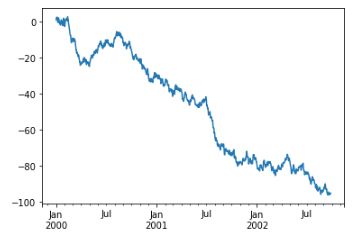
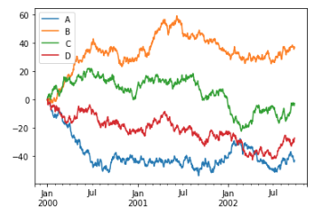

## Notes on Pandas

## Usar pandas para hacer un (inner) join

**tldr**: Usa la [función `merge` de pandas](https://pandas.pydata.org/docs/reference/api/pandas.DataFrame.merge.html)

Supongamos las siguientes tablas:

```python
pesos = pd.DataFrame.from_dict({
    'palabra': ['economia', 'educacion', 'turismo', 'videojuego'],
    'pesos': [.12, .33, .88, -0.73]
})
```

|   | palabra    | pesos |
|---|------------|------:|
| 0 | economia   | 0.12  |
| 1 | educacion  | 0.33  |
| 2 | turismo    | 0.88  |
| 3 | videojuego | -0.73 |


```python
muestra = pd.DataFrame.from_dict({
    'palabra': ['el', 'videojuego', 'del', 'gran', 'turismo', 'es', 'fantastico'],
    'total': [1, 1, 1, 1, 1, 1, 1]
})
```

|   | palabra    | total  |
|---|------------|-------:|
| 0 | el         | 1      |
| 1 | videojuego | 1      |
| 2 | del        | 1      |
| 3 | gran       | 1      |
| 4 | turismo    | 1      |
| 5 | es         | 1      |
| 6 | fantastico | 1      |


Podemos hacer un join usanndp la funcion `merge`. Los dos primeros parámetros
son obligatorios y son los dos _dataframes_ con los datos. Si la columna por la
que queremos hacer el _join_ se llama igual en ambos _dataframes_, podemos usar
el parámetro opcional `on`:

```python
pd.merge(pesos, muestra, on='palabra')
```

|   | palabra    | pesos  | total |
|---|------------|-------:|------:|
| 0 | turismo    |   0.88 |     1 |
| 1 | videojuego |  -0.73 |     1 |


¿Qué pasa si los nombres de las columnas no coinciden? Podemos usar los dos
parámetros opcionales `left_on` y `right_on`. Vamos a redefinir el _dataframe_
`muestra` para cmabiar el nombre de la columna de `palabra` a `termino`:


```python
muestra = pd.DataFrame.from_dict({
    'termino': ['el', 'videojuego', 'del', 'gran', 'turismo', 'es', 'fantastico'],
    'total': [1, 1, 1, 1, 1, 1, 1]
})
```

|   | termino    | total |
|---|------------|------:|
| 0 | el         | 1     |
| 1 | videojuego | 1     |
| 2 | del        | 1     |
| 3 | gran       | 1     |
| 4 | turismo    | 1     |
| 5 | es         | 1     |
| 6 | fantastico | 1     |


```python
pd.merge(pesos, muestra, left_on='palabra', right_on='termino')
```

|   | palabra    | pesos | termino    | total |
|---|------------|-------|------------|-------|
| 0 | turismo    |  0.88 | turismo    |     1 |
| 1 | videojuego | -0.73 | videojuego |     1 |


Fuente:

- [Joins in Pandas: Master the Different Types of Joins in Python](https://www.analyticsvidhya.com/blog/2020/02/joins-in-pandas-master-the-different-types-of-joins-in-python/)


### How to kwnow if a series has NaN values: The [hasnans]{.title-ref} method

Pandas offers a quick method to check if a given series contains any
nulls with hasnans attribute:

```python
series = pd.Series([2, 4, 6, "sadf", np.nan])
assert series.hasnans is True
```

## 25 Pandas functions

Fuente: <https://towardsdatascience.com/25-pandas-functions-you-didnt-know-existed-p-guarantee-0-8-1a05dcaad5d0>

## Cheatsheets

-   [Python](http://www.utc.fr/~jlaforet/Suppl/python-cheatsheets.pdf)
-   [Numpy](https://s3.amazonaws.com/assets.datacamp.com/blog_assets/Numpy_Python_Cheat_Sheet.pdf)
-   [Pandas](https://pandas.pydata.org/Pandas_Cheat_Sheet.pdf)

## How to create a pandas from a HTML Table

The basic usage is of pandas `read_html` is pretty simple and works well
on many Wikipedia pages since the tables are not complicated. To get
started, I am including some extra imports we will use for data cleaning
for more complicated examples:

```python
import pandas as pd
import numpy as np
import matplotlib.pyplot as plt
from unicodedata import normalize

table_MN = pd.read_html("https://en.wikipedia.org/wiki/Minnesota")
```

The unique point here is that `table_MN` is a list of all the tables on
the page:

```python
print(f"Total tables: {len(table_MN)}")
Total tables: 38
```

With **38** tables, it can be challenging to find the one you need. To make
the table selection easier, use the `match` parameter to select a subset
of tables. We can use the caption \"Election results from statewide
races\" to select the table:

```python
table_MN = pd.read_html(
    "https://en.wikipedia.org/wiki/Minnesota",
    match="Election results from statewide races"
)
assert len(table_MN) == 1
```

Source: [Reading HTML tables with Pandas - Practical Business](https://pbpython.com/pandas-html-table.html)

## How to create Pandas Dataframe

DataFrames can be created in multiple ways.

-   Creating Pandas DataFrame **from lists of lists**:

    ```python
    data = [['tom', 10], ['nick', 15], ['juli', 14]]
    df = pd.DataFrame(data, columns = ['Name', 'Age'])
    ```

-   Creating DataFrame **from dict of narray/lists**:

    To create DataFrame from dict of narray/list, all the narray must be of
    **same length**. If index is passed then the length index should be equal to
    the length of arrays. If no index is passed, then by default, index will be
    `range(n)` where `n` is the array length.

    ```python
    data = {'Name':['Tom', 'nick', 'krish', 'jack'], 'Age':[20, 21, 19, 18]} 
    df = pd.DataFrame(data) 
    ```

-   Creates a indexes DataFrame **using arrays**:

    ```python
    data = {'Name':['Tom', 'Jack', 'nick', 'juli'], 'marks':[99, 98, 95, 90]} 
    df = pd.DataFrame(data, index =['rank1', 'rank2', 'rank3', 'rank4']) 
    ```

-   Creating Dataframe **from list of dicts**:

    Pandas DataFrame can be created by passing lists of dictionaries as a input
    data. By default dictionary keys taken as columns.

    ```python
    data = [{'a': 1, 'b': 2, 'c':3}, {'a':10, 'b': 20, 'c': 30}] 
    df = pd.DataFrame(data)
    ```

-   Creating DataFrame **from Dicts of series**:

    To create DataFrame from Dicts of series, dictionary can be passed to form a
    DataFrame. The resultant index is the union of all the series of passed
    indexed.

    ```python
    d = {
        'one' : pd.Series([10, 20, 30, 40], index =['a', 'b', 'c', 'd']), 
        'two' : pd.Series([10, 20, 30, 40], index =['a', 'b', 'c', 'd'])
        } 
    df = pd.DataFrame(d) 
    ```

-   Load **from a csv** file:

    Just call method `load_csv`.

    ```python
    df = pd.read_csv('example.csv')
    ```

    It works with URLs also:

    ```python
    df = pd.read_csv('http://web.stanford.edu/class/archive/cs/cs109/cs109.1166/stuff/titanic.csv')
    ```

    If the cvs has no headers

    ```python
    df = pd.read_csv('example.csv', header=None)
    ```

- From a database query

    ```python
    db = MySQLdb.connect(host='localhost', db='comics', user='stan.lee, passwd='mske')
    df1 = pd.read_sql_query(sql, db, index_col='holding_id')
    ```

## How to change the size of the images made with matplotlib

Please try a simple code as following:

```python
from matplotlib import pyplot as plt
plt.figure(figsize=(1,1))
x = [1,2,3]
plt.plot(x, x)
plt.show()
```

You need to set the figure size before you plot.

## How to use a columnn as index

Pandas `set_index()` is a method to set a List, Series or Data frame as
an index of a Data Frame. The index object is an immutable array.
Indexing allows us to access a row or column using the label.

The syntax for Pandas Set Index is following.

DataFrame.set\_index(keys, drop=True, append=False, inplace=False,
verify\_integrity=False) Set the DataFrame index (row labels) using one
or more existing columns. By default yields the new object.

-   `keys`: Column name or list of a column name.
-   `drop`: It's a Boolean value which drops the column used for the
    index if True.
-   `append`: It appends the column to the existing index column if
    True.
-   `inplace`: It makes the changes in the DataFrame if True.
-   `verify_integrity`: It checks the new index column for duplicates if
    True.

We will use Real data which can be found on the following google doc
link.

    https://docs.google.com/spreadsheets/d/1zeeZQzFoHE2j_ZrqDkVJK9eF7OH1yvg75c8S-aBcxaU/edit#gid=0

Okay, now we will use the `read_csv()` method:

```python
data = pd.read_csv('data.csv', skiprows=4)
```

Remember that the index data is **immutable** and we can not be able to
change that in any circumstances.

## How to add a column to a Dataset

As of Pandas 0.16.0, you can also use assign, which assigns new columns
to a DataFrame and returns a new object (a copy) with all the original
columns in addition to the new ones.

```python
    df1 = df1.assign(e=e.values)

    d = pd.DataFrame({'a': [1, 2, 7], 'b': [3, 4, 21]})
    d = d.assign(suma=d['a']+d['b'])
    d = d.assign(media=d.suma/2)
```

gives:

| index  | a | b  | suma | media |
|-------:|--:|---:|-----:|------:|
|      0 | 1 |  3 |    4 |   2.0 |
|      1 | 2 |  4 |    6 |   3.0 |
|      2 | 7 | 21 |   28 |  14.0 |

## How to visualize data

We use the standard convention for referencing the matplotlib API:

```python
import matplotlib.pyplot as plt
plt.close('all')
```


## Cómo usar plot

The plot method on Series and DataFrame is just a simple wrapper around
plt.plot():

Example using series:

```python
ts = pd.Series(
    np.random.randn(1000),
    index=pd.date_range('1/1/2000', periods=1000),
    )
ts = ts.cumsum()
ts.plot()
```



En un _dataFrame_, el métdod `plot()` es una forma muy cómoda de representar todas las columndas 
con sus etiquetas:

```python
df = pd.DataFrame(
    np.random.randn(1000, 4),
    index=ts.index,
    columns=list('ABCD'),
    )
df = df.cumsum()
plt.figure()
df.plot()
```


