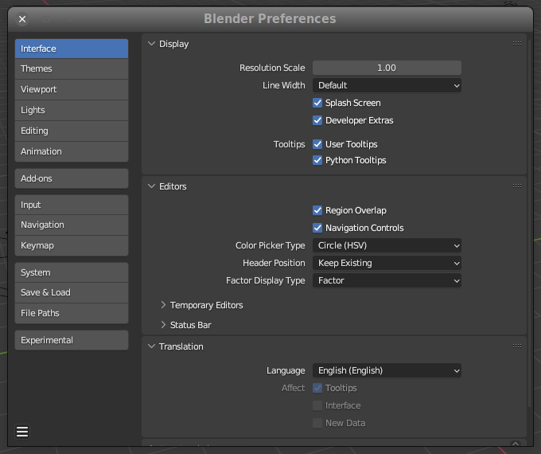

Blender
========================================================================

.. tags:: blender

Introducción a :index:`Blender`
------------------------------------------------------------------------

**Blender** es un programa informático multiplataforma, dedicado
especialmente al modelado, iluminación, renderizado, la animación y
creación de gráficos tridimensionales. También de composición digital
utilizando la técnica procesal de nodos, edición de vídeo, escultura
(incluye topología dinámica) y pintura digital.

Ajustes iniciales para desarrollar con Blender/Python
------------------------------------------------------------------------

Activar, en ``Preferencias`` -> ``Interfaz``, las opciones de
``Developer extra`` y ``Python tooltips``.

   Preferencias -> Interfaz

Con estos cambios conseguiremos varias ventajas:

-  Completado automático en la consola Python

-  Los controles muestran un *tooltip* con el nombre y parámetros de la
   función asociada.

-  Igualmente, los menús emergentes enlazan con la web de documentación
   de la API correspondiente.

Dónde encontrar ejemplos de Python/Blender
------------------------------------------------------------------------

Blender incorpora varios *scripts* útiles para aprender:

-  ``scripts/startup/bl_ui`` para intarfaz de usuario.

-  ``scripts/startup/bl_operators`` para operadores.

Como ejecutar código Python en Blender
------------------------------------------------------------------------

Las dos formas más habituales son o usar el editor incorporado, o
mediante la consola. Las dos son tipos de ventanas que podemos
seleccionar en cualquier espacio de Blender (Hay una configuración
predeterminada para desarrollo con estas ventanas ya activas en el
*workspace* ``Scripting``.

En el editor de texto podemos cargar ficheros ``.py`` o pegar el código
desde el porta papeles. La consola se usa habitualmente para pequeñas
pruebas o para consultar la documentación.

Otra forma posible es al invocar a Blender desde la línea de comandos.

Cómo aplicar la escala/desplazamiento/rotaciones de un objeto
------------------------------------------------------------------------

Antes de exportar un objeto, siempre es conveniente aplicar todas las
transformaciones realizadas en el objeto, de forma que tengamos una
figura limpia, con escala :math:`1`, sin rotaciones ni desplazamientos.
Para ello, con el objeto seleccionado, pulsamos ++ctrl+a++. En el menú
emergente podemos seleccionar que valores queremos aplicar, incluyendo
la opción de aplicarlos todos.

   Menú de aplicar transformaciones

Cómo invertir la selección en Blender
------------------------------------------------------------------------

Para invertir la selección podemos usar el atajo ++ctrl++i++.

Conceptos claves para usar Python en Blender
------------------------------------------------------------------------

Acceso a datos
~~~~~~~~~~~~~~

Se puede acceder desde Python a cualquier cosa que se pueda hacer con un
botón en Blender. El acceso a los datos de la escena actual se realiza
con el módulo ``bpy.data``. Algunos ejemplos:

En ``bpy.data.objects`` tenemos una colección de todos los objetos
definidos en la escena. Si estamos en la escena inicial que carga
Blender por defecto, tendremos tres objetos: El cubo, la cámara y una
luz.

.. code:: python

   >>> bpy.data.objects[0]
   bpy.data.objects['Camera']

   >>> bpy.data.objects[1]
   bpy.data.objects['Cube']

   >>> bpy.data.objects[2]
   bpy.data.objects['Light']

En ``bpy.data.scenes``, tenemos una colección de escenas. Si acabamos de
arrancar Blender, lo normal es que solo tengamos una escena, que será,
lógicamente, la activa.

.. code:: python

   >>> for s in bpy.data.scenes:
   ...     print(s)
   ...     
   <bpy_struct, Scene("Scene") at 0x7fcc93211008>

En ``bpy.data.materials`` tenemos todos los materiales definidos en la
escena.

.. code:: python

   >>> bpy.data.materials
   <bpy_collection[1], BlendDataMaterials>

Cómo unir dos vértices en uno solo
------------------------------------------------------------------------

Selecciona los vértices a unificar y pulsar :keys:`m` (:keys:`alt+m` en
versiones anteriores a la 2.8) y seleccionar entre las opciones que se
nos ofrecen: Las opciones **At First** y **At Last** unifican todos los
vértices en el primer o último seleccionado, respectivamente. Con **At
Center** todos los vértices se unifican en uno situado en el centro
geométrico de los seleccionados. **At cursor** hace lo mismo pero
unificando los vértices en la posición del cursor.

Si queremos unificar automáticamente los vértices que estén muy próximos
entre si (Dada una distancia mínima entre ellos) tenemos que, en modo
Edición, usar el menú *Mesh -> AutoMerge Editing*.

Fuente:

-  `Modeling - How to merge vertices in Blender? - Blender Stack
   Exchange <https://blender.stackexchange.com/questions/34037/how-to-merge-vertices-in-blender>`__

Como copiar los datos de animación desde un objeto a otro
------------------------------------------------------------------------

Primero, seleccionar el objeto que queremos animar, después seleccionar
el objeto cuya animación queremos copiar. Ahora, podemos usar un menú o
un atajo de teclado:

-  Usando el menú: Ir a *Object → Link/Transfer Data → Link Animation
   Data*. Los datos de la animación están ahora *enlazados*

-  El atajo de teclado: Pulsar ++ctrl+l++, y en el menú emergente,
   seleccionar *Link Animation Data*

Los datos de animación están *enlazados*, lo que significa que si
cambiamos la animación en uno de los objetos, los cambios se reflejan en
otro. Si no es esto lo que queremos, podemos copiar los datos de la
animación a ``Single User``: En el menú superior, seleccionar *Object →
Relations → Make Single User → Object Animation*. Ahora las dos
animaciones son diferentes y se pueden modificar una sin que afecte a la
otra.

Fuente:

-  `How to copy animation data from one object to another - Gachoki
   studios <https://gachokistudios.com/how-to-copy-animation-data-from-one-object-to-another-in-blender/>`__

How to use an array modifier to create individually manipulatable objects
------------------------------------------------------------------------

I often use an array modifier (or two) to quickly create a grid of
identical or symmetric objects, which can be really useful when modeling
all sorts of man-made objects. Once I've made the grid, though, is there
any way for me to make it so that each of the objects are individually
manipulatable?

Simply applying the modifier does not seem to be the full answer, since
it still only allows me to select the grid-of-objects as a whole in
object mode. Is there any way to separate them so I work with them each
individually?

This is the way:

1. Apply the modifier to make the data real

2. Enter edit mode on the object and press ``P`` (Separate by loose
   parts).

3. Select all separated objects and press
   ``Shift``\ +\ ``Ctrl``\ +\ ``Alt``\ +\ ``C`` (Origin to Geometry).

This will make each piece an individual object with the origin located
at the origin of the original object. Now you can manipulate them as you
wish.

Source: `StackExchange - How can I use an array modifier to create
individually manipulatable
objects? <https://blender.stackexchange.com/questions/109/how-can-i-use-an-array-modifier-to-create-individually-manipulatable-objects>`_

Cómo poner el cursor en el centro de masas de un objeto en Blender
------------------------------------------------------------------------

En modo edición, seleccionar todas las caras. Pulsar :keys:`shitft+s` y
seleccionar *cursor to selected*, esto pondrá el cursor en el centro de
masas de todas las caras selecionadas.

Otra forma, más sencilla:

Pulsar :keys:`shift+s` y luego :keys:`u`. Esto funciona tanto en modo objeto
como en modo edición.

Source: `Blender manual: 3D
Cursor <https://docs.blender.org/manual/en/dev/editors/3dview/3d_cursor.html?highlight=cursor#using-the-snap-menu>`_

Cómo poner el cursor en un vértice
------------------------------------------------------------------------

En modo de edición, seleccionar el vértice y pulsar ++shift+s++.
Seleccionar *Cursor to selected*.

Fuente: `How to move 3D cursor in Blender – And other tricks!
iMeshh <https://blog.imeshh.com/index.php/2022/08/15/how-to-move-3d-cursor-in-blender-and-other-tricks/>`_

Cómo hacer que la cámara de Blender se oriente hacia un objeto
------------------------------------------------------------------------

Para forzar a una cámara a seguir un objeto, selecciona la cámara y
añade un *constraint* de tipo *Track to*. Selecciona el objeto en el
campo *Target*, ``-Z`` en el campo *Field*, e ``Y`` en el campo *Up*.

La cámara ahora apuntará al objeto en todo momento, ya sea que se mueva
el objeto, la cámara o ambos.

Por eficiencia computacional, es recomendable hacer que la cámara apunte
a un *empty*, y usar este para guiar la cámara.

Cómo resetear la rotación, escala y/o translación de un objeto
------------------------------------------------------------------------

Con el objeto seleccionado, pulsar ++ctrl+a++ y elegir la opción
adecuada en el menú.

The simplest ways to do this are to either rotate the mesh in Edit Mode
or to rotate it in Object mode and then applying the rotation.

So you can either enter Edit mode, by pressing ++tab++, and then
rotating the mesh with ++r++; the reason this works is that, when
transforms are applied in edit mode, the object’s origin is not
affected.

The other possible solution is to press ++ctrl+c++ -> “Rotation”, which
will, essentially do the same as above, by rotating the mesh, but not
the object, and thus not the origin, and then resseting the origin’s
rotation.

Source:
https://blender.stackexchange.com/questions/33905/how-can-i-zero-an-objects-orientation-in-blender

Cómo usar la vista activa para definir la vista de la cámara
------------------------------------------------------------------------

tldr: ++ctrl+alt+0++

This feature allows you to position and orient the active camera to
match your current viewport.

Select a camera and then move around in the 3D View to a desired
position and direction for your camera (so that you are seeing what you
want the camera to see). Now press ++ctrl+alt+0++ and your selected
camera positions itself to match the view, and switches to camera view.

Source: `Blender Manuel: Camera
View <http://builder.openhmd.net/blender-hmd-viewport-temp/editors/3dview/navigate/camera_view.html>`__

Cómo crear un fondo de estrellas usando ruido
------------------------------------------------------------------------

First you need to jump over the the Node Editor view, then select Shader
Nodes and **World**. Also make sure **Use Nodes** is checked.

Then add a **Noise Texture node** and a **Color Ramp node**. Plug thgq}e
Fac of the noise texture into the Color Ramp, and the Color of the Color
Ramp into the Color of the default Background shader.

You can then adjust the Color Ramp and Noise Texture how you would like
to create the desired starry effect.

-  **Noise Texture Scale**. This controls the size and amount of stars.
   Higher scale means more, smaller stars; smaller scale means less,
   larger stars.

-  **Noise Texture Detail**. This will adjust the shape and variation in
   brightness in the stars. Higher value will mean more irregularly
   shaped stars, but there will be a greater variation in the brightness
   of the stars.

-  **Color Ramp Swatches**. Adjusting the color swatches on the Color
   Ramp will change the size and shape of the stars. The farther apart
   the swatches are the bigger and more irregularly shaped the stars
   will be.

This values are a good example:

-  Scale: 400

-  Detail: 4

-  Ramp color bwtween 0.7 and 0.9

.. figure:: ./blender/blender-noise.png
   :alt: Ajustes de blender para fondo de estrellas

   Ajustes de blender para fondo de estrellas

Cómo cambiar las unidades del sistema de medidas de Blender
------------------------------------------------------------------------

Hay que ir a *Scene Properties*, expandir la sección etiquetada *units*
y seleccionar el sistema el sistema de medidas que queramos. Por defecto
es el sistema métrico y la unidad en Blender equivale a un metro.

También podemos definir la unidad de medidas de rotación (Grados por
defecto), la unidad de masa (kilogramo), tiempo (Segundos) y
temperaturas (Grados Kelvin).

Atajos de teclado de Blender
------------------------------------------------------------------------

-  ++ctrl+z++ Deshacer la última acción

-  ++a++ Seleccionar todo

-  ++shift+a++ Añadir un *mesh*

-  ++x++ Borrar

-  ++ctrl+space++ : ampliar panel actual / volver a panel normal

Cambiar la vista en el *viewport*
~~~~~~~~~~~~~~~~~~~~~~~~~~~~~~~~~

-  ++1++ : vista frontal

-  ++3++ : vista lateral

-  ++7++ : vista superior

-  ++ctrl+7++ teclado numérico → Vista inferior

-  ++ctrl+1++ teclado numérico → Vista trasera

-  ++ctrl+3++ teclado numérico → Vista izquierda

-  ++0++ : vista de cámara

-  ++5++ : cambiar de perspectiva/ortográfica

-  ++shift+f++ : navegación vuelo/a pie

-  ++alt+F++ : vista del cursor

Mover el objeto seleccionado
~~~~~~~~~~~~~~~~~~~~~~~~~~~~

La tecla clave es ``G``, de *grab*.

-  ++g++ Mover el objeto libremente
-  ++g++ y ++x++ Mover en el eje :math:`x`
-  ++g++ y ++shift+x++ Mover en el plano perpendicular al eje :math:`x`,
   es decir, al plano :math:`z \times y`.
-  ++g++ e ++y++ Mover en el eje :math:`y`
-  ++g++ y ++shift+y++ Mover en el plano perpendicular al eje :math:`y`,
   es decir, al plano :math:`z \times x`.
-  ++g++ y ++z++ Mover en el eje :math:`z`
-  ++g++ y ++shift+z++ Mover en el plano perpendicular al eje :math:`z`,
   es decir, al plano :math:`y \times x`.

Cualquier comando de mover, si se añade un número, mueve ese número de
unidades. Por ejemplo, para mover un objeto :math:`3.2` unidades en el
eje :math:`z` haríamos: ++g++ ++z++ ++3++ ++period++ ++2++

Rotar el objeto seleccionado
~~~~~~~~~~~~~~~~~~~~~~~~~~~~

-  ++r++ Rotar libremente

-  ++r++ ++x++ Rotar alrededor del eje :math:`x`

-  ++r++ ++y++ Rotar alrededor del eje :math:`y`

-  ++r++ ++z++ Rotar alrededor del eje :math:`z`

Cualquier comando de rotar, si se añade un número, rota ese número de
grados. Por ejemplo, para mover un objeto :math:`45°` en el eje
:math:`y` haríamos: ++r++ ++y++ ++4++ ++5++

Escalar el objeto seleccionado
~~~~~~~~~~~~~~~~~~~~~~~~~~~~~~

-  ++s++ Escalar el objeto seleccionado
-  ++s++ y ++x++ Escalar el objeto seleccionado en el eje :math:`x`
-  ++s++ y ++shift+x++ Escalar el objeto seleccionado en el plano
   perpendicular al eje :math:`x` (es decir, :math:`z \times y`)
-  ++s++ y ++y++ Escalar el objeto seleccionado en el eje :math:`y`
-  ++s++ y ++shift+y++ Escalar el objeto seleccionado en el plano
   perpendicular al eje :math:`y` (es decir, :math:`x \times z`)
-  ++s++ y ++z++ Escalar el objeto seleccionado en el eje :math:`z`
-  ++s++ y ++shift+z++ Escalar el objeto seleccionado en el plano
   perpendicular al eje :math:`z` (es decir, :math:`x \times y`\ x
   :raw-latex:`\times `y$))

Cualquier comando de escalar, si se añade un número, escala por ese
número. Por ejemplo, para duplicar un objeto en el eje :math:`x` sería:
++s++ ++x++ ++2++.

Entrar en *Edit Mode*
~~~~~~~~~~~~~~~~~~~~~

-  ++tab++ Entrar en *edit Node*. Ahora estamos modificando
   individualmente los vertices (*vertexs*), bordes (*edges*) y caras
   (*faces*).

-  ++1++ Seleccionar vértices

-  ++2++ Seleccionar border

-  ++3++ Seleccionar caras

En modo de edición
~~~~~~~~~~~~~~~~~~

-  ++ctrl+r++ Crear un nuevo borde
-  ++ctrl+r++ y mouse wheel Crear una serie de bordes
-  ++ctrl+e++ Subdividir cara

Acciones con el ratón
------------------------------------------------------------------------

En la vista 3D:

-  ++middle-button++ y movimiento: Rotar la cámara alrededor del centro
-  ++shift+middle-button++ y movimiento: Desplazamiento lateral o
   vertical
-  Mouse wheel -> zoom
-  ++ctrl++ y mouse arriba o abajo: zoom

Operaciones en modo edición
~~~~~~~~~~~~~~~~~~~~~~~~~~~

++k++ : cuchillo (*knife*) ++f++ : crear cara y/o arista ++alt+m++ :
fusionar vértices (*merge*) ++alt+s++ : encoger / ensanchar (cambiar
volumen de la malla) ++y++ : dividir selección ++v++ : recortar
selección ++p++ : separar selección de objeto ++ctrl+m++ : reflejar
++w++ : menú de acciones especiales ++ctrl+e++ : menú de edición de
aristas (*edges*) ++ctrl+f++ : menú de edición de caras ++ctrl+v++ :
menú de edición de vértices ++ctrl+n++ : recalcular normales ++delete++
o ++x++ : menú de borrado ++u++ : desenvolver (unwrap)

Fuentes:

-  `140 shortcuts esenciales de Blender 3D \|
   Domestika <https://www.domestika.org/es/blog/7434-140-shortcuts-esenciales-de-blender-3d>`__

Cómo hacer un efecto tipo Interfaz de Iron Man
------------------------------------------------------------------------

-  Grabar un croma con el individuo

-  Hacer *track* del ojo, o de los dos ojos, si queremos

-  | Añadir los elementos del interfaz, con una restricción o
     *Constraint*
   | de tipo *copy location*, limitada a los ejes ``X`` e ``Y``. El
     ``Z`` queda libre para que podamos situar los elementos de la
     interfaz a diferentes alturas y así obtener un mejor efecto de
     perspectiva.

Fuentes:

-  `Futuristic HUD Part 1 - Blender Tutorial -
   YouTube <https://www.youtube.com/watch?v=QFJESgclikQ>`_

-  `Futuristic HUD Part 2 - Blender Tutorial -
   YouTube <https://www.youtube.com/watch?v=Q3kDiTXUU-s>`_

-  `Futuristic HUD Part 3 - Blender Tutorial -
   YouTube <https://www.youtube.com/watch?v=RwDXp4BFl9c>`_

Cómo hacer niebla dinámica usando un *Volumetric Cube*
------------------------------------------------------------------------

Tldr: Se cubre la escena con un cubo lo suficientemente grande como para
contenerla en su totalidad, cambiamos la densidad dentro del cubo usando
una textura, para que no sea una densidad uniforme. Esto hace que
parezca una niebla. Luego, ajustando los parámetros, podemos hacer que
se mueva.

1. **Añadimos el cubo**

Añadimos el cubo con ``Add`` > ``Mesh`` > ``Cube``. Incrementamos su
tamaño para que abarque toda la escena, cambiando su escala, por
ejemplo.

En principio el cubo no nos dejará ver la escena, podemos pulsar
++alt+z++ (Activar transparencia),

Cambia la pantalla de *3d Viewport* a *Shading*. Esta pantalla tiene dos
ventanas, una es una vista de presentación 3D, como en el espacio de
trabajo normal, y la otra es el *shader editor*, que se usa para aplicar
texturas y materiales a un modelo.

Selecciona el cubo y añade y un nuevo material. Normalmente este
material sera de tipo superficial *surface*, y necesitamos que sea
volumétrico. Borramos el *Principled BSDF* que pone por defecto y
añadimos un *Principled Volume* pulsando ``Add`` > ``Shader`` >
``Principled Volume``. Conectamos el nuevo nodo a la entrada *Volume*
del nodo *Material Output*.

Si activamos ahora la vista *Rendered* deberíamos poder ver el efecto en
forma de una niebla muy densa.

2. **Cambiamos la densidad para que no sea uniforma (Añadir ruido)**

Para cambiar la densidad de nuestra niebla, añadiremos una textura
dinámica, y controlaremos la densidad que queremos usando un nodo
``ColorRamp``.

We want the scene to have a fog like effect, to do this, we are going to
have some parts of the volume have higher density than the others. This
can be done using a texture. To adjust the density of the fog we will
use a ColorRamp node.

Add a ColorRamp node by clicking Add > Converter > ColorRamp. Connect
the Color output to the Density input of the Principled Volume node.

We will add a Noise texture, click Add > Texture > Noise Texture.
Connect the Color output to the Fac Input of the ColorRamp.

You will now see some patches of the fog on your screen. You may scale
the texture appropriately using the Scale parameter on the Noise
Texture.

Note that, to adjust the density of the fog, you will need to use color
ramp. The black color represents the number 0 which means no fog. while
the white presents the number 1, means thick fog.

You will need to adjust the slider of the both colors to achieve the
desired result. You may also add more colors that are between black and
white.

3. **Animating the fog**

To animate the fog, we will need to define a coordinate system and then
move it. We are going to add two nodes for both of these.

Add a *Mapping node* by clicking ``Add`` > ``Vector`` > ``Mapping``.
Conmect Vector output to the Vector input of the *Noise Texture*. This
node will be used for animating.

Add a *Texture Coordinate* node by clicking ``Add`` > ``Input`` >
``Texture Coordinate``. This node will define the coordinate type. We
will use ``Generated``. It generates coordinates without deforming mesh
or the texture. Connect Generated output to the Vector input of the
Mapping node.

Switch to the Animation tab from the ribbon. There will be two 3D
Viewports there, change one to the Shader Editor. We are going to use
Timeline to animate. For this tutorial, we have animated only upto 100
frames. But, the number can be increased.

Select the mapping node, and press Right Mouse Button on the X parameter
under Location of the mapping node. A menu will pop up, click Insert
Single Keyframe. We have inserted a keyframe thus, the value is stored
on this particular keyframe. Now, drag the Timeline cursor to the end
frame (in this case,100), and change the X location to 0.1 m, and then
again insert a keyframe by pressing ``Right Mouse Button``.

-  Sources:

   -  `Make Volumetric fog animation in Blender using Eevee - Part
      1 <https://usamababar.com/make-volumetric-fog-animation-in-blender-using-eevee/>`__
   -  `Make Volumetric fog animation in Blender using Eevee - Part
      2 <https://usamababar.com/make-volumetric-fog-animation-in-blender-using-eevee/2/>`__

Cómo hacer un croma en Blender
------------------------------------------------------------------------

Resumen:

-  Grabar con un fondo verde que cubra, si no toda, la mayoria de la
   acción.

-  Crear una mascara para el resto de lo que quede fuera del croma, si
   lo hubiera.

-  Usar el compositer

Esta todoo explicado en la fuente:

Fuente: https://www.youtube.com/watch?v=deUyhukYzwI

Distintos usos del compositor
------------------------------------------------------------------------

- Eliminar ruido (Denoise)
- Añadir efectos de brillos (Glare)
- Ajustar brillo, tono, saturación, ajustes de color
- Blanco y negro
- Marcas de agua (Watermarks)
- Reemplazar fondos
- Mascaras

Fuente: https://www.youtube.com/watch?v=8x2qfWNHedM

Blender API
------------------------------------------------------------------------

La API de Blender en Python permite hacer:

-  Editar cualquier dato que se pueda editar desde la interfaz de
   usuario (Escenas, modelos, partículas, etc.)

-  Modificar preferencias de usuarios, asignaciones de teclas y temas

-  Ejecutar utilidades con ajustes personalizados

-  Crear elementos de la interfaz de usuario, como menús, cabeceras y
   paneles

-  Crear nuevas herramientas

-  Crear herramientas interactivas

-  Crear nuevos motores de renderizado que se integren con Blender.

-  Subscribirse a cambios en datos y propiedades

-  Definir nuevos ajustes

-  Dibujar en el *Viewport*

Ajustes recomendados:

En preferencias -> *Interface* -> Display, habilitar *Developer extras*
y *python tooltips*.

Cómo copiar los modificadores de un objeto en otro
------------------------------------------------------------------------

Seleccionar el objeto sin modificadores, y luego con ++ctrl++ pulsado
seleccionar el objeto con los modificadores que queremos copiar. Pulsar
++ctrl+l++ y seleccionar ``Copy modifiers``.

Fuente: `Copy modifiers FAST in
Blender <https://youtube.com/shorts/vXG6m5lTeJk?si=CQI3T2ysm6ho1YlI>`__
