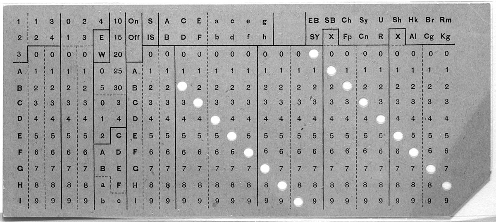

Databases
=======================================================================

Qué son las bases de datos
-----------------------------------------------------------------------

El término **base de datos** ha sido utilizado para referirse a muchas
cosas (En algunos casos, incluso, para cosas que claramente no son bases
de datos, cómo por ejemplo un simple fichero de nombres y teléfonos),
por lo que hay múltiples definiciones del término.

Además, los distintos proveedores de :term:`DBMS` (*Data Base Management
System*) han desarrollado diferentes arquitecturas, por lo que no todas
las bases de datos están diseñadas de la misma manera.

A falta de una definición absoluta y consensuada, vamos a utilizar la
siguiente: Una base de datos es **una colección de datos estructurados,
que se organiza y almacena de forma que se facilita la recuperación,
manejo y gestión de los mismos**.

Antecedentes históricos
------------------------------------------------------------------------

Los datos han sido almacenados de forma digital desde haca ya mucho
tiempo. `Herman Hollerith`_ inventó el sistema de tarjetas perforadas
para procesar el censo de los Estados Unidos de América en 1890. Las
tarjetas perforadas fueron usadas durante los siguientes 65 años como
sistema de almacenamiento de datos, hasta que fueron reemplazados 
durante la década de los 50 por las cintas magnéticas y, un poco más
tarde,por los primeros discos duros.

Hasta ese momento, los datos eran almacenados secuencialmente en una
cinta, y estaban dedicados en exclusiva para una sola aplicación. Un
sistema de control de inventario de la época podía funcionar, por
ejemplo, leyendo periódicamente los datos, quizá una vez por semana, se
realizaban los cambio oportunos y luego se grababan los datos
actualizados nuevamente en la cinta.

La llegada de los discos duros, con el IBM RAMAC en 1956, provocó un
impacto enorme en la forma en que los datos se almacenaban y procesaban.
Ya no era necesario procesar los datos secuencialmente, ya que los
discos duros permiten el acceso a los datos en cualquier orden (Las
iniciales RAMAC son las iniciales en inglés de Sistema de Contabilidad
con Memoria de Acceso Aleatorio (*Random Access Memory ACcounting
System*). Esto llevo a nuevos esfuerzos de innovación en lo referido
a la organización de los datos en el disco.

Durante la década siguiente, en los años 60 del pasado siglo, un equipo
de ingenieros que trabajan para la NASA desarrollaron un sistema,
pensado inicialmente para ser usado en el `programa Apolo`_, que
almacenada y recuperaba la información desde un disco duro. El sistema,
llamado *Information Management System* (`IMS`_), pronto demostró ser
útil también fuera del programa espacial, y fue puesto a disposición de
los usuarios de los sistemas IBM en 1969. Este programa organizaba la
información en el disco en forma de un **sistema jerárquico de
registros** "padres" e "hijos".

Más o menos al mismo tiempo, en la empresa *General Electric*, uno de
sus empleados, `Charles Bachman`_, estaba trabajando en un sistema
llamado `Integrated Data Store` (IDS) con el mismo objetivo de recuperar
y almacenar información. Como el sistema IMS, IDS almacenaba los datos
en disco en forma de registros y conexiones entre los mismos. Los
usuarios podían recuperar la información usando estas conexiones,
siguiendo las rutas que llevaban de un registro a otro. Pero a
diferencia de IMS, este sistema no exigía que los registros estuvieran
organizadas en forma jerárquica, sino que permitía organizaciones en
forma de red, de mayor complejidad.

Mientras trabaja en su sistema, Bachman tuvo una revelación muy
importante. Si los datos almacenados en el disco se podían acceder en
cualquier orden, no había en realidad necesidad de que el sistema
estuviera dedicado en exclusiva a una única aplicación. Se podía crear
un nuevo nivel de abstracción, situado sobre el nivel del sistema
operativo, que gestionara y manejara los datos para diferentes
aplicaciones. Llamó a esta nueva capa de abstracción "*Database
management system*". 

Este nuevo *sistema de gestión de bases de datos* podía a la vez
eliminar redundancias y hacer los datos más consistentes entre las
aplicaciones. Ofrecía además otras ventajas: podría proporcionar control
de acceso a los datos a diferentes tipos de usuarios. Aprovechando la
centralidad de este sistema, se facilitaban también las copias de
seguridad, la seguridad de las transacciones y la seguridad de que las
actividades de múltiples usuarios no interfirieran entre si.

Estos dos sistemas definieron los primeros sistemas de bases de datos,
IMS a las bases de datos jerárquicas e IDS a las sistemas de bases de
datos en red. (Charlie Bachman recibió el premio ACM A.M. Turing por
este y otros trabajos en 1973).

El lenguaje de programación COBOL, orientado a aplicaciones de negocios,
había sido diseñado por una organización conocida como *Conference on
Data System Languages* (CODASYL). A finales de los 60, se creo un grupo
de trabajo, llamado *Data Base Task Group* (DBTG), con el objetivo de
definir un lenguaje estándar para las aplicaciones de bases de datos,
que pudiera ser embebido en COBOL. Bachman formaba parte de este grupo,
por lo que sus ideas influyeron decisivamente en el mismo.

Por otro lado, `Edgar Frank «Ted» Codd`_, un científico informático
inglés, había estado trabajando en su modelo *relacional* de base de
datos en IBM. En una publicación de 1970, "Un modelo relacional de datos
para grandes bancos de datos compartidos" (*A Relational Model of Data
for Large Shared Data Banks*) definía un modelo fuertemente matemático,
en el que se introdujeron conceptos fundamentales como independencia de
datos, normalización, el propio concepto de *relación* se definía como
un subconjunto del producto cartesiano de un conjunto de dominios.

También introdujo la idea de que era posible usar el cálculo de
predicados de primer orden como una forma ideal de estimar la potencia
de futuros lenguajes de consulta, y definió un conjunto de operadores,
mas tarde conocidos como "Álgebra relacional".

Muchos investigadores y empresas del momento no prestaron mucha atención
a este enfoque, considerándolo como un documento de interés teórico,
alejado de los requerimientos prácticos de la industria. La idea
consistía en construir un compilador que tradujera de forma óptima desde
las descripciones de alto nivel de las consultas, a un plan de ejecución
que produjera los resultados buscados. Algunos expertos se mostraron
escépticos de que se consiguiera un nivel de traducción lo
suficientemente bueno como para competir con el que podría producir un
programador humano. Las ventajas del sistema relacional eran evidentes,
pero había dudas acerca de si sería posible conseguir un rendimiento
aceptable para bases de datos masivas y con múltiples usuarios.

En 1973, la división de investigación de IBM decidió a crear un
nuevo proyecto en sus oficinas de San Jose, en California, donde estaba
trabajando Ted Codd. El proyecto, más tarde bautizado "System R",
consistía en crear un prototipo de gestor de base de datos relacional.

Más o menos al mismo tiempo, en la Universidad de Berkeley, bajo el
liderazgo de los profesores `Michael Stonebraker`_ y `Gene Wong`_, se
estaba desarrollando el sistema INGRES, una abreviatura de *INteractive
Graphics and REtrieval System*. Como *System R*, INGRES intentaba
explorar las posibilidades de la tecnología de bases de datos
relacionales y demostrar su uso práctico, incluso en sistemas en
producción. Los fondos del proyecto provenian de diferentes agencias
federales, incluyendo la NSF (*National Sciente Foundation*). A lo largo
de su vida activa, el proyecto realizo numerosas invetigaciones y
experimentos prácticos, formando a dos docenas de estucantes de la
Universidad queluego ocuparon posiciones de cierta incluencia en la
creciente industria de las bases de datos.
 

El Modelo Relacional
------------------------------------------------------------------------

La idea principal de un sistema relacional reside en que toda la
información se representa mediante valores de datos, nunca mediante
conexiones explícitas entre registros. Las consultas se formulan en un
lenguaje descriptivo de alto nivel basado únicamente en los valores de
los datos. Un compilador optimizador traduce cada consulta en un plan
eficiente, utilizando mecanismos de acceso subyacentes a dichos valores
(índices B-tree, tablas *hash*, algoritmos de unión por ordenación y
fusión, etc.).

Estos mecanismo son invisibles para los usuarios. De hecho, se pretende
que se puedan modificar e incluso añadirse otros nuevos sin afectar a
las aplicaciones existentes (salvo, posiblemente, mejorando el
rendimiento). Esta es básicamente la misma idea que se encuentra en los
lenguajes de programación de alto nivel.

Tanto el grupo System R como el grupo INGRES tenían objetivos
ambiciosos. Tuvieron que desarrollar técnicas de software para
implementar datos relacionales sobre un sistema operativo (VM/CMS en el
caso de System R; Unix en el caso de INGRES). También tuvieron que
diseñar una interfaz de usuario, incluyendo un lenguaje de consulta
relacional, y construir un compilador optimizador para traducir dicho
lenguaje de consulta en planes de ejecución eficientes.

Ambos grupos operaban en entornos que fomentaban la asistencia de sus
miembros a conferencias, el intercambio de experiencias con colegas
(incluidos entre ellos) y la publicación de artículos en la literatura
técnica abierta. Este entorno colaborativo abierto resultó crucial para
el impacto que ambos proyectos tendrían en la industria del software. A
lo largo de su existencia, System R e INGRES publicaron cada uno más de
40 artículos técnicos. En 1988, System R e INGRES recibieron
conjuntamente el Premio ACM al Sistema de Software por sus
contribuciones a la tecnología de bases de datos relacionales.

Two more facts about SIGFIDET 1974 may be worth mentioning. The first is
that, after this meeting, the participants in the Special Interest Group
realized that what they were doing was managing data, and changed the
name of the group to SIGMOD, the Special Interest Group on Management of
Data. SIGMOD continues to hold annual meetings, which are among the most
widely respected conferences in the field of data management. The second
fact is that, hidden on page 249 of the Proceedings of SIGFIDET 1974 was
a short paper by Don Chamberlin and Ray Boyce, titled “SEQUEL: A
Structured English Query Language”.

En ese *paper* se describen varios objetivos que se desean para este
nuevo lenguaje:

    Our specific goals were to design a query language with the
    following properties:

    - El lenguaje debe ser declarativo (no procedimental) y debe basarse
      on los conpectos relacionales de Codd.

    - The language should be framed in familiar English keywords, with
      no jargon or special symbols, and easy to type on a keyboard.

    - In addition to the usual relational operations of selection,
      projection, and join, the language should provide a way to
      partition a table into groups and apply aggregating functions such
      as SUM or AVERAGE to the groups.

    -  Queries should resemble natural language to the extent that a
      user with no specialized training could, in simple cases,
      understand the meaning of a query simply by reading it. We called
      this the “walk-up-and-read” property.

    We called this language SEQUEL, an acronym for “Structured English
    Query Language.” 

As the System R project matured, the SEQUEL language continued to
evolve. A 1976 paper titled SEQUEL 27 extended the query syntax to cover
insert, delete, and update operations; view definitions; integrity
assertions; and triggered actions. The language defined in that paper
would be immediately recognized by database developers working today. In
1977, the SEQUEL name was shortened to SQL, an acronym for “Structured
Query Language.”

En 1977, los fundadores de una pequeña empresa llamada *Software
Development Laboratories* (SDL) se interesaron en estos artículos sobre
el System R, incluyendo las especificaciones de SQL publicadas entre
1974 y 1976. Asumieron (correctamente) que IBM intentaría liberar un
producto comercial basado en *mainframes*, por lo que apostaron por
sacar un producto compatible, que se ejecutara sobre plataformas más
económica. Llamaron a este producto **Oracle**, inicialmente pensado
para ser ejecutado sobre los miniordenadores DEC PDP-11. El código
fuente se escribió en el entonces novedoso lenguaje C, lo que facilitó
el portarlo a otros sistemas. De esta forma, La base de datos Oracle, la
primera base de datos comercial con una implementación completa de SQL,
salió al mercado en 1979. Disponible también para los populares sistema
VAX de DEC, Oracle fue un éxito inmediato. Cinco años más tarde, la
empresa cambió oficialmente su nombre de SDL a Oracle.

The INGRES project at UC Berkeley also produced an experimental
prototype and distributed it freely to other universities and research
labs. By 1978, INGRES had about 300 installations and had become the de
facto standard for use in university classes on database management. In
1980, the leaders of the INGRES project spun off a commercial company,
funded by venture capital and initially named Relational Technology Inc.
(RTI), which had its own management and technical staff that was
independent of the university. This enabled the INGRES project at the
university to continue its focus on research issues of academic
interest. The first task for RTI was to port the INGRES code from Unix
to run on the DEC VAX platform. The resulting commercial product was
released in 1981, supporting a query language called QUEL. RDI changed
its name to Ingres Corporation in 1989.

IBM was not in a hurry to release a relational database system on its
strategic mainframes to compete with its successful IMS database
product. But IBM’s mid-range platform, a competitor to DEC VAX, needed a
database system to compete with Oracle and INGRES. It took IBM about two
years to turn the System R prototype into a commercial product running
on the VSE and VM operating systems. This product, called SQL/DS, was
released in 1981, at about the same time as INGRES but two years behind
Oracle.

IBM finalmente lanzó su producto de base de datos relacional para MVS,
su plataforma estratégica de *mainframes*. El producto, llamado **DB2**,
se lanzó de forma limitada en 1983 y estuvo disponible para el público
general al año siguiente. Para entonces, Oracle ya había consolidado una
posición dominante en la industria de las bases de datos relacionales.

Another significant development came from the National Institute of
Standards and Technology (NIST). Unlike ANSI, which is a voluntary
association of private companies, NIST is a branch of the federal
government. In 1992, NIST published a Federal Information Processing
Standard, called FIPS-127,19 which specified the requirements for
relational database systems to be purchased by the U.S. government.

FIPS-127 was essentially identical to the ANSI SQL standard that was
current at the time (SQL:1992 Entry Level). Most importantly, NIST
created a test suite of several hundred test cases, and offered a
service of testing systems for conformance to FIPS-127. About a dozen
companies had their SQL products certified under FIPS-127 and became
eligible to sell them to the federal government. Naturally, this was a
big help in marketing these products.

The H2 committee’s strategy of tying standards closely to commercial
products proved to be successful. Over several decades, H2 provided a
mechanism for the controlled evolution of SQL to meet changing
requirements. Under the guidance of H2, the SQL standard has grown to
include referential integrity, outer joins, date and time datatypes,
OLAP features, window functions, recursive queries, stored procedures,
constraints and triggers, and many more features.

Los sistemas de bases de datos relacionales estaban atrayendo tanta
atención en los años 80 que Codd publicó una lista, conocida como la
lista de las 12 reglas (Aunque eran 13 en realidad, numeradas del 0 al
12) que definían su interpretación de lo que realmente puede ser llamado
un auténtico sistema relacional. La más importante de estas reglas, la
llamada Regla de la información, declaraba que "Toda la información
almacenada en una base de datos relacional debe representarse
explícitamente en el nivel lógico y únicamente de la siguiente manera:
mediante valores en filas y columnas dentro de tablas".

Open source.

The mid-1990s saw some game-changing developments in the database industry. Three open-source SQL implementations became available for free: MySQL, PostgreSQL, and SQLite. For companies developing new Web applications, these systems offered a compelling business model.

MySQL
~~~~~~~~~~~~~~~~~~~~~~~~~~~~~~~~~~~~~~~~~~~~~~~~~~~~~~~~~~~~~~~~~~~~~~~~

MySQL (https://mysql.com), developed by Michael Widenius and David
Axmark, was first released in 1995 by the Swedish company MySQL AB.
MySQL soon became popular as part of the LAMP stack (Linux, Apache,
MySQL, and PHP) for developing Web applications. It now has an active
installed base of 5 million users. In 2008, MySQL was acquired by Sun
Microsystems, which in turn was acquired by Oracle in 2010.

At the time of the Oracle acquisition, a copy of MySQL was separated
from the Oracle version and is being maintained independently by Michael
Widenius and some of the other original MySQL developers under the name
MariaDB (https://mariadb.org). MariaDB is promised to be open-source
forever and is now evolving separately from MySQL. MySQL and MariaDB are
named after Widenius’ two daughters, My and Maria.

PostgreSQL
~~~~~~~~~~~~~~~~~~~~~~~~~~~~~~~~~~~~~~~~~~~~~~~~~~~~~~~~~~~~~~~~~~~~~~~~

PostgreSQL (https://postgresql.org) is derived from POSTGRES, the
successor to the INGRES project at U.C. Berkeley. As a research project,
POSTGRES focused on an extensible type system. When the research project
ended, the POSTGRES code continued to be maintained by a volunteer
organization called the PostgreSQL Global Development Group. Its first
SQL-based version was released in 1997. PostgreSQL is the most fully
featured and most complex of the open-source SQL implementations. For
their work on POSTGRES, Michael Stonebraker and Larry Rowe received the
SIGMOD Systems Award in 2015.

SQLite
~~~~~~~~~~~~~~~~~~~~~~~~~~~~~~~~~~~~~~~~~~~~~~~~~~~~~~~~~~~~~~~~~~~~~~~~

SQLite (https://sqlite.org), designed by Richard Hipp, was first
released in 2000. Unlike MySQL and PostgreSQL, SQLite is not a
client-server system in which the server runs as a separate process.
Instead, SQLite is a library of C-language functions that can be called
directly from application code and run in the application process.
SQLite claims to be the most widely deployed database system in the
world. It is embedded (invisibly) in every Apple or Android smartphone;
every Mac or Windows computer; every Firefox, Chrome, or Safari browser;
and countless well-known applications. For designing SQLite, Richard
Hipp received the SIGMOD Systems Award in 2017.

Falta

* Cálculo relacional

In his early papers, Codd had described two relational query languages;
a “relational algebra” consisting of operators like “projection” and
“join”; and a “Relational Calculus,” based on first-order logic. Codd’s
papers proved that these two languages were equivalent in their
expressive power.

* Álgebra Relacional

* Normalización de  base de datos
  * 1 FM

  Primera forma normal
  ~~~~~~~~~~~~~~~~~~~~~~~~~~~~~~~~~~~~~~~~~~~~~~~~~~~~~~~~~~~~~~~~~~~~~~~~

  Una relación (tabla) está en primera forma si:

  * Todos los atributos **son atómicos**. Un atributo es atómico si los
    elementos del dominio son simples e indivisibles.

  * No debe existir variación en el número de columnas.

  * Los campos no clave deben identificarse por la clave (dependencia
    funcional).

  * Debe existir una independencia del orden tanto de las filas como de
    las columnas; es decir, si los datos cambian de orden no deben
    cambiar sus significados.

  Esta forma normal elimina los valores repetidos dentro de una base de
  datos. 

  Segunda Forma Normal (2FN)
  ~~~~~~~~~~~~~~~~~~~~~~~~~~~~~~~~~~~~~~~~~~~~~~~~~~~~~~~~~~~~~~~~~~~~~~~~

  Para entender la segunda forma normal, nos ayudará definir un
  concepto conocido como **Dependencia Funcional**. 

  Una relación está en 2FN si:

  * Está en primera forma normal

  * los atributos que **no** forman parte de ninguna clave, dependen de
    forma completa de la clave principal. Es decir, que no existen
    dependencias parciales. Todos los atributos que no son clave
    principal deben depender únicamente de la clave principal.

  En otras palabras, podríamos decir que la segunda forma normal está
  basada en el concepto de dependencia completamente funcional. Una
  dependencia funcional x → y {\displaystyle x\rightarrow y} es
  completamente funcional si al eliminar los atributos A de X significa
  que la dependencia no es mantenida, esto es que A ∈ X , X − { A } ↛ Y
  {\displaystyle A\in X,X-\{A\}\nrightarrow Y}. Una dependencia
  funcional x → y {\displaystyle x\rightarrow y} es una dependencia
  parcial si hay algunos atributos A ∈ X {\displaystyle A\in X} que
  pueden ser eliminados de X y la dependencia todavía se mantiene, esto
  es A ∈ X , X − { A } → Y {\displaystyle A\in X,X-\{A\}\rightarrow Y}.

  Por ejemplo {DNI, ID_PROYECTO} → {\displaystyle \rightarrow }
  HORAS_TRABAJO (con el DNI de un empleado y el ID de un proyecto
  sabemos cuántas horas de trabajo por semana trabaja un empleado en
  dicho proyecto) es completamente funcional dado que ni DNI →
  {\displaystyle \rightarrow } HORAS_TRABAJO ni ID_PROYECTO →
  {\displaystyle \rightarrow } HORAS_TRABAJO mantienen la dependencia.
  Sin embargo {DNI, ID_PROYECTO} → {\displaystyle \rightarrow }
  NOMBRE_EMPLEADO es parcialmente dependiente dado que DNI →
  {\displaystyle \rightarrow } NOMBRE_EMPLEADO mantiene la dependencia.
  * 3 Fn *   

Forma Normal de Boyce-Codd (FNBC)
~~~~~~~~~~~~~~~~~~~~~~~~~~~~~~~~~~~~~~~~~~~~~~~~~~~~~~~~~~~~~~~~~~~~~~~~

La **Forma Normal de Boyce-Codd** (FNBC) es una forma normal utilizada
en la normalización de bases de datos. Es una versión ligeramente más
fuerte de la Tercera forma normal (3FN). La forma normal de Boyce-Codd
requiere que no existan dependencias funcionales no triviales de los
atributos que no sean un conjunto de la clave candidata.

En una tabla en 3FN, todos los atributos dependen de una clave, de la
clave completa y de ninguna otra cosa excepto de la clave (excluyendo
dependencias triviales, como A → A. Se dice que una tabla está en FNBC
si y solo si está en 3FN y cada dependencia funcional no trivial tiene
una clave candidata como determinante. En términos menos formales, una
tabla está en FNBC si está en 3FN y los únicos determinantes son
claves candidatas.

Una forma sencilla de comprobar si una relación se encuentra en FNBC
consiste en comprobar, además de que esté en 3FN, lo siguiente:

(1) Si no existen claves candidatas compuestas (con varios atributos),
está en FNBC.

(2) Si existen varias claves candidatas compuestas y éstas tienen un
elemento común, puede no estar en FNBC. Solo si, para cada dependencia
funcional en la relación, el determinante es una clave candidata, estará
en FNBC.

Transacciones
~~~~~~~~~~~~~~~~~~~~~~~~~~~~~~~~~~~~~~~~~~~~~~~~~~~~~~~~~~~~~~~~~~~~~~~~

ACID
~~~~~~~~~~~~~~~~~~~~~~~~~~~~~~~~~~~~~~~~~~~~~~~~~~~~~~~~~~~~~~~~~~~~~~~~

NoSQL
-----------------------------------------------------------------------

En la actualidad, muchos avances interesantes en la gestión de bases de
datos forman parte de un movimiento conocido como :index:`NoSQL`. Tal y
como los describió `Rick Cattell`_ en 2010 , los sistemas *NoSQL*
se caracterizan por su capacidad para escalar horizontalmente un gran
volumen de transacciones simples en múltiples servidores. Estas
capacidades están motivadas por las aplicaciones web, en las que miles o
millones de usuarios realizan lecturas y actualizaciones relativamente
sencillas de datos compartidos.

Los sistemas *NoSQL* logran sus objetivos de baja latencia, alto
rendimiento y alta disponibilidad al flexibilizar una o más de las
limitaciones de los sistemas relacionales convencionales. Por ejemplo:

* Las bases de datos relacionales tienen esquemas rígidos que definen su
  estructura. Los sistemas *NoSQL* pueden tener esquemas flexibles o
  parciales, o incluso carecer de esquemas.

* Los sistemas relacionales suelen tener transacciones que ofrecen
  ciertas garantías, incluidas las conocidas propiedades ACID. Los
  sistemas *NoSQL* pueden hacer ciertas concesiones en la semántica de
  las transacciones. Por ejemplo, una actualización de información
  replicada en varios nodos puede tardar un poco en propagarse a todos
  ellos. En algunos casos esto puede ser asumible.

* Los sistemas relacionales suelen implementar el lenguaje SQL completo.
  Los sistemas *NoSQL* pueden admitir interfaces de usuario más
  sencillas que omiten algunas de las operaciones más complejas y
  costosas, como las uniones y la agrupación. La interfaz de usuario
  puede parecerse más a una API que a un lenguaje de consulta.

* El modelo de datos relacional consiste en tablas planas y homogéneas.
  Los sistemas *NoSQL* a veces se basan en otros modelos de datos. Si
  almacenan tablas, pueden permitir que estas tablas se aniden. O pueden
  usar algún formato orientado a documentos, como XML o JSON, para
  almacenar documentos. O incluso pueden ser algo muy simple, como un
  almacén de clave-valor.

Un sistema *NoSQL* probablemente incluirá un subconjunto de estas
restricciones. En consecuencia, el término NoSQL abarca una variedad de
sistemas diferentes y representa un área activa de investigación y
desarrollo.

Cabe destacar que no todas las características de NoSQL mencionadas
anteriormente están relacionadas con los lenguajes de consulta. Un
sistema con un esquema flexible y consistencia eventual, por ejemplo,
aún podría tener un lenguaje de consulta de alto nivel.  Por eso, a
veces se interpreta *NoSQL* como **No Solo SQL**.

Diagramas de Entidad/Relacion
-----------------------------------------------------------------------

Fuentes:

https://www.red-gate.com/blog/chen-erd-notation/

.. _Charles Bachman: https://es.wikipedia.org/wiki/Charles_Bachman
.. _Edgar Frank «Ted» Codd: https://es.wikipedia.org/wiki/Edgar_Frank_Codd
.. _Herman Hollerith: https://es.wikipedia.org/wiki/Herman_Hollerith
.. _IMS: https://es.wikipedia.org/wiki/IMS_(IBM)
.. _Michael Stonebraker: https://es.wikipedia.org/wiki/Michael_Stonebraker
.. _programa Apolo: https://es.wikipedia.org/wiki/Programa_Apolo
.. _Rick Cattell: https://cattell.net/vita/index.html

