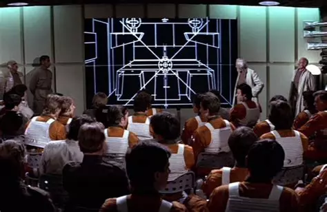
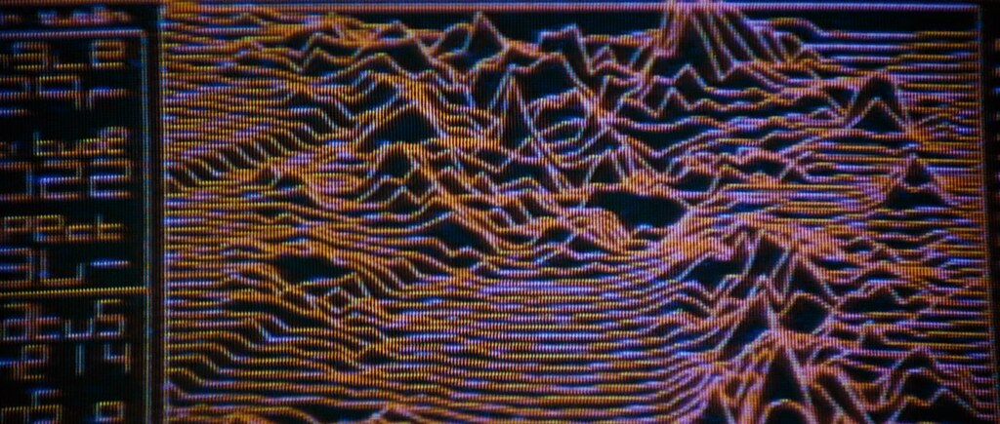

Game development
========================================================================

Libros sobre desarrollo de juegos
---------------------------------

-  **The Art of Game Design**, de Jesse Schell.

-  **Designing games**, de Tynan Sylvester.

-  **Situational Game Design**, de Brian Upton.

-  **Sid Meier’s Memoir!: A Life in Computer Games**, de Sid Meier

-  `Amazon UK <https://www.amazon.co.uk/gp/product/039386829X/>`__

-  **Procedural Generation in Game Design**, por Tanya Short (*Kitfox
Games*) y Tarn Adams (*Dwarf Fortress*)

-  **Masters Of Doom: How two guys created an empire and transformed pop
culture**, por David Kushner

-  **Video Game Writing: From Macro to Micro**, por Maurice Suckling,

-  **A Playful Production Process**, por Richard Lemarchand,

-  **Doom Guy: Life in First Person**, por John Romero.

-  **LevelUp!**, por Scott Rogers for game design

-  **The Gamer’s Brain: How Neuroscience and -X Can Impact Video Game
Design**, por Celia Hodent

- *Game Programming Patterns*, por Bob Nystrom

- *Theory of Fun for Game Design*, por Raph Koster

- *Godot from Zero to Proficiency (5 books)*, por Patrick Felicia

- *Advanced Game Design* by Michael Sellers.

- *Achievement Relocked: Loss Aversion and Game Design* by Geoffrey
  Engelstein.

- *Game Balance* by Ian Schreiber, Brenda Romero.

Fuentes:

- `Books for Game Designers`_ / `Playtank`_

Reality check
-------------

-  https://www.gamespot.com/shows/reality-check/

Halcyon DAys
~~~~~~~~~~~~

Interviews with classic computer and video game programmers

-  `Halcyon Days <http://www.dadgum.com/halcyon/index.html>`__

How do bullets work in games
----------------------------

-  https://www.gamespot.com/videos/how-do-bullets-work-in-games/2300-6448382/

Drawing Lines is Hard
---------------------

Drawing lines might not sound like rocket science, but it’s damn
difficult to do well in OpenGL, particularly WebGL. Here I explore a few
different techniques for 2D and 3D line rendering, and accompany each
with a small canvas demo.

Fuente: https://mattdesl.svbtle.com/drawing-lines-is-hard

Crafting Stylised Mouse Trails With OGL
---------------------------------------

Source:
https://tympanus.net/codrops/2019/09/24/crafting-stylised-mouse-trails-with-ogl/

Checkio
-------

CheckIO - online game for Python and JavaScript coders

-  `CheckIO <https://checkio.org/>`__

Empire of Code
--------------

Space strategy game where coding is your extra weapon

-  `Empire of Code <https://empireofcode.com/game/>`__

A Brief, Early History of Computer Graphics in Film
~~~~~~~~~~~~~~~~~~~~~~~~~~~~~~~~~~~~~~~~~~~~~~~~~~~

A menudo se atribuye a `John Whitney`_, conocido por haber inventado
la técnica *split-scan*, que produjo las poderosas imágenes del monolito
de `2001\: Una odisea en el Espacio`_ , el haber usado por primera vez
ordenadores en la industria del cine. Empezó experimentando con
ordenadores analógicos, excedentes de la guerra, que habían sido usados
para el control de armas antiaéreas, para controlar el movimiento de la
cámara.

A finales de los años cincuenta y sesenta, produjo una serie de
animaciones cortas y anuncios de televisión. Continuó trabajando con
ordenadores, siempre buscando crear movimientos armónicos basados en
algoritmos, produciendo algunos imágenes muy atractivas de mándalas en
una serie de animaciones cortas a lo largo de los años setenta y
ochenta.

El pionero de Internet `Ivan Sutherland`_, en su tesis para el MIT de 1962, 
titulada *Sketchpad: A Man-machine Graphical Communications System*,
inventó el **Sketchpad**, el primer interfaz gráfico de usuario.
La Universidad de Utah y el Instituto de Tecnología de Nueva York
produjeron una generación de investigadores de gráficos por 
ordenador y técnicas que ayudado a dar forma al campo.

El primer largometraje en utilizar procesamiento digital de imágenes fue
`Westworld`_, de 1973, el mismo año que la primera conferencia de
`SIGGRAPH`_. John Whitney y `Gary Demos`_, de *Information International
Inc*. (III, también conocido como "Triple I") produjeron versiones
pixeladas y procesadas digitalmente de secuencias usadas para retratar
el punto de vista del androide. El mismo grupo utilizó la composición
digital para materializar personajes sobre un fondo en la secuela de
1976, `Futureworld`_. Estos esfuerzos fueron reconocidos con un Premio
de la Academia de Ciencia e Ingeniería en 1994

.. _Star Wars: https://en.wikipedia.org/wiki/Star_Wars
.. _2001\: Una odisea en el Espacio: https://www.imdb.com/es-es/title/tt0062622/
.. _John Whitney: https://es.wikipedia.org/wiki/John_Whitney
.. _Ivan Sutherland: https://es.wikipedia.org/wiki/Ivan_Sutherland
.. _Larry Cuba: https://en.wikipedia.org/wiki/Larry_Cuba
.. _Books for Game Designers: https://playtank.io/2022/05/18/books-for-game-designers/
.. _Playtank: https://playtank.io/
.. _Scanimate: https://en.wikipedia.org/wiki/Scanimate
.. _EVL: https://en.wikipedia.org/wiki/Electronic_Visualization_Laboratory
.. _Alien: https://es.wikipedia.org/wiki/Alien:_el_octavo_pasajero

En `Star Wars`_, de 1977, se usaron probablemente por primera vez
gráficos en 3D determinadas tomas, en forma de gráficos vectoriales (Es
decir, con modelos "de alambre", no sólidos) . `Larry Cuba`_, en lo que
entonces se llamaba el *Circle Graphicas Habitat* (ahora el Laboratorio
de Visualización Electrónica o `EVL`_) de la Universidad de Illinois en
Chicago, creó una vista 3D de las trincheras de la Estrella de la
Muerte, utilizada para entrenar a los pilotos rebeldes. Esta película
también presentó un raro ejemplo de gráficos de computadora 3D
analógicos: una imagen muy breve en falso color de la Estrella de la
Muerte emergiendo de detrás de un planeta, creada con el sistema
`Scanimate`_.

In 1979 la película `Alien_`, de Ridley Scott hizo un uso limitado, pero
efectivo, de gráficos por computadora en 3D, también en forma de
gráficos vectoriales o de estructura alámbrica. La empresa *Systems
Simulation Ltd.*, de Londres, creó una secuencia de monitorización por
computadora que mostraba un sobrevuelo del terreno, renderizando
montañas generadas por computadora como imágenes de estructura
alámbrica, con eliminación de líneas ocultas.

The first feature film to use shaded 3D computer graphics imagery,
rendered in the style used today, was 1981’s Looker. Polygonal models
obtained by digitizing a human body were used to render the effects,
which were again created at III. After working on the effects for
Looker, John Whitney Jr. and Gary Demos were instrumental in the
pitching and preproduction of the next big CGI film, Tron, but left III
before its production to form Digital Productions.

The film many people associate with the (difficult) birth of Hollywood
computer graphics is Disney’s Tron, released in 1982. The effects for
Tron were created by a number of fledgling production facilities: III,
Magi Synthavision, Digital Effects (of New York), and Robert Abel and
Associates. Despite its intriguing and attractive imagery, the poor
critical and public response to Tron, as a film, together with some
delays and difficulties during production, put a chill on the CGI
industry that probably slowed its growth for a time. Indeed, most of the
CGI production companies involved in Tron are no longer in business and
none are currently involved in computer graphics production. All of
these companies produced television commercials for a time during the
1980s, and Gary Demos, while still at III, produced some unused and
seldom seen but impressive test footage of an X-wing fighter for Star
Wars.

The polyhedron character, “Bit”, in Tron is probably the first CGI
“character”, though it was deliberately designed to have a sufficiently
limited range of controls and animation that it is debatable whether
this work qualifies as true character animation.

In 1982 Paramount released Star Trek II: The Wrath of Khan, which
contained a one minute CGI sequence depicting a simulation of the birth
of a planet (the “Genesis Effect”), created by Pixar, a LucasFilm
spin-off that would go on to produce Oscar-winning computer graphics in
the years to come. The Genesis Effect made the first onscreen use of a
particle rendering system to achieve its fiery effects.

In all of the films to this point, computer graphics had been used to
portray... computer graphics. Throughout its early years in Hollywood,
sophisticated CGI of the day was used to show what computers of the
future might look like, whether from the outside, as in the monitor
displays of Alien and Khan, or, as in Tron, from the “inside”.

In 1984 Digital Productions created the first photorealistic computer
graphic images for a feature film, The Last Starfighter, using a Cray
X-MP supercomputer. Here the computer images were integrated with live
action as realistic scene elements, rather than as monitor graphics or
computer-generated imagery. Instead of the film industry’s traditional
models and miniatures, computer graphics were used to create all the
spaceships, planets, and high-tech hardware in the film. Also at Digital
Productions: Larry Yaeger and Craig Upson combined computational fluid
dynamics with CGI, for the first time, to create the planet Jupiter in
2010 (1984); Larry Yaeger and Bill Kroyer designed, animated, and
technical directed the flying owl in the award-winning opening title
sequence of Labyrinth (1986); and Bill Kroyer animated Mick Jagger’s
“Hard Woman” rock video (1986). Digital Productions also created a
string of Clio award-winning television commercials during the 1980s,
and produced some impressive test footage for a few special projects,
including Dune (1984) and Star Trek: The Next Generation, prior to its
television premiere in 1987. Digital film scanning and compositing work
at Digital Productions was also subsequently recognized with a
Scientific & Engineering Academy Award in 1995.

Digital Productions was purchased, along with Robert Abel & Associates,
by Omnibus Computer Graphics in 1986, and all three organizations closed
their doors in 1987. Omnibus Computer Graphics also produced the
silvery, reflective spaceship for Flight of the Navigator (1986).

In 1984, musical group Dire Straits came out with a classic rock video
for their song, “Money for Nothing”, featuring a low-detail, but very
engaging animated CGI character, animated by Ian Pearson, Gavin Blair,
and David Throssell at a London-based company called Rushes.

In 1985 Pixar produced what is arguably the first CGI character
animation in a feature film–the stained-glass-window-come-to-life effect
for Young Sherlock Holmes (the primary contender being the simple
polyhedron character, Bit, in Tron). Unlike their Genesis Effect, Pixar
used more traditional rendering and texture-mapping techniques in this
film. In the early days, however, Pixar was probably better known for
their John Lasseter-directed series of short subjects, including the
Oscar-nominated “Luxo, Jr.,” (1986) and the Oscar-winning “Tin Toy”
(1988). With John Lasseter directing, Pixar also went on to produce the
first all-CGI animated film, the Oscar-nominated Toy Story (1995).

ILM/LucasFilm produced some unique special effects for The Abyss (1989)
and Terminator 2 (1991). Though used quite differently in these two
films, both sets of effects were based on traditional rendering
techniques coupled with methods for dynamically warping the shapes of 3D
objects and 2D images known as morphing (ILM actually first showed its
image morphing techniques in the less commercially successful Willow
(1988)). The firm has also created television commercials and music
videos using these techniques, and further popularized CGI effects for
film in the Jurassic Park films (1993, 1997).

Other computer graphics production for television commercials has been
done by the now-defunct Cranston-Csuri Productions, its successor
MetroLight Studios, the Robert Abel spin-off Rhythm and Hues, and the
oldest surviving (and still thriving) computer graphics production
house, Pacific Data Images. DeGraf/Wahrman, a Digital Productions
spin-off, produced effects for the film version of The Jetsons (1990).
In addition, the dropping prices of graphics workstations and the
growing capabilities of microprocessor-based systems have given rise to
smaller independent production houses such as Homer and Associates, and
Kleiser-Walczak, as well as some in-house production at various film
studios.

Computer graphics has also given a behind-the-scenes assist to
traditional animation in film, going back to Disney’s The Black Hole
(1979), in most Disney films since The Great Mouse Detective (1986), and
in Kroyer Films’ FernGully: The Last Rainforest (1992). Disney brought
computer graphics back in front of the camera to provide the ballroom
interior scenes for Beauty and the Beast (1991).

Though far from an exhaustive list of all computer graphics effects for
film, I believe this summary does hit, and accurately date, most of the
early landmarks.

Soerce: `Westword <https://en.wikipedia.org/wiki/Westworld_(film)>`__

Algebra lineal (Vectores y matrices)
------------------------------------

Math for Game Programmers 05 – Vector Cheat Sheet
~~~~~~~~~~~~~~~~~~~~~~~~~~~~~~~~~~~~~~~~~~~~~~~~~

Complete list of basic vector operations

Strictly speaking, a point is not a vector – but a vector can be used to
represent the distance from the origin (0, 0) to the point, and so, it
is perfectly reasonable to just use vectors to represent positions as if
they were points.

I expect the class to give you access to each of the components, and to
the following operations (using C++ style notation, including operator
overloading – but it should be easy to translate to any other language
of your choice). If a given operation is not available, you can still do
it manually, either by extending the class or creating a “VectorUtils”
class. The examples below are usually for 2D vectors – but 3D is usually
simply a matter of adding the z coordinate following the pattern of x
and y.

-  ``Vector2f operator+(Vector2f vec)``: Returns the sum of the two
vectors. (In a language without operator overloading, this will
probably be called ``add()``. Similarly for the next few ones.)

.. code:: cpp

a + b = Vector2f(a.x + b.x, a.y + b.y);

-  ``Vector2f operator-(Vector2f vec)``: Returns the difference between
the two vectors.

.. code:: cpp

a – b = Vector2f(a.x – b.x, a.y – b.y);

-  ``Vector2f operator*(Vector2f vec)``: Returns the component-wise
multiplication of the vectors.

.. code:: cpp

a * b = Vector2f(a.x * b.x, a.y * b.y);

-  ``Vector2f operator/(Vector2f vec)``: Returns the component-wise
division of the vectors.

.. code:: cpp

a / b = Vector2f(a.x / b.x, a.y / b.y);

-  ``Vector2f operator*(float scalar)``: Returns the vector with all
components multiplied by the scalar parameter.

.. code:: cpp

a * s = Vector2f(a.x * s, a.y * s);
s * a = Vector2f(a.x * s, a.y * s);

-  ``Vector2f operator/(float scalar)``: Returns the vector with all
components divided by the scalar parameter.

.. code:: cpp

a / s = Vector2f(a.x / s, a.y / s);

-  ``float dot(Vector2f vec)``: Returns the dot product between the two
vectors.

.. code:: cpp

a.dot(b) = a.x * b.x + a.y * b.y;

-  ``float cross(Vector2f vec)``: (2D case) Returns the z component of
the cross product of the two vectors augmented to 3D.

.. code:: cpp

a.cross(b) = a.x * b.y – a.y * b.x;

-  ``Vector3f cross(Vector3f vec)``: (3D case) Returns the cross product
of the two vectors.

.. code:: cpp

a.cross(b) = Vector3f(a.y * b.z – a.z * b.y, a.z*b.x – a.x*b.z, a.x*b.y – a.y*b.x);

-  ``float length()``: Returns the length of the vector.

.. code:: cpp

a.length() = sqrt(a.x * a.x + a.y * a.y);

-  ``float squaredLength()``: Returns the square of the length of the
vector. Useful when you just want to compare two vectors to see which
is longest, as this avoids computing square roots

.. code:: cpp

a.squaredLength() = a.x * a.x + a.y * a.y;

-  ``float unit()``: Returns a vector pointing on the same direction,
but with a length of 1.

.. code:: cpp

a.unit() = a / a.length();

-  ``Vector2f turnLeft()``: Returns the vector rotated 90 degrees left.
Useful for computing normals. (Assumes that y axis points up,
otherwise this is turnRight)

.. code:: cpp

a.turnLeft = Vector2f(-a.y, a.x);

-  ``Vector2f turnRight()``: Returns the vector rotated 90 degrees
right. Useful for computing normals. (Assumes that y axis points up,
otherwise this is turnLeft)

.. code:: cpp

a.turnRight = Vector2f(a.y, -a.x);

-  ``Vector2f rotate(float angle)``: Rotates the vector by the specified
angle. This is an extremely useful operation, though it is rarely
found in Vector classes. Equivalent to multiplying by the 2×2
rotation matrix.

.. code:: cpp

a.rotate(angle) = Vector2f(a.x * cos(angle) – a.y * sin(angle), a.x * sin(angle) + a.y * cos(angle));

-  ``float angle()``: Returns the angle that the vector points to.

.. code:: cpp

a.angle() = atan2(a.y, a.x);

See the source for a lot of operations you can do with this operators.
For example:

Case #01 – **Distance between two points**

You probably know that this is done with the Pythagorean theorem, but
the vectorial way is simpler. Given two vectors ``a`` and ``b``:

.. code:: cpp

float distance = (a-b).length();

or:

Case #07 – **Determining if the angle between two vectors is less than
alpha**

We know that the angle between two vectors ``a`` and ``b`` will be less
than ``alpha`` if the dot product between their unit vectors is less
than cosine of ``alpha``.

.. code:: cpp

bool isLessThanAlpha(Vector2f a, Vector2f b, float alpha) {
return a.unit().dot(b.unit()) < cos(alpha);
}

Source: `Math for Game Programmers 05 – Vector Cheat
Sheet <http://higherorderfun.com/blog/2012/06/03/math-for-game-programmers-05-vector-cheat-sheet/>`__
