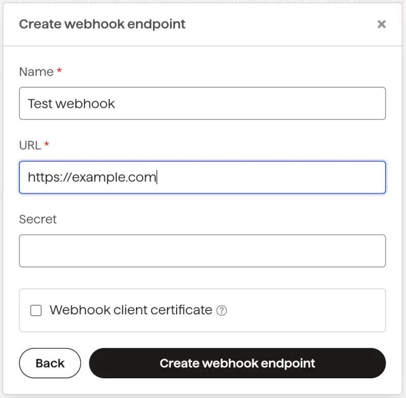

gocardless
========================================================================

Qué es GoCardlss
----------------

`GoCardless <https://developer.gocardless.com/getting-started/introduction>`__
es una plataforma de pagos en línea destinada a empresas que está
fundamentalmente enfocada en la gestión de cobros recurrentes y
puntuales a través de domiciliación bancaria.

Fundada en 2011 en Reino Unido por unos estudiantes de la Universidad de
Oxford, GoCardless se ha convertido en uno de los actores principales en
su sector, tanto en su país de origen como internacionalmente en países
como España, habiendo sido implantado en pequeñas, grandes empresas y
multinacionales.

Qué es Direct Debit
-------------------

**Direct Debit** es un sistema de pagos automática que permite realizar
pagos desde una cuenta bancaria, sin necesidad de tarjetas de crédito.
La API de GoCardless es un *wrapper* sobre diferentes sistemas de
*Direct Debit* en el Reino Unido, la Eurozona, Suecia, Dinamarca,
Australia, Nueva Zelanda, Canadá y los EEUU, lo que permite realizar
pagos un cualquier de estos países con una única integración.

Como realizar un pago con GoCardless
------------------------------------

Hay tres fases principales en la integración con la API - Su puede
elegir realizar una, dos o todas las fases.

-  **Autorizar el pago**

Los clientes autorizan una operación (Meidante la verificación *open
banking*, obligatoria para *Direct Debit*), dando permiso para que el
pago pueda ser solicitado.

-  **Cobro**

Se realiza el cobro bajo la autorización otorgada anteriormente.
GoCardless permite realizar tanto cobros únicos como recurrentes.

-  **Actualización mediante webhooks**

Podemos mantenernos al día con la confirmación de los pagos
pendientes y realizar reconciliaciones.

!!! note annotate “Reconciliaciones bancarias”

::

La **conciliación bancaria** es un procedimiento contable cuyo
objetivo es asegurar que los saldos y las transacciones registradas
en los libros empresariales coinciden con los datos proporcionados
por el banco. Es decir, es el proceso para cotejar y comparar la
información financiera del negocio con sus correspondientes datos
bancarios, lo que permite identificar discrepancias, errores u
omisiones en los registros contables y tomar medidas correctivas.

Este proceso implica comparar y revisar los extractos bancarios con
los registros contables de la compañía, como los propios libros de
contabilidad de la empresa e incluso facturas y otros documentos
financieros. Por ello, es una práctica a adoptar por cualquier
emprendedor en su startup.  Alongside the API, you’ll have access to
the GoCardless Dashboard which you can also use to manage your
account.

Además de la API, se puede acceder al panel de control de GoCardless,
que se puede usar también para gestionar la cuenta. Esto significa que
podríamos, por ejemplo, añadir los datos de los clientes mediante una
integración con la API, pero realizar el cobro manualmente desde el
panel de mando o *dashboard*.

Cómo hacer la primera petición a la API de GoCardless
-----------------------------------------------------

Existen librerías para Python (Y otros lenguajes, Java, Ruby, PHP,
JavaScript, .NET y Go). Las instalamos con:

.. code:: shell

pip install gocardless_pro

!!! note annotate “También se pueden usar las APIs solo con REST”

::

También se puede usar la API como una [RESTful
API](https://en.wikipedia.org/wiki/REST) sin necesidad de ninguna
librería adicional. Ver la [documentación de la
API](https://developer.gocardless.com/api-reference) si estás
interesado.

Para poder usar la API, lo primero que necesitamos es un **Token de
acceso** (*Access token*). GoCardless proporciona un entorno de
*Sandbox* ideal para aprender. `Crea una cuenta en el
Sandbox <https://manage-sandbox.gocardless.com/signup>`__ si no la has
creado ya. Crea un token de acceso, asegurandote de darle accessos de
lectura y escritura. Con esto ya dispuesto, podemos realizar nuestra
primera llamada a la API:

.. code:: python

import os
import gocardless_pro

client = gocardless_pro.Client(
# We recommend storing your access token in an
# environment variable for security
access_token=os.environ['GC_ACCESS_TOKEN'],
# Change this to 'live' when you are ready to go live.
environment='sandbox'
)

Ahora podemos ver si todo está funcionando correctamente realizando una
llamada para obtener un listado de todos nuestros clientes:

.. code:: python

var customers = await client.customers.list().records
print(f"Clientes ({len(customers}})")
for customer in customers:
print(customer.email)

Como añadir un cliente con GoCardless
-------------------------------------

Vamos a añadir a nuestro primer cliente y configurar un nuevo pago por
*Direct Debit*. Pero antes algunas definiciones previas:

-  Un **cliente** (*customer*) es una persona o empresa que quiere
realizarnos un pago a nosotros.

-  Una **mandato** u **orden de domiciliación** (*mandate*) es una
autorización realizada por un cliente que permite realizar un cobro
en su cuenta bancaria. Una vez que tenemos un mandato, se puede
cargar al cliente con una futura llamada a la API. Un cliente puede
tener múltiples mandatos, pero lo normal es tener solo uno por
cliente.

Un pago con *Instant Bank* es un pago único realizado mediante *open
banking*. Puede ir vinculado con un mandato para realizar un cobro
inicial y una suscripción, o bien ser usado de forma independiente.

Mantenerse informado mediante webhooks
--------------------------------------

Un *webhook* es una solicitud que realizará GoCardless a nuestro
servidor para informarnos de un evento. Si añadimos soporte para
*webhooks*, podremos obtener notificaciones en tiempo real y reaccionar
de la forma oportuna. Por ejemplo:

-  Si un pago falla debido a una flata de fondos, reintentarla de forma
automática.

-  Cuando un cliente cancela su mandato en el banco, dar de de baja al
usuario.

-  Cuando una suscripción de un cliente genera un nuevo pago, se puede
registrar dicho pago asociado a la cuenta del usuario.

Para empezar a recibir *webhooks*, es necesario añadir una URL
*endpoint* en el panel de control. Tiene que ser una conexión ``https``.

:alt: Añadir *webkook*

Añadir *webkook*

LOs *webhooks* deben aceptar una solicitud ``POST`` con un cuerpo en
``JSON``, como el siguiente:

.. code:: js

POST https://example.com/webhooks HTTP/1.1
User-Agent: gocardless-webhook-service/1.1
Content-Type: application/json
Webhook-Signature: 78e3507f61f141046969c73653402cb50b714f04322da04d766ee0f6d2afe65f

{
"events": [
{
"id": "EV123",
"created_at": "2014-08-04T12:00:00.000Z",
"action": "cancelled",
"resource_type": "mandates",
"links": {
"mandate": "MD123",
"organisation": "OR123"
},
"details": {
"origin": "bank",
"cause": "bank_account_disabled",
"description": "Your customer closed their bank account.",
"scheme": "bacs",
"reason_code": "ADDACS-B"
}
}
]
}
