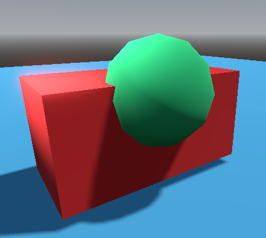
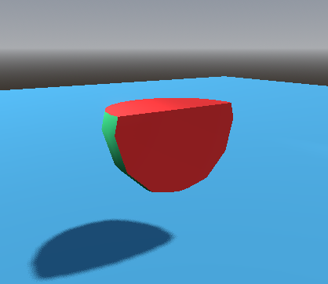
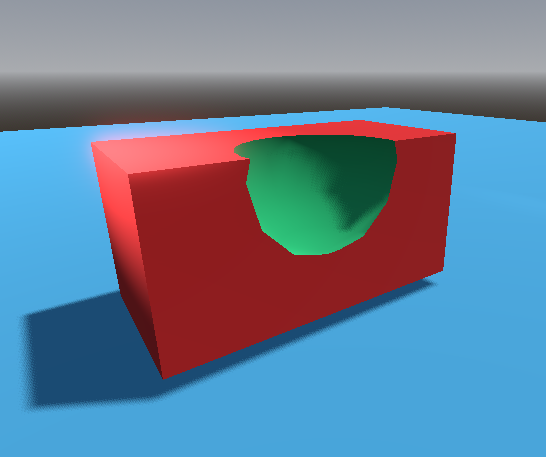

Godot Engine CSG (*Constructive Solid Geometry*)
========================================================================

Creación de prototipos con CSG en Godot
------------------------------------------------------------------------

El acrónimo **CSG** viene de la traducción al inglés de Geometría Sólida
Constructiva (`Constructive solid geometry`_). Es una herramienta para
combinar formas básicas o mallas personalizadas para obtener formas más
complejas. En el software de modelado 3D, CSG es conocido principalmente
como "Operadores Booleanos".

La creación de prototipos a nivel es uno de los principales usos de CSG en
Godot. Esta técnica permite a los usuarios crear las formas más comunes
mediante la combinación de primitivas. Los ambientes interiores se pueden
crear mediante el uso de primitivas invertidas.

.. warning::

   Los nodos CSG en Godot están pensados principalmente para prototipos.
   No tiene soporte para mapas UV, ni para editar polígonos 3D

Los nodos CSG viene en distintas variedades:

- ``CSGBox3D``

- ``CSGCylinder3D`` (Para cilindros y también para conos)

- ``CSGSphere3D``

- ``CSGTorus3D``

- ``CSGPolygon3D``

- ``CSGMesh3D``

- ``CSGCombiner3D``

Todos ellos soportan tres tipos de operaciones booleanas:

- **Union**

   Ejemplo de uso de la operación **Unión**. 

- **Intersección**

   Ejemplo de uso de la operación **Intersección**. 

- **Diferencia**

   Ejemplo de uso de la operación **Diferencia**. 

.. _Constructive solid geometry: https://en.wikipedia.org/wiki/Constructive_solid_geometry
