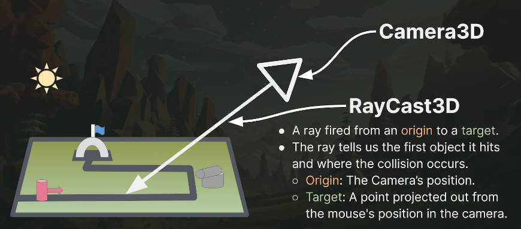
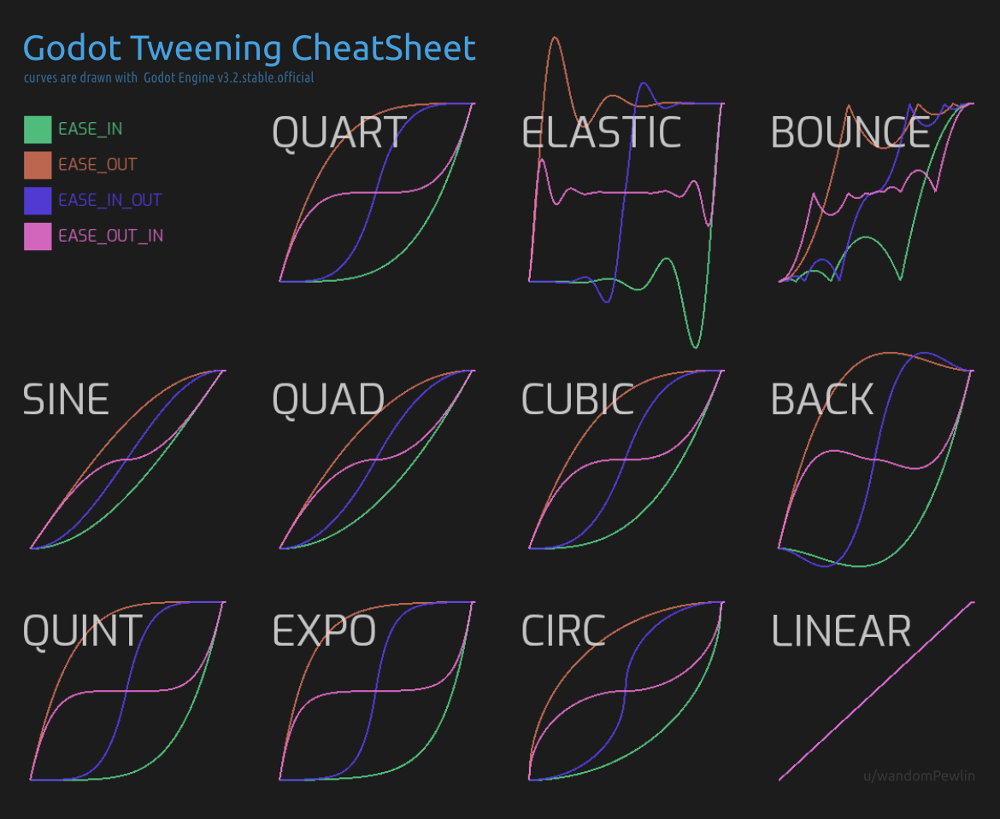

Godot
========================================================================

.. tags:: godot, game development, framework, ide

.. contents:: Relación de contenidos
    :depth: 3

.. index:: single:Godot
Sobre Godot
------------------------------------------------------------------------

**Godot** es un motor de vídeo juegos 2D y 3D multiplataforma, libre y
de código abierto, publicado bajo la Licencia MIT y desarrollado por la
comunidad de Godot. El motor funciona en sistemas Windows, OS/X, Linux y
BSD. Permite exportar los vídeo juegos creados a PC (Windows, OS X y
Linux), teléfonos móviles (Android, iOS), y HTML5.

En Godot se puede programar en varios lenguajes, pero el recomendado
para empezar es **GDScript**, que es un lenguaje con una gran influencia
de **Python**, y con una fuerte integración con el motor.

Godot es si está escrito en **C++**, y es posible escribir extensiones
en este lenguaje para conseguir aun más rendimiento y control del motor,
pero en general esto no es necesario, especialmente al principio.


.. _Object:
Qué es :index:`Object`, la base de la jerarquía de objetos de Godot
------------------------------------------------------------------------

**Object** es la clase base para todas las demás clases del motor.
Es Un tipo ``Variant`` avanzado. Cada clase puede definir nuevas
propiedades, métodos o señales, disponibles para todas las clases que
heredan de ella. Por ejemplo, una instancia de `Sprite2D`_ puede llamar a
``Node.add_child()`` porque hereda de ``Node``.

Puedes crear nuevas instancias usando ``Object.new()`` en GDScript o ``new
GodotObject`` en C#.

Para eliminar una instancia de |Object|, se llama a ``free()``. Esto
es necesario para la mayoría de las clases que heredan de Object, ya que
no gestionan la memoria por sí mismas y, de lo contrario, causarían
fugas de memoria. Existen algunas clases que **si** gestionan la
memoria. Por ejemplo, ``RefCounted`` (y por extensión ``Resource``) se
elimina a sí misma cuando ya no se hace referencia a ella, y ``Node``
elimina sus clases hijas cuando se libera.

Los objetos pueden tener un *script* asociado. Una vez instanciado e;
objeto, el *script*, actúa como una extensión de la clase base,
permitiendo definir y heredar nuevas propiedades, métodos y señales.

Dentro del *script*, se puede sobrescribir el método
`_get_property_list()` para personalizar las propiedades de diversas
maneras. Esto permite que estén disponibles para el editor, se muestren
como listas de opciones, se subdividan en grupos, se guarden en disco,
etc. Los lenguajes de *scripting* ofrecen formas más sencillas de
personalizar propiedades, como con la anotación ``@GDScript.@export``.

Godot es muy dinámico. El *script* de un objeto, y por lo tanto sus
propiedades, métodos y señales, pueden modificarse en tiempo de
ejecución. Debido a esto, puede haber ocasiones en las que, por ejemplo,
una propiedad requerida por un método no exista. Para evitar errores en
tiempo de ejecución, consulte métodos como ``set()``, ``get()``,
``call()``, ``has_method()``, ``has_signal()``, etc. Tenga en cuenta que
estos métodos son mucho más lentos que las referencias directas.

En GDScript, también puedes comprobar si una propiedad, método o señal
existe en un objeto con el operador ``in``:

.. code:: GDScript

    var node = Node.new()
    print("name" in node) # Imprime true
    print("get_parent" in node) # Imprime true
    print("tree_entered" in node) # Imprime true
    print("unknown" in node) # Imprime false


Cada objeto también puede contener **metadatos** (datos sobre
datos). ``set_meta()`` puede ser útil para almacenar información de la
que el objeto en sí no depende. Para mantener el código limpio, se
desaconseja el uso excesivo de metadatos.

.. note:: A diferencia de las referencias a un RefCounted, las
   referencias a un objeto almacenado en una variable pueden volverse
   inválidas sin ser establecidas a null. Para comprobar si un objeto se
   ha eliminado, no lo compare con null. En su lugar, utilice
   ``@GlobalScope.is_instance_valid()``. También se recomienda heredar de
   ``RefCounted`` para las clases que almacenan datos en lugar de ``Object``.

El *script* no se expone como la mayoría de las propiedades. Para
establecer u obtener el *script* de un objeto en el código, utilice
``set_script()`` y ``get_script()``, respectivamente.

En un contexto booleano, todo ``Object`` se evaluará como falso si es
igual a ``null`` o si se ha liberado. De lo contrario siempre se
evaluará como verdadero. Consulte también
``@GlobalScope.is_instance_valid()``.


Propiedades (properties)
------------------------------------------------------------------------

Godot permite que las variables definida en el *script* tegan un
comportamiento reactivo, algo similar a las properties de
:doc:<Python<notes-on-python>'. Podemos definir dentro de la variable un
método ``set`` -y opcionalmente, un método ``get``- que se ejecutan cada
vez que asignamos un valor a una variable, o lo leemos de esta.

Esto **obliga** a que determinado código se ejecute **siempre** cuando
el valor de una variable se modifica. Por ejemplo, si la variable
``health`` cae por debajo de cero, hay que llamar a la función
``death()``.

.. code:: gd

    var health: int = 100:
        set(new_health):
            health = new_health
            print("Helath is now {health}", {'health': health})
            death()
        get():
            return health


Nodos
------------------------------------------------------------------------

Los **nodos** son el componente básico de Godot. Hay muchos tipos
diferentes de nodos, cada uno de ellos especializado en realizar un
determinada función dentro de un juego. Un tipo de nodo, por ejemplo, se
especializa en mostrar una imagen en pantalla, otro puede encargarse de
realizar una animación, otra puede representar un modelo 3D de un
objeto.

Los nodos tienen **propiedades**, que permiten definir y personalizar su
comportamiento. El sistema es modular, de forma que añades al juego solo
los nodos que necesites. Esto es bueno porque podemos empezar a hacer
juegos sin tener que conocer todos los tipos de nodos existentes.

En un proyecto, los nodos se organizan en un `árbol jerárquico`_.
Todos los nodos son hijos de otros nodos, excepto el nodo raíz. Los
nodos pueden tener múltiples hijos, o no tener ninguno, pero solo pueden
tener un padre.

Escenas
------------------------------------------------------------------------

El conjunto de nodos agrupados en forma de árbol jerárquico forma lo que
denominamos la **escena**. El árbol de nodos se conoce normalmente como
el **árbol de la escena**.

Que el nombre no nos confunda, las escenas no son *solo* las escenas que
podríamos pensar como fases de un juego, que lo son, pero también pueden
ser **cualquier agrupación de nodos en forma de árbol** que nos interese
agrupar como una escena. Por ejemplo, podemos tener una escena solo para
el personaje que controle el jugador. Otra escena podría ser un
laberinto. Una fase del juego sería otra escena, que incluiría en su
árbol la escena del jugador y la escena del laberinto.

Un aspecto muy importante de los nodos es que, además de las
propiedades, podemos **asignarles un script o programa** que controle su
comportamiento.


La función ``get_tree()``
------------------------------------------------------------------------

La función **``get_tree()``** nos da acceso al árbol completo de la
escena actual, en forma de un objeto de tipo `SceneTree`_


Esto nos permite controlar la escena en sí, el *viewport*, y el *game
loop*.

Se usa normalmente para cambiar, reiniciar o salir de niveles, para
añadir dinámicamente nodos, o para pausar el juego.

Métodos de uso frecuente:

-  ``reload_current_scene()`` : Carga de nuevo la escena actual

-  ``change_scene_to_file(filename)`` : Carga una nueva escena, desde un
fichero.

-  ``quit()`` : Sale del programa

Cómo cargar una escena en Godot
------------------------------------------------------------------------

Usando ``get_tree()`` podemos obtener el nodo raíz de la escena actual,
y luego, sobre ese nodo llamar al método
``change_scene_to_file(file_path)`` para cargar la nueva escena.

Ejemplo:

.. code:: gd

    get_tree().change_scene_to_file("res://Physics/Main.tscn")

Cómo cambiar el gris oscuro de fondo por defecto de las escenas
------------------------------------------------------------------------

En ``Project`` –> ``Settings``, ir a ``Environemnt`` y cambiar el color
etiquetado como ``Default Clear Color``.

Trabajar con colores en Godot
------------------------------------------------------------------------

Godot tiene su propia clase para trabajar con colores, ``Color``. Los
colores se pueden crear de diferentes maneras:

- A partir de un código hexadecimal, como en HTML: ``Color('#FF0000')``

- A partir de un conjunto de colores predefinidos: ``Color.ORANGE``.

- Usando valores RGB, en el rango [0..1]: ``Color(1.0, 0.5, 0.0)``

  También se ouede usar un cuarto parámetro para definir el valor
  de *alpha*.

Propiedades:

=============  ======================================================
``a``          Valor de *alpha* (float, entre 0.0 y 1.0)
``r``          Valor de rojo (float, entre 0.0 y 1.0)
``g``          Valor de verde (float, entre 0.0 y 1.0)
``b``          Valor de azul (float, entre 0.0 y 1.0)
``a8``         Valor de *alpha* (int, entre 0 y 255)
``r8``         Valor de rojo (int, entre 0 y 255)
``g8``         Valor de verde (int, entre 0 y 255)
``b8``         Valor de azul (int, entre 0 y 255)
``s``          Saturación HSV (float, entre 0.0 y 1.0)
``v``          Brillo (*brightness*) HSV (float, entre 0.0 y 1.0)
=============  ======================================================

Métodos:

- ``blend(over: Color) -> Color``

  Devuelve un nuevo color mezclado con
  el pasado como parámetro.

  .. code:: gd

      var bg = Color(0.0, 1.0, 0.0, 0.5) # Green with alpha of 50%
      var fg = Color(1.0, 0.0, 0.0, 0.5) # Red with alpha of 50%
      var blended_color = bg.blend(fg) # Brown with alpha of 75%

- ``from_hsv(h: float, s: float, v: float, alpha: float = 1.0) -> Color``

  Construye un color a partir de los valores HSV, que normalmente deben
  indicarse con valores entre 0.0 y 1.0. Es un método estático.

- ``darkened(amount: float) -> Color``

  A partir de un color, obtiene uno nuevo más oscuro, basándose en
  la cantidad pasado en el parámetro ``amount``, que debe variar entre
  0.0 y 1.0.

- ``lightened(amount: float) -> Color``

  A partir de un color, obtiene uno nuevo más luminoso, basándose en la
  cantidad pasado en el parámetro ``amount``, que debe variar entre 0.0
  y 1.0.

- ``from_rgba8(r8, g8, b8: int, a8: int = 255)``

  Construye el color usando valores para RGB enteros -entre 0 y 255). Es
  un método estático.

- ``float get_luminance() -> float``

  Devuelve la intensidad luminosa del color, en el rango [0.0..1.0].
  Esto resulta útil para determinar si un color es claro u oscuro. Los
  colores con una luminancia inferior a :math:`0.5` se consideran
  generalmente oscuros.

- ``inverted() -> Color``

  A partir de un color, Devuelve otro nuevo, con los valores de RBG
  invertidos.

- ``lerp(to: Color, weight: float) -> Color``

  Devuelve la interpolación lineal entre los componentes de este color y
  los componentes de otro. El factor de interpolación debe estar entre
  0,0 y 1,0 (inclusive).

Más información: `La clase Color`_ en la documentación oficial.


Qué son las partículas
------------------------------------------------------------------------

Las **partículas** (*Particles*) son una herramienta que nos permite
crear efectos visuales relativamente complicados. Con ella podemos crear
y animar cientos o miles de elementos, las partículas a la vez. Con
estas partículas podemos representar explosiones, fuego, polvo, chispas
y muchos efectos más.

Para ello se usa un nodo en particular, ``GPUParticles3D``. Podemos
hacer que este objeto emita o deja de emitir partículas con la propiedad
``emitting``.

Herencia de nodos
------------------------------------------------------------------------

El siguiente muestra un diagrama simplificado de alguno de los nodos
disponibles en GDScript:

.. d2::
   :scale: 0.5

    direction: left

    Object <- InputMap
    Object <- Node
    Node <- AnimationMixer
    AnimationMixer <- AnimationPlayer
    Node <- Node3D
    Node3D <- GridMap
    Node3D <- Camera3D
    Node3D <- Path3D
    Node3D <- PathFollow3D
    Node3D <- VisualInstance3D
    VisualInstance3D <- GeometryInstance3D
    GeometryInstance3D <- Label3D
    Node <- CanvasItem
    CanvasItem <- Node2D
    CanvasItem <- CollisionObject2D
    CollisionObject2D <- Area2D
    CollisionObject2D <- PhysicsBody2D
    PhysicsBody2D <- RigidBody2D
    PhysicsBody2D <- StaticBody2D
    PhysicsBody2D <- CharacterBody2D
    Node2D <- CollisionShape2D
    CanvasItem <- Control
    Control <- Container
    Container <- HSplitContainer
    Control <- BaseButton
    BaseButton <- Button
    Button <- CheckButton


.. _Object
.. index:: single:Object; Goodt
El objeto ``Object``
~~~~~~~~~~~~~~~~~~~~~~~~~~~~~~~~~~~~~~~~~~~~~~~~~~~~~~~~~~~~~~~~~~~~~~~~

La clase ``Object`` es la base de la jerarquía de objetos de GDScript, y
en en esencia una top de dato `Variante`_. Gracias a las variantes, las
variables son capaces de cambiar el tipo de valor que contienen
libremente.

La función global ``typeof()`` devuelve el valor enumerado del tipo de
variante almacenado en la variable actual.

.. code:: gd

    var foo = 2
    match typeof(foo):
        TYPE_NIL:
            print("foo es nulo (null)")
        TYPE_INTEGER:
            print("foo es un entero")
        TYPE_OBJECT:
            # Ten en cuenta que los objetos son su propia categoría
            # especial. Para obtener el nombre del tipo de objeto
            # subyacente, necesitas el método ``get_class()``.

Una variante sólo ocupa 20 bytes y puede almacenar casi cualquier tipo
de dato del motor en su interior. Las variantes rara vez se utilizan
para mantener información durante largos periodos de tiempo. En cambio,
se utilizan principalmente para la comunicación, la edición, la
serialización y el desplazamiento de datos.

Una variante:

- Puede almacenar casi cualquier tipo de datos.

- Puede realizar operaciones entre muchas variantes. GDScript las
  utiliza como su tipo de dato atómico/nativo.

- Puede ser *hashed*, por lo que puede ser comparado rápidamente con
  otras variantes.

- Puede ser usado para convertir con seguridad entre tipos de datos.

- Puede ser usado para abstraer métodos que están siendo llamados
  y sus argumentos. Godot exporta todas sus funciones a través de
  variantes.

- Puede utilizarse para diferir llamadas o mover datos entre hilos.

- Puede ser serializado como binario, y ser almacenado en el disco, o
  transferido a través de la red.

- Puede ser serializado como texto y ser usado para imprimir valores
  y configuraciones editables.

- Puede funcionar como una propiedad exportada, de modo que el editor
  puede editarla globalmente.

- Puede ser usado por diccionarios, *arrays*, *parsers*, etc.


.. _Node:
.. index:: single:Node; Goodt
El nodo ``Node``
~~~~~~~~~~~~~~~~~~~~~~~~~~~~~~~~~~~~~~~~~~~~~~~~~~~~~~~~~~~~~~~~~~~~~~~~

Herencia: `Object`_ ← `Node`_

Los nodos son componentes fundamentales en Godot. Pueden asignarse como
hijos de otros nodos, formando una disposición jerárquica en forma de
árbol. Un nodo dado puede contener cualquier cantidad de nodos como
hijos, con la condición de que todos los nodos hermanos (hijos directos
de un mismo nodo) tengan nombres únicos.

Para realizar un seguimiento de la jerarquía de la escena (especialmente
al instanciar escenas dentro de otras), se puede asignar un
*propietario* al nodo mediante la propiedad ``owner``. Esto permite saber
quién instanció qué nodo, lo cual es útil principalmente al escribir
editores y herramientas.

.. _Node2D:
.. index:: single:Node2D; Godot
El nodo ``Node2D``
~~~~~~~~~~~~~~~~~~~~~~~~~~~~~~~~~~~~~~~~~~~~~~~~~~~~~~~~~~~~~~~~~~~~~~~~

Un nodo ``Node2d`` representa un objeto pensado para ser usado en un
juego 2D. Tiene una posición, una rotación (aplicada en el eje ``Z``), una
escala para cada eje y una deformación de torsión o *skew*.

Herencia: `Object`_  ← `CanvasItem`_ ← `Node2D`_

Todos los demás objetos de tipo 2D, como objetos físicos, *sprites*,
etc. heredan de este tipo. Un uso habitual de ``Node2D`` es como nodo
padre de otros nodos 2D, ya que así todos los hijos heredan la posición,
rotación, escala, etc. También nos permite controlar de forma sencilla
el orden de *renderizado*. Los nodos de tipo ``Control`` también heredan
de la misma base que ``Node2D``, ``CanvasItem``, por lo que heredan
otras propiedades interesantes como ``z_index`` y ``visible``.

Métodos de ``Node2D``:

- ``apply_scale(ratio: Vector2)`` : Cambia la escala

- ``get_angle_to(point: Vector2) -> float`` : Obtiene el angulo entre el
  nodo y el punto indicado ``point``.

- ``get_relative_transform_to_parent(parent: Node) -> Transform2D`` :
  Obtiene la transformación aplicada (En forma de matriz :math:`2\times
  3`) entre el nodo antecesor, indicado con ``parent`` y el nodo actual.

- ``global_translate(offset: Vector2)`` : Añade una diferencia u
  *offset* a la posición global del nodo.

- ``look_at(point: Vector2)`` : Rota el nodo de forma que el eje local
  :math:`x` del nodo se oriente hacia el punto indicado, que debe estar
  expresado en el espacio global de coordenadas.

.. _Node3D:
.. index:: single: Node3D;Godot
El nodo ``Node3D``
~~~~~~~~~~~~~~~~~~~~~~~~~~~~~~~~~~~~~~~~~~~~~~~~~~~~~~~~~~~~~~~~~~~~~~~~

Herencia: `Object`_ ← `Node`_ ← `Node3D`_

El nodo ``Node3d`` es similar a ``Node2D``, solo que en este caso
pensado para un juego 3D. Todos los demás nodos 3D derivan de esta
clase. Los nodos 3D tienen una posición, rotación, escala y deformación
(*skew*). 

Las operaciones afines (traslación, rotación, escala) se calculan en el
sistema de coordenadas relativo al padre, a menos que su propiedad
``top_level`` sea ``true``. En este sistema de coordenadas, las
operaciones afines corresponden a operaciones afines directas sobre el
``transform`` del ``Node3D``. El término espacio del padre se refiere a este
sistema de coordenadas. El sistema de coordenadas que está asociado al
propio ``Node3D`` se conoce como sistema de coordenadas objeto-local, o
espacio local.

Los nodos 3D almacenan su rotación en una matriz llamada ``basis``.

.. Note:: A menos que se especifique lo contrario, todos
    los métodos que necesiten ángulos deben recibirlos
   en radianes.

.. _CanvasItem:
.. index:: single:CanvasItem; Godot
El nodo ``CanvasItem``
~~~~~~~~~~~~~~~~~~~~~~~~~~~~~~~~~~~~~~~~~~~~~~~~~~~~~~~~~~~~~~~~~~~~~~~~

Herencia: `Object`_ ← `Node`_ ← `CanvasItem`_

**``CanvasItem``** es una clase abstracta de la que deriva cualquier
componente en el espacio 2D, como por ejemplo ``Control`` para nodos
relacionados con la interfaz de usuario o ``Node2D`` para elementos en
juegos de dos dimensiones.

Cualquier objeto que herede de ``CanvasItem`` puede dibujar en pantalla.
El motor realiza una llamada a ``queue_redraw()``, que forzará a todos los
nodos a volver a dibujarse. A causa de esto, el control **no tiene** que
volver a pintarse obligatoriamente en cada *frame*, lo que mejora el
rendimiento de forma significativa. Hay muchos métodos de dibujo
disponibles, cuyos nombres empiezan por ``draw_*``, como por ejemplo
``draw_circle``, pero estos métodos **solo pueden ser usados dentro del
método especial ``_draw()``, ``_notificacion()`` (con el valor
``NOTIFICATION_DRAW``) o métodos que estén conectados con la señal de
``draw``**.

- `CanvasItem
  <https://docs.godotengine.org/en/stable/classes/class_canvasitem.html>`_

- `draw_circle()
  <https://docs.godotengine.org/en/stable/classes/class_canvasitem.html#class-canvasitem-method-draw-circle>`_

.. _CollisionObject2D:
.. index:: single:CollisionObject2D; Godot
El nodo ``CollisionObject2D``
~~~~~~~~~~~~~~~~~~~~~~~~~~~~~~~~~~~~~~~~~~~~~~~~~~~~~~~~~~~~~~~~~~~~~~~~

Herencia: `Object`_ ← `Node`_ ← `CanvasItem`_ ← `Node2d`_ ← `CollisionObject2d`_


El nodo ``CollisionObject2D`` es una clase abstracta para todos los
objetos afectados por la física 2D. Un objeto de este tipo puede
almacenar una serie de objetos de tipo `Shape2D`_, que sirven para
detectar colisiones. Cada forma debe tener asignado un propietario, (que
no son nodos y no aparecen el en editor) pero que son accesibles desde
el código con una serie de métodos ``shape_owner_*``.

.. warning::
   Con una escala no uniforme, es probable que este nodo no se comporte
   como se espera. Se recomienda mantener la misma escala en todos los
   ejes y ajustar su(s) forma(s) de colisión.


Las propiedades más relevantes son:

- ``collision_later (int)``: Por defecto ``1``
- ``collision_mask (int)`` : Por defecto ``1``
- ``collision_priority (float)`` : Por defecto ``1.0``
- ``disable_mode (DisableMode)`` : Por defecto ``0``
- ``input_capture_on_flag (bool)``: Por defecto ``false``
- ``input_ray_pickable (bool)``: Por defecto ``true``

Los métodos más relevantes son:

- ``_input_event(camera: Camera3D, event: InputEvent, event_position:
  Vector3, normal: Vector3, shape_idx: int) virtual``

- ``_mouse_enter()``

= ``_mouse_exit``


.. _CanvasLayer:
.. index:: single:CanvasLayer; Godot
El nodo ``CanvasLayer``
~~~~~~~~~~~~~~~~~~~~~~~~~~~~~~~~~~~~~~~~~~~~~~~~~~~~~~~~~~~~~~~~~~~~~~~

Herencia: `Object`_ ← `Node`_ ← `CanvasLayer`_

Los nodos 2D como ``Node2D`` o ``Control`` heredan de ``CanvasItem``, que
es la base para todos los nodos 2D. Estos nodos se pueden organizar en los
árboles y heredan sus transformaciones. Esto significa que al mover a los
padres, los hijos también se moverán, lo que suele ser muy conveniente.

Pero a veces no es lo deseado, hay situaciones en las que se quiere estas
transformaciones, por ejemplo:

- Fondos de paralaje: Fondos que se mueven más lento que el resto de la
  etapa.

- El **HUD**: Pantalla frontal o interfaz de usuario. Si el mundo se
  mueve, el contador de vida, la puntuación, etc. debe permanecer
  estático.

- Transiciones: Los efectos utilizados para las transiciones
  (desvanecimientos, mezclas) a veces se desean en una ubicación fija.

La respuesta es ``CanvasLayer``, que es un nodo que agrega una capa de
representación 2D separada para todos sus hijos y nietos. Los hijos de
``Viewport`` se dibujan de forma predeterminada en la capa ``0``, mientras
que un ``CanvasLayer`` puede usar cualquier número de capa. Las capas con
un número mayor se dibujarán por encima de las que tienen un número más
pequeño. 

``CanvasLayers`` tienen su propia transformación y no dependen de la
transformación de otras capas. Esto permite que la interfaz de usuario
se fije en su lugar mientras el mundo se mueve.

Un ejemplo de esto es crear un fondo de paralaje. Esto se puede hacer
con una ``CanvasLayer`` en la capa :math:`-10`. La pantalla con los
puntos, el contador de vida y el botón de pausa se pueden crear en la
capa :math:`10`.


.. _Area2D:
.. index:: single:Area2D; Godot
El nodo ``Area2D``
~~~~~~~~~~~~~~~~~~~~~~~~~~~~~~~~~~~~~~~~~~~~~~~~~~~~~~~~~~~~~~~~~~~~~~~~

Herencia: `Object`_ ← `Node`_ ← `CanvasItem`_ ← `Node2D`_ ←
`CollisionObject2D`_ ← `Area2D`_

El objetivo de ``Area3D`` es principalmente reaccionar a colisiones.
Para ellos requiere de un ``CollisionShape`` que define la superficie o
área de colisión. Mientras que ``CollisionShape`` simplemente define un
área de colisión estática, ``Area2D`` está buscando activamente
colisiones que se produzcan en esa área. Se usa principalmente para
detectar, no para representar un objeto físico.


.. _PhysicsBody2D:
.. index:: single: PhysicsBody2D; Godot
El nodo ``PhysicsBody2D``
~~~~~~~~~~~~~~~~~~~~~~~~~~~~~~~~~~~~~~~~~~~~~~~~~~~~~~~~~~~~~~~~~~~~~~~~

Herencia: `Object`_ ← `Node`_ ← `CanvasItem`_ ← `Node2D`_ ←
`CollisionObject2D`_ <- `PhysicsNode2D`_

La clase ``PhysicsBody2D`` es una clase abstracta de la que derivan todos
los objetos que se ven afectados por el motor de físicas. Todos los objetos que responden a fuerzas físicas, como `CharacterBody2D`_, `RigidBody2D`_ o `StaticBody2D`_ derivan de esta clase.

Métodos:

- ``get_gravity() -> Vector2D``: Devuelve el vector de gravedad
  calculado a partir de todas las fuentes que pueden afectar al cuerpo,
  incluidas todas las anulaciones de gravedad de los nodos ``Area2D`` y la
  gravedad global del mundo.


- ``move_and_collide(motion: Vector2, test_only: bool = false,
  safe_margin: float = 0.08, recovery_as_collision: bool = false) ->
  KinematicCollision2D``: Mueve el cuerpo siguiendo el movimiento
  vectorial indicado por ``motion``. Para que sea independiente de la
  velocidad de fotogramas en ``_physics_process()`` o
  ``_process()``, el movimiento debe calcularse usando ``delta``.

  Devuelve un ``KinematicCollision2D``, que contiene información sobre la
  colisión cuando el cuerpo se detiene o cuando toca otro cuerpo durante
  el movimiento.

  Si ``test_only`` es verdadero, el cuerpo no se mueve, pero se
  proporciona la información de la posible colisión.

  El valor de ``safe_margin`` es el margen adicional utilizado para la
  recuperación de colisiones.

  Si ``recovery_as_collision`` es verdadero, cualquier despenetración
  durante la fase de recuperación también se informa como una colisión;
  esto se utiliza, por ejemplo, por ``CharacterBody2D`` para mejorar la
  detección del suelo durante el ajuste al suelo.

- ``test_move(from: Transform2D, motion: Vector2, collision:
  KinematicCollision2D = null, safe_margin: float = 0.08,
  recovery_as_collision: bool = false)``: Comprueba posibles colisiones
  sin mover realmente el cuerpo. Para ser independiente de los
  :term:`FPS` se debe usar el parámetro ``delta``.

- Los métodos ``get_collision_exceptions()``,
  ``add_collision_exception_with(body: Node)`` y
  ``remove_collision_exception_with(body: Node)`` permiten gestionar
  excepciones a las colisiones.


.. _RigidBody2D:
.. index:: single: RigidBody2D; Godot
El nodo ``RigidBody2D``
~~~~~~~~~~~~~~~~~~~~~~~~~~~~~~~~~~~~~~~~~~~~~~~~~~~~~~~~~~~~~~~~~~~~~~~~

Herencia: `Object`_ ← `Node`_ ← `CanvasItem`_ ← `CollisionObject2D`_
← `PhysicsBody2D`_ ← `RigidBody2D`_

El nodo ``RigidNode2D`` es un nodo que puede ser afectado por fuerzas y
que puede ser afectado por otros nodos físicos. Reacciona a colisiones,
tiene masa, inercia, etc. Es básicamente lo que se podría esperar de un
modelo de un objeto "real".

Cosas que hay que saber de ``RigidBody3D``:

- Utiliza el motor de físicas de Godot

- Necesita un ``CollisionShape``

- Normalmente tendrá un `Sprite2D`_ o algo para que sea visible.

Por ejemplo, se le supone sujeto a la fuerza de la gravedad, así que su
comportamiento por defecto será "caer" en el sentido en que esté
configurada la gravedad del motor de físicas.

Necesita un nodo de tipo `CollisionShape2D`_ para definir su área de
interacción. Con la propiedad ``lineal -> Damp`` podemos definir el
rozamiento que le afecta en su movimiento. Por defecto está a cero, así
que cualquier fuerza aplicada provoca un movimiento continuo.

Podemos usar el método ``apply_force`` para aplicar una fuerza sobre el
cuerpo.


.. _CollisionShape2D:
.. index:: single:CollisionShape2D;Godot
El nodo ``CollisionShape2D``
~~~~~~~~~~~~~~~~~~~~~~~~~~~~~~~~~~~~~~~~~~~~~~~~~~~~~~~~~~~~~~~~~~~~~~~~

Herencia: `Object`_ ← `CanvasItem`_ ← `Node2D`_ <-
`CollisionShape2D`_

A la hora de usar ``Area2D``, o alguno de los otros nodos que se usan para
detectar colisiones, es necesario definir la forma del área usada para las
colisiones. Esta es la función principal de este nodo, definir dicho área.
La forma en si está definida como un objeto de tipo ``Shape3D``, que
incluye formas geométricas como rectángulos, círculos y polígonos, entre
otras.


.. _PhysicsBody2D:
.. index:: single: _PhysicsBody2D;Godot
El nodo ``PhysicsBody2D``
~~~~~~~~~~~~~~~~~~~~~~~~~~~~~~~~~~~~~~~~~~~~~~~~~~~~~~~~~~~~~~~~~~~~~~~~

Herencia: `Object`_ ← `Node`_ ← `CanvasItem`_ ← `Node2d`_ ← `CollisionObject3d`_ ← `PhysicsBody2D`_

La clase ``PhysicsBody2D`` es una clase abstracta, para re[presentar, en
juegos 2D, objetos que pueden ser afectados por el motor de físicas.
Todos los objetos *físicos* 2D derivan de esta clase.

Algunos de sus métodos más importantes son:

- ``move_and_collide(
        motion: Vector2,
        test_only: bool = false,
        safe_margin: float = 0.08,
        recovery_as_collision: bool = false,
        )``

  Mueve el cuerpo siguiendo el ventor ``motion``. Para que sea
  independiente de los :term:`FPS`, en `Node._physics_process()` o
  `Node._process()` el movimiento debe calcularse usando ``delta``.

  Devuelve un `KinematicCollision2D`_, que contiene información
  sobre la colisión cuando el cuerpo se detiene o cuando toca 
  otro cuerpo durante el movimiento.

  Si ``test_only`` es verdadero, el cuerpo no se mueve, pero se
  proporciona la información de la posible colisión.

  Con ``safe_margin`` podemos definir el margen utilizado para
  la recuperación de colisiones.


.. _AnimationPlayer:
.. index:: single:AnimationPlayer;Godot
El nodo ``AnimationPlayer``
~~~~~~~~~~~~~~~~~~~~~~~~~~~~~~~~~~~~~~~~~~~~~~~~~~~~~~~~~~~~~~~~~~~~~~~~

Herencia: `Object`_ ← `Node` ← `AnimationMixer`_ ← `AnimationPlayer`_

Un nodo ``AnimationPlayer`` sirve para crear animaciones de tipo
general, permitiendo animar (casi) cualquier característica del **nodo que
lo contenga**. Contiene un diccionario de recursos de tipo
``AnimationLibrary``, al que se puede acceder por el nombre de la
animación. Para animaciones más sencillas puede ser más sencillo usar
`tweens`_.

En Godot podemos animar cualquier cosa que esté accesible desde el
Inspector, como las transformaciones de un nodo, *sprites*, elementos de
interfaz de usuario, partículas, visibilidad, color de los materiales,
etc. También se pueden modificar valores de variables e incluso llamar a
funciones.

Para poder trabajar con las animaciones lo primero es crear un nodo de
tipo ``AnimationPlayer``. Este nodo sirve como contenedor de una o más
animaciones. Un nodo de tipo ``AnimationPlayer`` puede contener múltiples
animaciones, que pueden además transicionar de una a otra.

Después de crear el nodo, hay que pulsar el botón ``Animation`` en la
parte inferior del *viewport*. Aparecerá el panel de animaciones, que
consta de cuatro partes:

- Los controles de animación, que permiten añadir, cargar, salvar o borrar
  animaciones

- Las lista de animaciones, o **tracks**

- La **línea temporal** o **timeline**, con *frames* claves o
    *keyframes*

- Los controles del *timeline* y de los *tracks*

La animación por ordenador se basa en el concepto de *keyframes*. Un
*keyframe* define el valor de una propiedad en un momento determinado.
Se representan en forma de diamante en cada pista. Si hay una línea
entre dos diamantes, significa que los dos *keyframes* tienen el mismo
valor, es decir, que no se produce ningún cambio entre ellos. En el
resto de los casos, es decir, cuando los valores son diferentes, se
calculan de forma automática los valores intermedios.

Un *keyframe* define el valor de una propiedad en un instante
determinado.

El uso de ``AnimationPlayer`` está orientado a animaciones más complejas
que las que se pueden hacer usando solo `tweens`_. Puede ser también
más cómodo usar la pista de animaciones, que es un entorno interactivo,
que definir la animación en código.


.. _CharacterBody2D:
.. index:: single:CharacterBody2D;Godot
El nodo ``CharacterBody2D``
~~~~~~~~~~~~~~~~~~~~~~~~~~~~~~~~~~~~~~~~~~~~~~~~~~~~~~~~~~~~~~~~~~~~~~~~

Herencia: `Object`_ ← `Node`_ ← `CanvasItem`_ ← `Node2D`_ ←
`CollisionObject2D`_ ← `PhysicsBody2D`_ ← `CharacterBody2D`_

El nodo ``CharacterBody2D`` es un objeto especializado en representar
personajes 2D controlados por un *script*. Sus movimientos, por tanto,
no se ven afectados por la física, pero ellos si que pueden afectar
físicamente a otros cuerpos físicos que se encuentren por el camino.

Proporciona una API de alto nivel para mover objetos que queremos que
detecten muros y reaccionen a pendientes (Véase el método
`move_and_slide`_).

Es usado a menudo para los personajes controlados por el jugador.

Para elementos del juego que no requieran movimientos complicados ni
detección de colisiones, como por ejemplo, plataformas móviles en un juego
de plataformas, es más sencillo de usar y configurar el nodo
`AnimatableBody2D`_.

.. _RayCast3D:
.. index:: single:RayCasy3D;Godot
~~~~~~~~~~~~~~~~~~~~~~~~~~~~~~~~~~~~~~~~~~~~~~~~~~~~~~~~~~~~~~~~~~~~~~~~

Herencia: `Object`_ ← `Node`_ ← `Node3D` ← `RayCast3D`_

Un objeto `RayCast3D`` representa una línea que se define entre dos
puntos, desde la posición propia del objeto hasta el ``Vector3D`` indicador
en el atributo ``target_potition``. El rayo se puede usar para
detectar el primer objeto con el que colisione. Nos indicará no solo el
objeto, sino la posición exacta donde se ha producido la colisión.




   Ejemplo de uso de RayCast3D

En caso de colisión, el resultado es un diccionario con la siguiente

estructura:

.. code:: gd

    {
        'position': Vector2 # point in world space for collision
        'normal': Vector2 # normal in world space for collision
        'collider': Object # Object collided or null (if unassociated)
        'collider_id': ObjectID # Object it collided against
        'rid': RID # RID it collided against
        'shape': int # shape index of collider
        'metadata': Variant() # metadata of collider
    }

Se pueden seleccionar varios objetos para que no sean detectables por
`RatCast3D```, incluyéndolos en una lista de excepciones.

Un truco habitual es usar un ``RayCast3D`` situado en el origen de la
cámara, proyectado a través de la pantalla virtual mediante las
coordenadas del ratón, y usarlo para detectar objetos en el entorno 3D.

.. warning::

   Aunque se puede usar esta técnica para seleccionar objetos en
   pantalla, muchas veces será innecesario, ya que todos los objetos
   ``CollisionObject3D`` tiene un ``input_event`` que se activa cada vez
   que el objeto es *clickado*.


Tutorial: https://docs.godotengine.org/en/4.x/tutorials/physics/ray-casting.html


.. _GridMap:
.. index:: single:GridMap;Godot
El nodo ``GridMap``
~~~~~~~~~~~~~~~~~~~~~~~~~~~~~~~~~~~~~~~~~~~~~~~~~~~~~~~~~~~~~~~~~~~~~~~~

Herencia: `Object`_ ← `Node`_ ← `Node3D`_ ← `GridMap`_

El nodo ``GridMap`` nos permite posicionar objetos de tipo *Mesh3d*
disponiéndolos como si fuera una parrilla. Es el equivalente en 3D del
``TileMap``. Es muy útil para bloquear un nivel con formas pre
existentes.

Para usar un ``GridMap``, se debe crear un recurso llamado
``MeshLibrary``, que básicamente es el conjunto de elementos que podemos
usar para posicionar usando el *Grid Map*. Para crear un
``MeshLibrary``, creamos una escena nueva, conteniendo los *Mesh*
válidos. Para convertir la escena en un ``MeshLibrary`` solo tenemos que
usar la opción de exportar. Los materiales y las formas de colisión que
se definan en la escena también se conservan en la librería.

Al exportar, debemos usar la extensión ``.tres`` (*text resource*).

.. _Path3D:
.. index:: single:Path3D;Godot
El nodo ``Path3D``
~~~~~~~~~~~~~~~~~~~~~~~~~~~~~~~~~~~~~~~~~~~~~~~~~~~~~~~~~~~~~~~~~~~~~~~~

Herencia: `Object`_ ← `Node`_ ← `Node3D` ← `Path3D`_

Un objeto de tipo **``Path3D``** almacena una `curva de Bézier`_ en tres
dimensiones. Tiene muchos usos: definir rutas que seguir, sitios de
generación de elementos, combinarse con un ``CSG Shape`` para construir
una carretera, etc.


.. _PathFollow3D:
.. index:: single:PathFollow3D;Godot
El nodo ``PathFollow3D``
~~~~~~~~~~~~~~~~~~~~~~~~~~~~~~~~~~~~~~~~~~~~~~~~~~~~~~~~~~~~~~~~~~~~~~~~

Herencia: `Object`_ ← `Node`_ ← `Node3D` ← `PathFollow3D`_

Muy vinculado con el nodo anterior, ``Path3d``, el nodo ``PathFollow3D``
nos permite **mover cosas a lo largo de una curva** descrita por un
``Path3D``. Los nodos ``PathFollow3D`` deben ser obligatoriamente
**hijos** de un nodo ``Path3D``. Este nodo calcula, a partir de su nodo
padre Path3D , las coordenadas de un punto dentro de él, dada una
distancia desde el primer vértice.

Tienen una propiedad ``progress`` que determina la posición dentro de la
curva, en metros. También podemos usar ``progress_ratio``, que es un valor
que va de :math:`0` a :math:`1`, siendo el cero el principio de la curva y
el uno el final.

Si hacemos que un nodo sea hijo de un ``PathFollow3D``, este nodo se
moverá siguiendo la curva.

.. _Label3D:
.. index:: single:Label3D;Godot
El nodo ``Label3D``
~~~~~~~~~~~~~~~~~~~~~~~~~~~~~~~~~~~~~~~~~~~~~~~~~~~~~~~~~~~~~~~~~~~~~~~~

Herencia: `Object`_ ← `Node`_ ← `Node3D`_ ← `VisualInstance3D`_ ← `GeometryInstance3D`_ ← `Label3D` 


El nodo ``Label3D`` nos permite representar texto en un entorno 3D.
La propiedad ``billboard`` nos permite definir como se orientará el
texto, de forma que el jugador siempre pueda leerlo. Si está
desabilitado ``DISABLED`` la etiqueta no se reorientara, se queda en la
orientación inicial. Si tiene el valor ``ENABLED``, la etiqueta se
orientará automáticamente para que sea visible desde la cámara por
defecto. Otra opción especial es ``BILLBOARD_FIXED_Y``, que reorienta la
etiqueta hacia la cámara, pero solo modificando los valores :math:`X` e
:math:`Z`, sin afectar al eje :math:`Z`.

Para facilitar la lectura, se puede especificar, aparte del tamaño del
texto, el grosor de un reborde.

.. _CheckButton:
.. index:: single:CheckButton;Godot
El nodo ``CheckButton``
~~~~~~~~~~~~~~~~~~~~~~~~~~~~~~~~~~~~~~~~~~~~~~~~~~~~~~~~~~~~~~~~~~~~~~~~

Herencia: `Object`_ ← `Node`_ ← `CanvasItem`_ ← `Control` ← `BaseButton`
← `Button`_ <- `CheckButton`_

**``CheckButton``** es un botón que representa una selección binaria que se
muestra como una casilla de verificación. Funciona de forma similar a la
de una casilla de verificación, pero la apariencia es diferente. Para
seguir los patrones de `UX`_ establecidos, se recomienda usar el Botón de
selección cuando su activación **tenga un efecto inmediato**. Por
ejemplo, se puede usar para mostrar u ocultar la configuración avanzada
al presionarlo, sin solicitar confirmación al usuario.

Al heredar de ``BaseButton``, tiene todas las propiedades y métodos comunes
asociados a este nodo.


.. _HSplitContainer
.. index:: single:HSplitContainer;Godot
El nodo ``HSplitContainer``
~~~~~~~~~~~~~~~~~~~~~~~~~~~~~~~~~~~~~~~~~~~~~~~~~~~~~~~~~~~~~~~~~~~~~~~~

Herencia: `Object`_ ← `Node`_ ← `ConvasItem`_ ← `Control`_ ← `Container` ← `HSplitContainer`_
   
Un contenedor que acepta dos (y solo dos) controles secundarios, los
dispone horizontalmente y proporciona un control divisor para ajustar la
proporción de la división. El divisor se puede arrastrar para cambiar la
relación de tamaño entre los controles secundarios.


Cuándo usar ``StaticBody2D``, ``RigidBody2D`` o ``CharacterBody2D``
------------------------------------------------------------------------

Godot ofrece tres tipos diferentes de cuerpos físicos, todos agrupados
bajo la clase base ``PhysicsBody2D``.

- ``StaticBody2D``: Los objetos de esto tipo se usan para representar
  objetos físicos, que interactúan con los demás objetos físicos mediante
  colisiones, pero que **no se mueven** a causa de estas interacciones. Se
  suele usar para representar objetos que forman parte del entorno y que
  no necesitan su propio comportamiento dinámico, como pueden ser muros o
  el suelo.

- ``RigidBody2D``: Representan objetos físicos cuyos movimientos van a ser
  determinados por el motor de físicas. Esto significa que no controlamos
  ni la posición ni la velocidad del objeto, sino que influimos sobre él
  aplicando fuerzas, como gravedad, impulsos, `torque`_, etc. y es el
  motor de físicas el que calcula el movimiento resultante, incluyendo en
  sus cálculos colisiones, rebotes, rotaciones y cualquier otro efecto.

- ``CharacterBody2D``: Este tipo de datos proporciona detección de
  colisiones, pero **sin físicas**. Todos los movimientos deben ser
  calculados y aplicados en código, es decir, son nuestra responsabilidad.
  Su uso es principalmente para implementar al jugador y otros actores que
  requieren una física simplificada, tipo *arcade*, más que una simulación
  física más realista.

Decidir que tipo de objeto usar en el juego es una decisión importante:
usando el tipo correcto escribiremos menos código, mientras
que intentar que un tipo se comporte de forma diferente de lo que está
inicialmente programado puede ser complicado y frustrante.

Cómo saber las dimensiones de la pantalla
------------------------------------------------------------------------

Llamando a ``screen_get_size`` en el módulo ``DisplayServer``.
También podemos preguntar cuantos monitores hay disponibles.

Ver documentación oficial de `DisplayServer`_.

Gestionando la entrada con ``InputEvent``
------------------------------------------------------------------------

Las entradas en los juegos son complicadas. Los eventos, representados en
Godot con objetos de la clase ``InputEvent`` nos permiten detectar
pulsaciones del teclado, movimiento del *joystick*, ratón, etc. Los
eventos pueden ser recibidos en múltiples lugares, dependiendo de su
propósito.

Por ejemplo, podemos añadir una función para cerrar el juego si se pulsa
la tecla ``escape`` con el siguiente código:

.. code:: gdscript

    func _unhandled_input(event):
        if event is InputEventKey:
            if event.pressed and event.scancode == KEY_ESCAPE:
                get_tree().quit()


Sin embargo, hay un sistema más flexible, que usa un mecanismo llamado
``InputMap``. Con este sistema, definimos las acciones de entrada que
queremos usar y las asignamos a múltiples eventos del sistema. Por
ejemplo, podemos crear el evento ``goLeft`` y asignarlo a la tecla ``A``,
a la tecla con la flecha hacia la izquierda y a determinada tecla del
*gamepad*. De esta forma se puede cambiar estas correspondencias en los
ajustes del proyecto sin tener que modificar el código, e incluso
permitir, dentro del juego, cambiar estas asignaciones a gusto del
jugador.

Para cambiar los ajustes, hay que ir al menú ``Project > Project Settings
> Input Map`` Y luego usar las acciones que hay predefinidas, o creadas
por uno mismo, por ejemplo así:

.. code:: gdscript

    func _process(delta):
        if Input.is_action_pressed("ui_right"):
            # Move right
            pass

Diferencia entre ``_process(delta)`` y ``_physics_process(delta)``
------------------------------------------------------------------------

La llamada a ``_process(delta)`` se realiza cada *frame*, Si no se
puede, se llama lo más a menudo que se pueda.

La llamada a ``_physics_process(delta)`` se llama con una frecuencia
fija determinada por el motor de físicas, que por defecto es 60 :term:`FPS`.
Esto ayuda a mantener la simulación física estable. Todos las llamadas a
``_physics_process`` se realizan **después** de realizar todos los
cálculos físicos necesarios.

Atajos de teclado
------------------------------------------------------------------------

- :keys:`ctrl-shift-o` - Abrir rápido una escena
- :keys:`ctrl-alt-o` - Abrir rápido un *script*
- :keys:`ctrl-shift-p` - Abrir la paleta do comandos para encontrar
  atajos


Qué ficheros de Godot debemos mantener bajo control de versiones
------------------------------------------------------------------------

La lista de ficheros a excluir difiere entre las versiones 3 y 4 de Godot.

El **directorio** ``.import`` está lleno de ficheros binarios, creados
automáticamente y regenerados cada vez que un usuario importa un proyecto.
Son ficheros grandes y generados automáticamente, así que no tiene sentido
almacenarlos en el sistema de control de versiones.

Los **ficheros** con extensión ``.import`` almacenan las especificaciones
sobre la forma en que se deben importar determinados ficheros /Sonidos,
imágenes, etc…). Estos ficheros se generan automáticamente, si no existen,
pero se pueden personalizar para controlar determinados aspectos de la
importación, por ejemplo, se puede hacer que al importar una determinada
textura, se desactive el filtrado.

En resumen:

Asegúrate de incluir:

- Los ficheros ‘.gs’, ‘.cs’ (Scripts)

- Los ficheros ``.tscn`` (Escenas)

- Todos los *assets*: Ficheros de imágenes (``.bmp``, ’.png\ ``,
  '.jpg``, etc.), audio (``.wav``, ``.mp3``, ``.ogg``, etc.), vídeo
  (``.mov``, ``.avi``, ``.mpg``, etc.)

- incluir los ficheros ``.import`` pero no incluir el directorio
  ``.import``.

Si tenemos dudas en algún tipo de fichero, debemos incluirlo, excepto
para los siguientes casos:

- Excluir la carpeta ``.godot``. Es donde Godot almacena resultados
    intermedios.

- Excluir los ficheros ``*.translation``. Son ficheros binarios de
  traducción generados automáticamente a partir de ficheros ``.csv``.


Cómo detectar colisiones
------------------------------------------------------------------------

En general hay colisiones cuando utilizamos el motor de físicas,
movimientos propios, etc. El sistema de colisiones de Godot funciona
añadiendo formas o zonas de colisión (``CollisionShape2D`` para dos
dimensiones, ``CollisionShape3D`` para tres) a áreas. Por ejemplo, en 2D,
se utiliza un nodo padre de tipo ``Area3D``, con uno o más hijos de tipo
``CollisionShape2D``, que define donde se pueden producir y detectar las
colisiones.

Para poder gestionar un sistema que nos permite determinar que cosas
colisionan con que otras, se pueden definir los **capas de colisión**
(*collision mask*) y **máscaras de colisión** (*collision mask*). La
idea para entender esto es que si un objeto pertenece a una determinada
capa, solo colisionará con los objetos que estén situados en la misma
capa.

Cómo funcionan las capas y las máscaras de colisión
------------------------------------------------------------------------

Las **Collision Layers** básicamente especifican a que categoría o
categorías pertenece un objeto. Por decirlo de otra manera, los objetos
solo existen en las capas o *layers* que se indican.

Las **Collision Masks**, por otro lado, determinan la *interacción*
entre objetos. Los objetos solo interactúan con los objetos que estén en
los niveles definidos en la máscara.

Esto permite un control muy preciso sobre qué objetos pueden
interaccionar con que otros.

Como ejemplo de la utilidad de estas capas, supongamos un juegos de
aviones, en el que queremos que los aviones del jugador ``A`` colisionen
con los del jugador ``B``, y viceversa, pero que los aviones de ``A`` no
colisiones con los propios, ni los de ``B`` con los suyos. Además,
tenemos balas, que pueden colisionar con cualquier avión (Es decir, es
válido el fuego amigo).

Podríamos resolver este caso usando tres capas o *layers*, una (1) para
los aviones de ``A``, otra (2) para los aviones de ``B``. Las balas
irían en el tercero, (3).

Los aviones de ``A`` irían en la capa 1, pero la mascara se ajustaría
para detectar solo los objetos en la capa 2 (Aviones enemigos, en este
caso de ``B``) y 3 (Balas, de quien sea).

La configuración para los aviones de ``B`` sería la contraría, los
aviones estarían en la capa 2 pero su máscara tendría solo la capa 1
(Aviones enemigos, en este caso de ``A``) y 3 (balas, de quien sea).

.. note:: "Nombre de las capas"

   Se le pueden asignar nombres a las capas en ``Project settings_ ->
   _General_ -> Layer Names``


-  Fuente: `Collision Layers and Masks in Godot 4`_ - Tutorial de Godot


.. _RefCounted:
RefCounted
------------------------------------------------------------------------

Herencia: `Object`_ ← `RefCounted`_

**RefCounted** es la clase base, para cualquier objeto que mantenga un
contador de referencias, como por ejemplo los objetos de tipo
`Resource`_ y muchos otros.

Los objetos ``RefCounted`` mantienen un contador de referencias interno
para liberarse automáticamente cuando ya no se utilizan, y solo entonces.
Por lo tanto, no es necesario liberarlos manualmente con
``Object.free()``.

.. note::

    Las instancias de ``RefCounted`` atrapadas en una referencia cíclica
    no se liberarán automáticamente. Por ejemplo, si un nodo mantiene
    una referencia a la instancia ``A``, que directa o indirectamente
    mantiene una referencia a ``A``, el contador de referencias de ``A``
    será 2. La destrucción del nodo dejará a ``A`` con un contador de
    referencias de 1, lo que provocará una fuga de memoria. Para evitar
    esto, se puede debilitar una de las referencias del ciclo con
    ``@GlobalScope.weakref()``.

En la gran mayoría de los casos de uso, basta con instanciar y utilizar
tipos derivados de ``RefCounted``. Los métodos proporcionados en esta
clase son por lo general solo para usuarios avanzados y pueden causar
problemas si se utilizan incorrectamente.

Métodos:

 - ``get_reference_count() -> int``: Devuelve el contador de
   referencias.


.. index:: single:Tweens;Godot
.. _tweens:
Cómo hacer animaciones sencillas con *tweens*
------------------------------------------------------------------------

Herencia: `Object`_ ← `RefCounted`_ ← `Tween`_

Un *``Tween``* es un objeto ligero usado para crear desde programación
animaciones sencillas. Funciona modificando un valor numérico e
interpolando su valor hasta llegar a un valor final. El nombre proviene
de *in betweening*, una técnica de animación en la que se especifican
valores claves y el ordenador calcula los *frames* intermedios.

Su uso es habitual cuando **no** conocemos los valores finales **con
antelación**. Por ejemplo, interpolar el nivel de zoom de una cámara
cuando ese nivel es ajustado por el usuario durante el juego es muy
sencillo con un *Tween*, y más complicado usando un ``AnimationPlayer``.

Además, consumen menos recursos que ``AnimationPlayer``, por lo que
están orientados a animaciones sencillas. Se usan con un patrón de
**dispara y olvídate** (*Fire and forget*).

.. note:: "Formas corectas de crear un *tween*"

    Un objeto de la clase ``Tween`` puede ser creado de dos maneras,
    llamando a ``SceneTree.create_tween()`` o a ``Node.create_tween()``.
    Los *Tweens* creados manualmente, es decir, usando ``Tween.new()``
    **son inválidos** y no se deben utilizar.

La animación en sí es creada añadiendo *tweeners* al objeto ``Tween``,
usando alguno de los métodos ``tween_property()``, ``tween_interval()``,
``tween_callback()`` o ``tween_method()``:

.. code:: gdscript

    var tween = get_tree().create_tween()
    tween.tween_property($Sprite, "modulate", Color.RED, 1)
    tween.tween_property($Sprite, "scale", Vector2(), 1)
    tween.tween_callback($Sprite.queue_free)

La secuencia anterior hará que el nodo ``$Sprite`` adquiera un todo rojo
en el primer segundo, luego reduce su tamaño hasta desaparecer (escala 0)
en el siguiente segundo, y finalmente llama a ``$Sprite.queue_free`` para
borrarse automáticamente. Podría valer para hacer desaparecer un enemigo
en un juego.

En principio, los *tweeners* se ejecuta de forma secuencial,
cuando termina una empieza el siguiente, pero esto se puede modificar y
controlar con ``parallel``, que hace que el siguiente *tweener* se ejecute
en paralelo con el previo, o con ``set_parallel``, que si se llama con
``true``, hace que todos los *tweeners* se ejecuten en paralelo.

Una vez creado un *tweener*, se puede usar ``.set_trans``, que es un
método que esta pensado para ser usado en cascada, y que permite modificar
la transición característica del *tweener*. Por ejemplo, podemos cambiar
de una animación lineal (por defecto) a otro tipo:

.. code:: gdscript

    var tween = get_tree().create_tween()
    tween.tween_property($Sprite, "modulate", Color.RED, 1).set_trans(Tween.TRANS_SINE)
    tween.tween_property($Sprite, "scale", Vector2(), 1).set_trans(Tween.TRANS_BOUNCE)
    tween.tween_callback($Sprite.queue_free)

Esta imagen está sacada de este proyecto: `godotTweeningCheatSheet
<https://github.com/wandomPewlin/godotTweeningCheatSheet>`_



    Godot Tweening Cheat Sheet

De forma similar, tenemos el método ``set_ease``, que acepta contantes
definidas en la clase ``Trans`` como ``EASE_IN``, ``EASE_OUT``,
``EASE_IN_OUT`` y ``EASE_OUT_IN``.

Podemos pasar parámetros a la función a invocar con ``tween_callback``
usando ``bind`` en la función:

.. code:: gdscript

    var tween = get_tree().create_tween()
    tween.tween_property(slot, "modulate", Color(1, 0, 0, 1.0), 0.5) ...
    tween.tween_callback(print.bind(self.transform))


.. index:: single:signals;Godot
Cómo usar las señales (*signals*) en Godot
------------------------------------------------------------------------

Las **señales** (**signals**) son mensajes que pueden emitir los nodos,
para indicar que algo les ha sucedido, como por ejemplo, un botón que ha
sido pulsado. Otros nodos pueden subscribirse a esta señal y ejecutar una
función en respuesta a ese evento.

Las señales son un mecanismo de delegación incorporado en Godot que
permite a un objeto del juego reaccionar a un cambio en otro sin necesidad
de que ninguno de los objetos se relacione directamente entre si. Usando
señales se reduce el acoplamiento y mantiene la flexibilidad del código.

Por ejemplo, podemos actualizar una barra de estado de vida en pantalla
que represente el daño infligido al jugador. Cuando el jugador sufre un
impacto, o cuando se cure tomando una poción, queremos que la barra
refleje ese cambio. Podemos hacer esto mediante señales.

.. note:: Cambios en Godot 4.

    Al igual que los métodos, las señales son un tipo de datos de
    primera clase desde la versión 4.0 de Godot. Esto significa que se
    pueden pasar como argumentos directamente, en vez de usando cadenas
    de texto como se hacia antes.

Los *signals* en Godot son una implementación del `Patrón Observador
(Observer)`_

Cuando conectamos una señal con el método receptor, Godot crea
automáticamente un nombre para el método, siguiendo la convención
``_on_<nombre del nodo>_<nombre de la señal>``. Por ejemplo, si conectamos
la señal ``pressed`` de un ``Button2D`` llamada ``button`` usando la
interfaz, está creará (Si no existía previamente) la función
``_on_button_pressed``.

En resumen, cualquier nodo puede emitir señales específicas cuando le
pase algo (como un botón al ser pulsado , por ejemplo). Otros nodos
pueden conectarse o suscribirse a señales individuales y reaccionar
frente a estos eventos. Un ``Area2D`` que represente monedas emitirá una
señal ``body_entered`` cuando el jugador colisione con ella,
permitiéndonos saber que se ha capturado la moneda.

Las señales se pueden conectar desde el editor, o mediante código.

Cómo conectar una señal con una función mediante código
~~~~~~~~~~~~~~~~~~~~~~~~~~~~~~~~~~~~~~~~~~~~~~~~~~~~~~~~~~~~~~~~~~~~~~~~

Se pueden conectar una función con una señal (En términos del patrón
*Observer*, una suscripción). Un caso habitual es cuando se crean o
instancian nuevos nodos desde el programa.

Por ejemplo, supongamos que tenemos un objeto ``Timer``, llamado
igualmente ``Timer``. Estos objetos definen varias señales, supongamos
que nos interesa la señal ``timeout``, y que queremos conectar dicha
señal con nuestra función ``_on_timer_timeout()``:

Se necesita realizar dos operaciones para poder realizar la conexión
mediante código:

-  Obtener una referencia al nodo que define la señal

-  Llamar al método ``connect()`` de la señal

En el caso propuesto de ejemplo:

.. code:: gdscript

    func _on_timer_timeout():
        print('Timer timeout')

    func _ready():
        var timer := get_node("Timer")
        timer.timeout.connect(_on_timer_timeout)


Crear y trabajar con tus propias señales
~~~~~~~~~~~~~~~~~~~~~~~~~~~~~~~~~~~~~~~~~~~~~~~~~~~~~~~~~~~~~~~~~~~~~~~~

Se pueden crear señales personales en un *script*. Supongamos que queremos
mostrar una pantalla de “**Game over**” cuando la salud del jugador llegue a
cero. Podríamos crear una señal propia, por ejemplo ``died`` o
``amochado`` (o el nombre que se nos ocurra), y emitir esa señal cuando
la salud llegue a cero. Lo primero será definir la señal usando la palabra
reservada ``signal``:

.. code:: gdscript

    extends Node2D

    signal amochado

    var health = 20

.. note:: Sobre los nombres de las señales

    Dado que las señales representan eventos que acaban de ocurrir, la
    recomendación para darles nombre es incluir un verbo en pasado.

Las señales creadas por nosotros son iguales que las incluidas por
defecto en el lenguaje. Aparecen en la pestaña de ``Node`` y se pueden
conectar igualmente al toque de ratón.

Para **emitir** la señal (es decir, notificar a todos los suscriptores)
desde código, hay que llamar al método ``emit`` de la propia señal:

.. code:: gdscript

    func take_damage(amount):
        health -= amount
        if health < 0:
            health = 0
        amochado.emit()

Una señal puede declarar, de forma opcional, uno o más parámetros,
incluyéndolos como una lista separada por comas, entre paréntesis, después
del nombre de la señal:

.. code:: gdscript

    signal health_changed(old_value, new_value)

.. note:: "Parámetros de las señales"

    Los argumentos declarados aparecen en en editor, en la pestaña
    `Node``, y Godot los usará para generar de forma automática el
    código de la función receptora, si hace falta. Pero al llamar a
    `emit`, no se comprueban estos parámetros, es decir, que debemos
    asegurarnos de que estamos pasándole a la función los parámetros
    adecuados.

Para emitir la señal con los argumentos, los pasaremos como parámetros
adicionales a la llamada a ``emit``:

.. code:: gdscript

    func take_damage(amount):
        var old_health = health
        health -= amount
        health_changed.emit(old_health, health)

.. index:: single:export;Godot
Qué son las anotaciones (*annotations*) y como se usan
------------------------------------------------------------------------

Las anotaciones nos permiten exponer el valor de determinadas variables
de forma que puedan ser modificados fácilmente en el inspector. Su
principal beneficio es permitirle a los artistas y diseñadores de juegos
modificar valores y comprobar inmediatamente como estos cambios influyen
en el funcionamiento del programa.

Para exportar una variable solo hay que anteponer a su declaración
la anotación `@export` (Hay varias opciones de exportación, todas
ellas empiezan con el símbolo ``@``).

Por ejemplo:

.. code:: gd

    ## Force to be appliend to the rocket
    @export var thrust: float = 1000.0

.. node::

   Si ponemos un comentario en la línea justa anterior a la declaración,
   usando dos veces el carácter `#`, el texto del comentario servirá
   como texto de ayuda en el inspector.

Para cada tipo de datos podemos usar unas versiones más específicas que
facilitan el uso. Por ejemplo, podemos exportar una ruta a un fichero a
partir de una variable de texto normal, pero también podemos usar
``@export_file``. Ahora, como Godot sabe que estamos hablando de una
ruta a un fichero, y no otra cosa, nos da la posibilidad de abrir el
navegador de archivos para seleccionar el fichero, por ejemplo.

Otras formas de exportar son:

- ``export_file``: Trata la variable como una ruta de un fichero

- ``export_dir``: Trata la variable como una ruta de un directorio

- ``@export_custom(PROPERTY_HINT_INPUT_NAME)``: Los valores de la
  variable son los definidos en el mapa de entradas.

- ``@export_range``: Permite definir valores numéricos (enteros o en
  coma flotante) dentro de un rango.

- ``@export_enum``: Para exportar *Enums*

Más información en `GDScript - Annotations`_


.. _Container:
.. index:: single:Container;Godot
Usar contenedores para la interfaz de usuario
------------------------------------------------------------------------

Herencia: `Object`_ ← `Node`_ ← `CanvasItem` ← `Control` ← `Container`_

Los *containers* o :index:`contenedores` proporcionan un control
enorme sobre la disposición de los controles en la pantalla. A modo de
ejemplo, el interfaz de Godot utiliza contenedores para su interfaz.

Cuando se utiliza un Contenedor (o cualquier clase que derive de
`Container`_), todos los hijos que contiene renuncian a su capacidad de
posicionarse o de cambiar de tamaño, y delegan esa responsabilidad al
propio contenedor. Esto significa que el contenedor controlara tanto su
posición como su tamaño, y cualquier intento de modificar estas
propiedades del objeto hijo sera o bien ignorada o invalidad la siguiente
vez que el contenedor cambie de tamaño o posición.

Igualmente, si el contenedor cambia de tamaño o posición, todos los hijos
serán posicionados y transformados de acuerdo al nuevo estado del
contenedor.

La forma en que el contenedor decide los tamaños y posiciones de sus hijos
dependen del tipo de contenedor.

La potencia de los contenedores es que se pueden anidar, permitiendo la
creación de diseños muy complejos que cambian de tamaño sin esfuerzo.

Hay un tutorial en la documentación de Godot específico sobre este tipo
de contenedores: `Usar Contenedores`_.

Opciones de tamaño
~~~~~~~~~~~~~~~~~~~~~~~~~~~~~~~~~~~~~~~~~~~~~~~~~~~~~~~~~~~~~~~~~~~~~~~~

Cuando se añade un control a un contenedor, la forma en que este los
dispone depende principalmente de las opciones de redimensionado, que
pueden ser inspeccionadas en el panel lateral de propiedades de cualquier
control que sea un contenedor.

.. index:: single:resource;Godot
.. _Resource:
Recursos (*resources*)
------------------------------------------------------------------------

Hemos visto que los nodos nos permiten implementar comportamiento:
dibujar *sprites* y modelos 3D, simular físicas, gestionar interfaces de
usuarios, etc. Los **recursos** son **contenedores de datos**. No hacen nada
por si mismos. Son los nodos los que usan los contenedores para almacenar
su información.

Otra forma de verlo es que todo lo que Godot puede leer o almacenar en un
disco es un **Recurso**.

Entre los tipos de recursos que Godot reconoce están:

- Imágenes (*Texture*)

- Programas (*Script*)

- Modelos 3d (*Mesh*)

- Animaciones (*Animation*)

- Audio (*AudioStream*)

- Tipografías (*Font*)

- Ficheros de traducción (*Translation*)

Cuando Godot carga un recurso desde el disco, solo lo carga una vez. Si
una copia de ese recurso está en la memoria, intentar cargar el recurso de
nuevo devolverá siempre la misma copia. Como los recursos solo contienen
datos, no hay necesidad de duplicarlos.

Godot lleva la cuenta de las veces que se ha usado un recurso, y cuando
esta cuenta llega a cero, el recurso se libera de la memoria
automáticamente

Cualquier objeto, ya sea un nodo o un Recurso, puede exportar propiedades.
Hay muchos tipos de propiedades, como cadenas de texto, números enteros,
Vectores, etc., y cualquiera de estos tipos puede convertirse en un
recurso. Esto significa que tanto los nodos como los recursos pueden
contener recursos como propiedades:

Los recursos se pueden leer desde el almacenamiento con la función
``load``. También se puede usar ``preload``. Al contrario que ``load``, el
compilador leerá el recurso **en tiempo de compilación**. Por esa razón
``preload`` no acepta una cadena de texto variable, debe ser una
constante.

.. code:: gd

    func _ready():
        # Godot loads the Resource when it reads this very line.
        var imported_resource = load("res://robi.png")
        $sprite.texture = imported_resource

Las escenas son un recurso también, pero la carga resulta un poco más
complicada. Las escenas se salvan a disco como recursos de tipo
``PackedScane``. Para volver a cargar la escena hay que usar
``packeScene.instantiate()``:

.. code:: gd

    func _on_shoot():
        var bullet = preload("res://bullet.tscn").instantiate()
        add_child(bullet)

Este método crea el nodo en forma de jerarquía de nodos, lo configura y
devuelve el nodo raíz de la jerarquía. Una vez tenemos este nodo, podemos,
por ejemplo, añadirlo al árbol de nodos de la escena actual, como se hace
en el ejemplo.

Esta aproximación ofrece varias ventajas. Al estar el recurso precargado,
la operación de ensamblado es muy rápida. Además, no importa el número de
sitios donde se use el recurso, solo estará cargado en memoria una vez.

Se pueden crear recursos propios. Todos los recursos heredan de la case
`Resource`_ la capacidad de:

- ser usado dentro de cualquier nodo

- Almacenar y recuperar datos, ya sea en modo texto o binario (Extensiones
  ``.tres`` o ``.res``)

- Gestión automática de la memoria

En nuestro recursos, podemos:

- Definir constantes.

- Definir métodos, incluidos métodos de tipo *setter/getter* de
  propiedades. Esto permite la abstracción y la encapsulación de
  los datos subyacentes. Si la estructura del *script* de recurso
  necesita cambiar, el juego que usa el recurso no necesita
  cambiar también.

- Definir señales, por lo que los recursos pueden desencadenar
  respuestas a los cambios en los datos que administran.

Nuestro recursos tienen propiedades definidas, por lo que los usuarios
saben al 100% que sus datos existirán.  La serialización y
deserialización de recursos es una característica incorporada del motor de
Godot. Los usuarios no necesitan implementar una lógica personalizada para
importar / exportar los datos de un archivo de recursos.

Los recursos pueden incluso serializar subrecursos de forma recursiva, lo
que significa que los usuarios pueden diseñar estructuras de datos aún más
sofisticadas.

Los usuarios pueden guardar Recursos como archivos de texto amigables con
el control de versiones (*.res). Al exportar un juego, Godot serializa los
archivos de recursos como archivos binarios (*.res) para aumentar la
velocidad y la compresión.

Diccionarios
------------------------------------------------------------------------

Los diccionarios (``Dictionary``) son una estructura de datos
incorporada que contiene pares clave-valor. En otros lenguajes se les
conoce también como *hash map* o *associative array*. Los diccionarios de
Godot preservan el orden de inserción.

Para definir un diccionario, usamos las llaves ``{`` y ``}``, con cada
entrada en forma de pares ``key``: ``value``, como en el siguiente
ejemplo.

.. code:: gd

    var my_dict = {} # Creates an empty dictionary.

    var dict_variable_key = "Another key name"
    var dict_variable_value = "value2"
    var another_dict = {
	    "Some key name": "value1",
    	dict_variable_key: dict_variable_value,
    }

    var points_dict = { "White": 50, "Yellow": 75, "Orange": 100 }

Se accede a los valores del diccionario usando los caracteres
``[`` y ``]`` con la clave deseada. En el ejemplo anterior,
``points_dict["White"]`` devuelve 50.

Iterar un diccionario con un bucle ``for`` nos ira iterando por los
valores de las claves.


Cómo ...
------------------------------------------------------------------------

Cómo alinear la cámara con la vista actual 3D
~~~~~~~~~~~~~~~~~~~~~~~~~~~~~~~~~~~~~~~~~~~~~~~~~~~~~~~~~~~~~~~~~~~~~~~~

Se puede hacer con el menú de perspectiva etiquetado **Align Transform
To View**, pero la forma más rápida es usar el atajo de teclado
:keys:`ctrl+alt+m`.

En el mismo menú existe también una opción, **Align Rotation with
View**, que permite alinear un objeto seleccionado con respecto a la
orientación de la cámara, sin afectar a su posición. El atajo de teclado
para esta opción es :keys:`ctrl-alt-f`.


Cómo ver las áreas de colisión de forma fácil
~~~~~~~~~~~~~~~~~~~~~~~~~~~~~~~~~~~~~~~~~~~~~~~~~~~~~~~~~~~~~~~~~~~~~~~~

Solo hay que ir al menú de *Debug* y habilitar el *checkbox* de *Visible
Collision Shapes*.


Cómo usar los *Timers* en Godot
~~~~~~~~~~~~~~~~~~~~~~~~~~~~~~~~~~~~~~~~~~~~~~~~~~~~~~~~~~~~~~~~~~~~~~~~

Un **Timer** en Godot es un nodo que realiza una cuenta atrás a partir de
un valor predeterminado, y que cuando llega a cero emite una señal, que
nosotros podemos capturar para realizar cualquier acción en nuestro juego.

Usos típicos son:

- Una cuenta atrás antes de empezar una carrera

- Retrasar la activación de un *power-up*

- Activar oleadas de enemigos de una forma estructurada

Después de que un nodo tipo *Timer* entra en el árbol, puede ser
arrancado manualmente llamando al método ``start()``. También puede
arrancar automáticamente si se ha puesto el atributo ``autostart`` a
``true``.

Sin necesidad de escribir código, desde el editor podemos añadir el
nodo, especificar el valor de la cuenta atrás y vincular el evento de
fin de cuenta atrás con una función.


Cómo eliminar un nodo de una escena
~~~~~~~~~~~~~~~~~~~~~~~~~~~~~~~~~~~~~~~~~~~~~~~~~~~~~~~~~~~~~~~~~~~~~~~~

**tl/dr**: ``self.queue_free()``

La forma correcta es llamando al método ``queue_free()`` del propio
nodo. Si el nodo no está en una escena (lo cual es raro, pero podría
pasar) se puede eliminar simplemente con el método ``free()``.


Cómo convertir una rama del árbol de nodos en una escena
~~~~~~~~~~~~~~~~~~~~~~~~~~~~~~~~~~~~~~~~~~~~~~~~~~~~~~~~~~~~~~~~~~~~~~~~

Simplemente hay que arrastrar el nodo de la rama que queremos que sea la
raíz de la nueva escena a la sección de Recursos (``FileSystem``), en la
esquina inferior izquierda.


Cómo trabajar con números aleatorios
~~~~~~~~~~~~~~~~~~~~~~~~~~~~~~~~~~~~~~~~~~~~~~~~~~~~~~~~~~~~~~~~~~~~~~~~

En el espacio global tenemos el método ``randomize()``. Este método solo
debe ser ejecutado al principio, para inicializar el generador de numero
pseudo-aleatorios con una semilla diferente, basado en el momento en que
ejecuta. También podemos fijar la semilla con ``seed(int)``.

- La función ``randi() -> int`` devuelve un número entero al azar entre
  :math:`0` y :math:`2^{32-1}`.

- La función ``randf() -> float`` devuelve un número flotante al azar
  entre :math:`0` y :math:`1`.

- La función ``randfn(float mean, float deviation) -> float`` devuelve
  un número flotante basado en una distribución normal, con media
  ``mean`` (Por defecto :math:`0`) y desviación estándar ``deviation``
  (Por defecto :math:`1.0`).

- La función ``randf_range(float from, float to) -> float`` devuelve un
  valor en coma flotante comprendido entre los valores ``from`` y
  ``to``, ambos inclusive.

- La función ``randi_range(int from, int to) -> int`` devuelve un entero
  comprendido entre los valores ``from`` y ``to``, ambos inclusive.


Cómo hacer un nodo visible / invisible
~~~~~~~~~~~~~~~~~~~~~~~~~~~~~~~~~~~~~~~~~~~~~~~~~~~~~~~~~~~~~~~~~~~~~~~~

Se puede usar o bien el método ``set_visible(false|true)`` o bien
asignar a la propiedad ``visible``. Por ejemplo ``visible = false``
oculta el objeto. La propiedad y el método están definidos en la clase
`CanvasItem`_, que es base de cualquier nodo que se pinte en 3D.

Solo hay que configurar la visibilidad del nodo raíz, todos los nodos
descendientes heredan la visibilidad del padre.


Cómo formatear una cadena de texto
~~~~~~~~~~~~~~~~~~~~~~~~~~~~~~~~~~~~~~~~~~~~~~~~~~~~~~~~~~~~~~~~~~~~~~~~

Podemos formatear texto usando el operador ``%``, muy similar a como
lo hace Python:

.. code:: gd

    print("%-10d" % 12345678)
    # Output: "12345678  "
    # 2 trailing spaces

Podemos usar el modificador ``*`` (asterisco) para definir de forma
dinámica el relleno o la posición. Si se usar un asterisco en el elugar
de uno de los valores numéricos, podemos pasar este valor a la hora de
realizar la operación:

.. code:: gd

    var format_string = "%*.*f"
    # Pad to length of 7, round to 3 decimal places:
    print(format_string % [7, 3, 8.8888])
    # Output: "  8.889"
    # 2 leading spaces

También es posible rellenar con ceros, precediendo el asterisco del
carácter ``0``:

.. code:: gd

    print("%0*d" % [4, 3])
    # Output: "0003"
    
Otra posibilidad es usar el método ``format`` de las cadenas de texto,
que reemplaza todas las ocurrencias de una clave con su valor
correspondiente. Las parejas de claves/valor poueden ser pasadas
mediante una lista o un diccionario:

.. code::

    var format_string = "We're waiting for {str}"
    var actual_string = format_string.format({"str": "Godot"})
    print(actual_string)
    # Output: "We're waiting for Godot"

.. note:: 

   Muy similar al ``format`` de Python, con pequeñas diferencias
   en la forma de expresar el formato.


.. _AnimatableBody2D: https://docs.godotengine.org/en/stable/classes/class_animatablebody2d.html#class-animatablebody2d
.. _Collision Layers and Masks in Godot 4: https://www.gotut.net/collision-layers-and-masks-in-godot-4/
.. _Curva de Bézier: https://es.wikipedia.org/wiki/Curva_de_B%C3%A9zier
.. _DisplayServer: https://docs.godotengine.org/en/stable/classes/class_displayserver.html
.. _GDScript - Annotations: https://docs.godotengine.org/en/4.7/classes/class_@gdscript.html#annotations
.. _La clase Color: https://docs.godotengine.org/en/stable/classes/class_color.html
.. _move_and_slide: https://docs.godotengine.org/en/stable/classes/class_characterbody2d.html#class-characterbody2d-method-move-and-slide
.. _Patrón Observador (Observer): https://es.wikipedia.org/wiki/Observer_(patr%C3%B3n_de_dise%C3%B1o)
.. _SceneTree: https://docs.godotengine.org/en/4.4/classes/class_scenetree.html
.. _torque: https://es.wikipedia.org/wiki/Momento_de_fuerza
.. _Usar Contenedores: https://docs.godotengine.org/es/4.x/tutorials/ui/gui_containers.html
.. _UX: https://es.wikipedia.org/wiki/Experiencia_de_usuario
.. _Variante: https://en.wikipedia.org/wiki/Variant_type_(COM)
.. _árbol jerárquico: https://es.wikipedia.org/wiki/%C3%81rbol_(inform%C3%A1tica)
