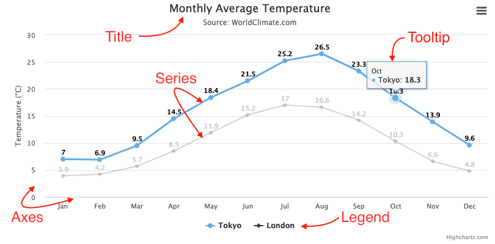

Highcharts
=======================================================================

Cuáles con las partes de un diagrama Highchrts
------------------------------------------------------------------------

El siguiente gráfico muestra las diferentes partes que constituyen nu
gráfico en *highcharts*.

- Título (*Title*)

  Texto que descibe el grático. Normalmente se ubica en la parte
  superior del gráfico. También se puede añadir un subtítulo.

- Series

  Una o más series de datos que se representan en el gráfico.

- Bocadillo (*Tooltip*)

  Al pasar el ratón por los puntos de datos de las series, se puede
  obtener un bocadillo o recuadro de texto que describe ese valor en
  particular.

- Leyenda (*Legend*)

  La leyenda permite identificar a la serie de datos en la gráfica, y
  también permite de forma interactiva mostrar u ocultar las series.

- Ejes (*Axes*)

  La mayoría de los gráficos, como el de líneas o barras, tiene dos ejes
  para medir y categorizar los datos; el eje vertical o eje Y y el eje
  horizontal o eje Y. Los gráficos en 3D utilizan un tercer eje como
  profundidad o eje Z. Los gráficos polares o de tiopo radar solo usan
  un eje, que recorre todo el perímetro del gráfico. Los graficos de
  tarta no tiene ejes. Gauge charts, also known as speedometer charts,
  can even have a single value axis.

