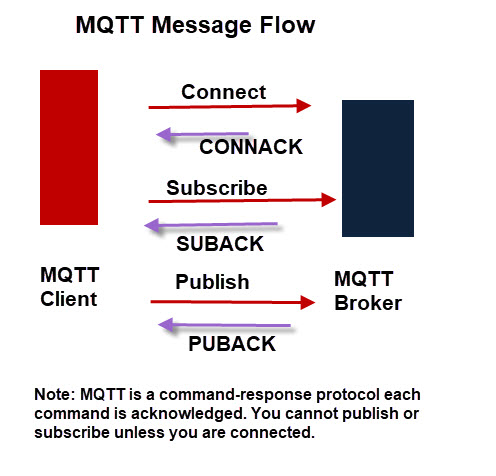
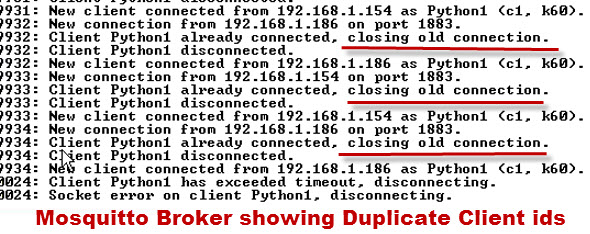

## Qué es MQTT

**MQTT** es un protocolo de tipo _publish/subscribe_ (también llamado
_Observer_) diseñado para interconectar dispositivos _IoT_ (_Internet of
Things_). Al contrario que los protocolos de tipo solicitud/respuesa,
como puede ser por ejempo HTTP, MQTT opera mediante un mecanismo de
eventos, permitiendo esto enviar (_push_) mensajes a los clientes. Esta
aproximación permite implementar soluciones muy eficientes y altamente
escalables, desacoplando a los productores de datos de los consumidores
de datos y, por tanto, evintado las dependencias entre ellos.

Los dos componentes esenciales para poder establecer una comunicación
con MQTT son los clientes MQTT y un _broker_ o intermediario de
mensajes, como se muestra en el siguiente diagrama:

## Algunos aspectos importantes de MQTT

- Los clientes **no tienen direcciones** (Al contrario que otros
  sistemas como por ejemplo el correo electrónico), y los mensajes **no
  se envían a los clientes**.

- Los mensajes son publicados en el _broker_, bajo una determinada
  etiqueta o _topic_.
  
- El _broker_ debe encargarse de filtrar los mensajes basándose en el
  _topic_, y en base a esto, enviarselos a los suscriptores.

- Un cliente solo recibirá los mensajes envuadoos bajo un determinado
  _topic_ si y solo si previamente el cliente se ha **suscrito** al
  _topic_.

- No hay ninguna conexión directa entre _publishers_ y _subscribers_.

- Todos los clientes puede publicar y/o suscribirse.

- Los _brokers_ de MQTT normalmente no almacenan los mensajes.

## Cómo funciona MQTT

MQTT uses TCP/IP to connect to the broker. TCP is a connection
orientated protocol with error correction and guarantees that packets
are received in order.

Once a connection is established you can talk over it until one party
hangs up.  Most MQTT clients will connect to the broker and remain
connected even if they aren’t sending data. Connections are acknowledged
by the broker using a Connection acknowledgement message. You cannot publish or subscribe unless you are connected.

The Client Name or Client ID. All clients are required to have a client
name or ID.  The client name is used by the MQTT broker to track
subscriptions etc.  Client names must also be unique.  If you attempt to
connect to an MQTT broker with the same name as an existing client then
the existing client connection is dropped.

Because most MQTT clients will attempt to reconnect following a
disconnect this can result in a loop of disconnect and connect.  The
screen shot below show what happens when I try and connect a client to
the broker using the same client id as an existing connected client.

Clean Sessions

MQTT clients by default establish a clean session with a broker.  A
clean session is one in which the broker isn’t expected to remember
anything about the client when it disconnects.

With a non clean session the broker will remember client subscriptions
and may hold undelivered messages for the client.  However this depends
on the Quality of service used when subscribing to topics, and the
quality of service used when publishing to those topics.

## Last Will Messages

The idea of the **last will message** is to notify a subscriber that the publisher is unavailable due to network outage. The last will message is set by the publishing client, and is set on a per topic basis which means that each topic can have its own last will message.

The message is stored on the broker and sent to any subscribing client
(to that topic) if the connection to the publisher fails.

If the publisher disconnects normally the last Will Message is not sent.

The actual will messages is including with the connect request message.

Fuentes:

- [Steve’s Guide to Networking, IoT and the MQTT Protocol](http://www.steves-internet-guide.com/)
