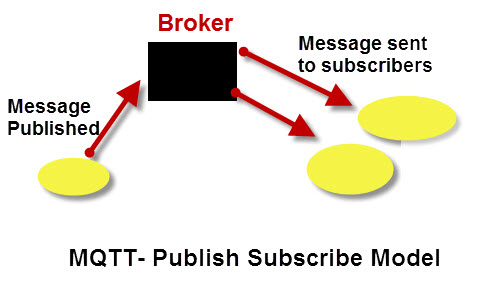
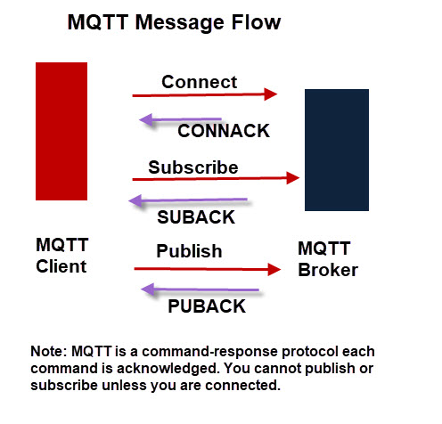
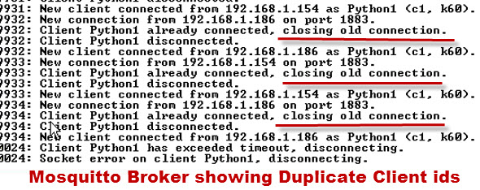

MQTT
========================================================================

.. tags:: protocol,network,IoT,mqtt

Qué es MQTT?
-----------------------------------------------------------------------

**MQTT** es un protocolo de tipo *publish/subscribe* (también llamado
*Observer*) diseñado para interconectar dispositivos *IoT* (*Internet of
Things*).

Al contrario que los protocolos de tipo solicitud/respuesta,
como puede ser por ejemplo HTTP, MQTT opera mediante un mecanismo de
eventos, permitiendo enviar (*push*) mensajes a los clientes. Esta
aproximación permite implementar soluciones muy eficientes y altamente
escalables, desacoplando a los productores de datos de los consumidores
de datos y, por tanto, evitando las dependencias entre ellos.

Los dos componentes esenciales para poder establecer una comunicación
con MQTT son los clientes MQTT y un *broker* o intermediario de
mensajes, como se muestra en el siguiente diagrama:

Algunos aspectos importantes de MQTT
-----------------------------------------------------------------------

- Los mensajes **no se envían a los clientes**.

- Los mensajes son **publicados** en el *broker*, bajo una determinada
  etiqueta o *topic*.

- El *broker* debe encargarse de filtrar los mensajes basándose en el
  *topic*, y en base a esto, **enviarselos** a los suscriptores.

- Un cliente solo recibirá los mensajes enviadoos bajo un determinado
  *topic* si y solo si previamente el cliente se ha **suscrito** al
  *topic*.

- **No hay ninguna conexión directa** entre *publishers* y *subscribers*.

- **Todos** los clientes puede publicar y/o suscribirse.

- Los *brokers* de MQTT **normalmente no almacenan** los mensajes.

Cómo funciona MQTT
-----------------------------------------------------------------------

MQTT utiliza TCP/IP para conectarse al broker.  Una vez establecida una
conexión, se puede hablar a través de ella hasta que una de las partes
cuelgue. La mayoría de los clientes MQTT se conectarán al *broker* y
permanecerán conectados incluso si no envían datos. El broker confirma las
conexiones mediante un mensaje de confirmación de conexión. No se puede
publicar ni suscribirse a menos que se esté conectado.

Protocolo de conexión de MQTT
------------------------------------------------------------------------

Todos los clientes deben tener un nombre o ID de cliente. El *broker*
utiliza el nombre del cliente para realizar el seguimiento de las
suscripciones, etc. Los nombres de los clientes deben ser únicos. Si
intenta conectarse a un *broker* con el mismo nombre que un cliente
existente, la conexión con el cliente existente se interrumpe.

Dado que la mayoría de los clientes MQTT intentan reconectarse tras una
desconexión, esto puede generar un bucle de desconexiones y conexiones.

La siguiente captura de pantalla muestra lo que sucede cuando intento
conectar un cliente al *broker* con el mismo ID de cliente que un
cliente existente.

Sesiones limpias frente a sesiones no limpias
-----------------------------------------------------------------------

Los clientes MQTT establecen por defecto una **sesión limpia** con un
*broker*. Una sesión limpia es aquella en la que no se espera que el
*broker* recuerde nada sobre el cliente al desconectarse.

Con una **sesión no limpia**, el *broker* recordará las suscripciones
del cliente y podría retener mensajes no entregados. Sin embargo, esto
depende de la calidad del servicio utilizada al suscribirse a los
temas y de la calidad del servicio utilizada al publicar en ellos.

Last Will Messages
-----------------------------------------------------------------------

La idea del **mensaje de testamento** es notificar a un suscriptor
que el editor no está disponible debido a una interrupción de la red. El
cliente editor lo establece y se configura por tema, lo que significa que
cada tema puede tener su propio mensaje de último testamento.

El mensaje se almacena en el intermediario y se envía a cualquier cliente
suscriptor (a ese tema) si falla la conexión con el editor.

Si el editor se desconecta normalmente, el mensaje de testamento no
se envía.

El mensaje  de testamento se incluye con el mensaje de solicitud de
conexión.

Fuentes:

- `Steve’s Guide to Networking, IoT and the MQTT Protocol <http://www.steves-internet-guide.com/>`_
