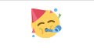
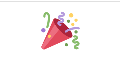
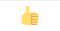
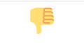
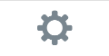
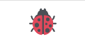

ntfy
========================================================================

Sobre *ntfy*
------------------------------------------------------------------------

**ntfy** permite enviar notificaciones ``push`` a su teléfono o
escritorio a través de *scripts* desde cualquier ordenador, utilizando
solicitudes ``HTTP PUT o POST``. El uso habitual es para notificar
cuando los scripts fallan, o los comandos de larga duración se
completan.

Fuente: `Documentación de ntfy`_.

Como publicar un mensaje en ntfy
------------------------------------------------------------------------

Se puede hacer a través de una petición ``HTTP PUT/POST`` o a través del
cliente de linea de comandos ``ntfy``. Los temas se crean sobre la marcha
suscribiéndose o publicándolos. Debido a que no hay registro, el tema es
esencialmente una contraseña, así que se debe eligir algo que no sea
fácil de adivinar.

El cliente para móvil puede descargarse de la Apple Store, Google Play o
F-Droid:

- https://play.google.com/store/apps/details?id=io.heckel.ntfy

- https://f-droid.org/en/packages/io.heckel.ntfy/

- https://apps.apple.com/us/app/ntfy/id1625396347

Aquí hay un ejemplo que muestra cómo publicar un mensaje simple usando
una solicitud de POST:

.. code:: python

    import requests

    requests.post(
        "https://ntfy.sh/mytopic", 
        data="Backup successful 😀".encode(encoding='utf-8'),
        )

Hay más funciones relacionadas con la publicación de mensajes: se puede
establecer una prioridad de notificación (``Priority``), un título
(``Title``) y etiquetas, que se visualizan como iconos. Por ejemplo la
etiqueta ``warning`` se mostrará como ⚠️.

Aquí hay un ejemplo que usa todo:

.. code:: python

    import requests

    requests.post(
        "https://ntfy.sh/mytopic",
        data="Remote access to phils-laptop detected. Act right away.",
        headers={
            "Title": "Unauthorized access detected",
            "Priority": "urgent",
            "Tags": "warning,skull"
            },
        )      

Más opciones para los mensajes
------------------------------------------------------------------------

You can also do multi-line messages. Here's an example using a click
action, an action button, an external image attachment and email
publishing:

.. code:: python

    import requests

    requests.post(
        "https://ntfy.sh/mydoorbell",
        data="""There's someone at the door. 🐶

    Please check if it's a good boy or a hooman.
    Doggies have been known to ring the doorbell.""".encode('utf-8'),
        headers={
            "Click": "https://home.nest.com/",
            "Attach": "https://nest.com/view/yAxkasd.jpg",
            "Actions": "http, Open door, https://api.nest.com/open/yAxkasd, clear=true",
            "Email": "phil@example.com"
            },
        )
        
Prioridad del mensaje
-----------------------------------------------------------------------

Todos los mensajes tienen una prioridad, que define cuan urgentemente
el móvil notificará al usuario receptor del mensaje. En Android, además,
la prioridad define si el mensaje incluye vibraciónes o sonidos
determinados.

+----------+----------+-------+-------------+------------------------------+
| Priority |  Icono   | ID    | Nombre      |    Descripción               |
+==========+==========+=======+=============+==============================+
| Máxima   | |pr5|    | ``5`` | ``urgent``  | Really long vibration bursts,|
|          |          |       | ``max``     | default notification sound   |
|          |          |       |             | with a pop-over notification.|
+----------+----------+-------+-------------+------------------------------+
| Alta     | |pr4|    | ``4`` | ``high``    | long vibration bursts,       |
|          |          |       | ``max``     | default notification sound   |
|          |          |       |             | with a pop-over notification.|
+----------+----------+-------+-------------+------------------------------+
| Normal   | ninguno  | ``3`` | ``default`` | Short default vibration and  |
|          |          |       |             | sound. Default notification  |
|          |          |       |             | behavior.                    |
+----------+----------+-------+-------------+------------------------------+
| Baja     | |pr2|    | ``2`` | ``low``     | No vibration or sound.       |
|          |          |       |             | Notification will not        |
|          |          |       |             | visibly show up until        |
|          |          |       |             | notification drawer is       |
|          |          |       |             | pulled down.                 |
+----------+----------+-------+-------------+------------------------------+
| Mínima   | |pr1|    | ``1`` | ``min``     | No vibration or sound.       |
|          |          |       |             | Notification will be         |
|          |          |       |             | under the fold in            |
|          |          |       |             | "Other notifications"        |
+----------+----------+-------+-------------+------------------------------+

Etiquetas y emoticones
------------------------------------------------------------------------

Hay una `lista de emoticonos`_ bastante extensa, aquí veremos algunos
de los más usados:

+----------------------+--------------------------------+
| Etiqueta             | Icono                          |
+======================+================================+
| ``heavy_check_mark`` | |heavy-check-mark|             |
+----------------------+--------------------------------+
| ``white_check_mark`` | |white-check-mark|             |
+----------------------+--------------------------------+
| ``+1``               | |thumb-up|                     |
+----------------------+--------------------------------+
| ``-1``               | |thumb-down|                   |
+----------------------+--------------------------------+
| ``partying_face``    | |partying-face|                |
+----------------------+--------------------------------+
| ``tada``             |     |tada|                     |
+----------------------+--------------------------------+
| ``shield``           | |shield|                       |
+----------------------+--------------------------------+
| ``clap``             | |clap|                         |
+----------------------+--------------------------------+
| ``gear``             | |gear|                         |
+----------------------+--------------------------------+
| ``lady_beetle``      | |lady_beetle|                  |
+----------------------+--------------------------------+

.. _Documentación de ntfy: https://docs.ntfy.sh/
.. _lista de emoticonos: https://docs.ntfy.sh/emojis/
