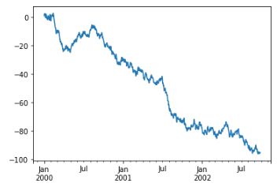
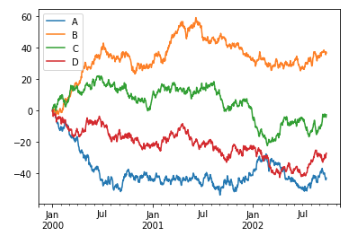

Pandas
========================================================================

.. tags:: python,pandas,math

.. contents:: Relación de contenidos
    :depth: 3

Notas sobre Pandas
------------------------------------------------------------------------

La librería :index:`Pandas` es una biblioteca de código abierto muy popular
entre los desarrolladores de Python, especialmente en los campos de la
`ciencia de datos`_ y el aprendizaje automático, porque proporciona
estructuras de datos muy potentes y flexibles.

Pandas surge por la necesidad de tener una biblioteca con todas las
funciones necesarias para cargar datos, limpiarlos, modelarlos,
analizarlos, manipularlos y prepararlos.

Estructuras de datos de Pandas
------------------------------------------------------------------------

Pandas añade dos contenedores: **Series** y **DataFrame**. 

Una **serie** es un vector unidimensional etiquetado (es
decir, indexado).

Un **dataframe** es una tabla con filas y columnas etiquetadas, similar
a una hoja de cálculo de Excel o una tabla MySQL. Cada columna de un
marco es una serie. Todas las valores en las filas se corresponden con
el mismo índice. Con algunas excepciones, Pandas trata los marcos y las
series de forma similar.

Tanto las series como los *dataframes* son más que contenedores de
almacenamiento. Ambos Ofrecen diversas operaciones de manipulación de
datos, como:

- Indexación de un solo nivel y jerárquica

- Gestión de datos faltantes

- Operaciones aritméticas y booleanas en columnas y tablas completas

- Operaciones de base de datos (como fusión y agregación)

- Representación gráfica de columnas individuales y tablas completas

- Lectura y escritura de datos de archivos

Qué es una serie en Pandas
^^^^^^^^^^^^^^^^^^^^^^^^^^^^^^^^^^^^^^^^^^^^^^^^^^^^^^^^^^^^^^^^^^^^^^^^

Una :index:`serie (Pandas)` es un vector unidimensional etiquetado (es
decir, indexado).

Una serie es un vector de datos unidimensional. Tiene dos diferencias
importantes frente a una lista normal de Python:

- Son **homogéneas**: todos sus elementos deben pertenecer al mismo tipo
  de dato.

- Tienen un índice, que no tiene qué ser necesariamente un entero.

Se puede crear una serie simple a partir de cualquier secuencia: una lista, una tupla o un array.
Usemos una tupla de datos recientes de inflación de EE. UU. para ilustrar una serie de datos de Pandas.

Qué es un *Dataframe* en Pandas
^^^^^^^^^^^^^^^^^^^^^^^^^^^^^^^^^^^^^^^^^^^^^^^^^^^^^^^^^^^^^^^^^^^^^^^^

Pandas proporciona una clase de objetos para trabajar con datos
multidimensionales, llamadas :index:`Dataframe|Dataframes`, muy
similares a los que podemos encontrar en ``R`` y en otros lenguajes.

Un *dataframe* está compuesto de una matriz de columnas y filas. Las
columnas están identificadas por un nombre; las filas, por un índice.
Podemos pensar en ellas como en un conjunto de series, todas
compartiendo el mismo índice. Al igual que con las series, el índice de
un *dataFrame* **no** tiene por qué ser un número entero --aunque muchas
veces lo es--, solo debe ser diferente para cada fila.

Operaciones básicas con un *Dataframe*
------------------------------------------------------------------------

.. note::

   Hay muchas formas posibles de crear un *dataframe*,
   aquí vamos a crear uno a partir de un diccionario
   de listas. Véase :ref:`diferentes_formas_de_crear_un_Dataframe`.
   
Supongamos que creamos el siguiente *dataframe*:

.. code:: python

    import pandas as pd
    df = pd.DataFrame({
        'label': ['A', 'B', 'C', 'A', 'B', 'C'],
        'value': [1, 2, 3, 4, 5, 6],
        })

Que nos da un *dataframe* como el siguiente:

===== ===== =====
index label value
===== ===== =====
0     A     1
1     B     2
2     C     3
3     A     4
4     B     5
5     C     6
===== ===== =====

Algunas operaciones que podemos hacer con este *dataframe* son:

Seleccionar por columnas
^^^^^^^^^^^^^^^^^^^^^^^^^^^^^^^^^^^^^^^^^^^^^^^^^^^^^^^^^^^^^^^^^^^^^^^^

.. code:: python

    >>> df['label']
    0   A
    1   B
    2   C
    3   A
    4   B
    5   C

Si queremos seleccionar por varias columnas, hay que tener en cuenta
que usando el acceso mediante corchetes solo se puede pasar un valor.
La solución es pasar una lista con los nombres de las columnas:

.. code:: python

    >>> df[['value', 'label']]

    value 	label
    0 	1 	A
    1 	2 	B
    2 	3 	C
    3 	4 	A
    4 	5 	B
    5 	6 	C

Aplicar funciones a toda una columna
^^^^^^^^^^^^^^^^^^^^^^^^^^^^^^^^^^^^^^^^^^^^^^^^^^^^^^^^^^^^^^^^^^^^^^^^

.. code:: python

    >>> df['label'].str.lower()
    0   a
    1   b
    2   c
    3   a
    4   b
    5   c
    >>> df['value'] * 2
    0     2
    1     4
    2     6
    3     8
    4    10
    5    12

Aplicar funciones de agregación sobre columnas numéricas
^^^^^^^^^^^^^^^^^^^^^^^^^^^^^^^^^^^^^^^^^^^^^^^^^^^^^^^^^^^^^^^^^^^^^^^^

.. code:: python

    >>> print(df['value'].sum())
    21

Realizar operaciones de agregación con agrupamiento
^^^^^^^^^^^^^^^^^^^^^^^^^^^^^^^^^^^^^^^^^^^^^^^^^^^^^^^^^^^^^^^^^^^^^^^^

.. code:: python

    >>> df.groupby('label').sum()

            value
    label       
    A          5
    B          7
    C          9

Cómo hacer un (*inner*) *join* en Pandas
------------------------------------------------------------------------

**tldr**: Usa la función `merge`_ de pandas.

Supongamos las siguientes tablas:

.. code:: python

    pesos = pd.DataFrame.from_dict({
        'palabra': ['economía', 'educación', 'turismo', 'videojuego'],
        'pesos': [.12, .33, .88, -0.73]
        })

== ========== =====
\  palabra    pesos
== ========== =====
0  economía   0.12
1  educación  0.33
2  turismo    0.88
3  videojuego -0.73
== ========== =====

.. code:: python

    muestra = pd.DataFrame.from_dict({
        'palabra': ['el', 'videojuego', 'del', 'gran', 'turismo', 'es', 'fantástico'],
        'total': [1, 1, 1, 1, 1, 1, 1]
        })

Que debería dar:

== ========== =====
\  palabra    total
== ========== =====
0  el         1
1  videojuego 1
2  del        1
3  gran       1
4  turismo    1
5  es         1
6  fantástico 1
== ========== =====

Podemos hacer un *join* usando la función ``merge``. Los dos primeros
parámetros son obligatorios y son los *dataframes* con los datos. Si la
columna por la que queremos hacer el *join* se llama igual en ambos
*dataframes*, podemos usar el parámetro opcional ``on``:

.. code:: python

    pd.merge(pesos, muestra, on='palabra')

El resultado debería ser:

== ========== ===== =====
\  palabra    pesos total
== ========== ===== =====
0  turismo    0.88  1
1  videojuego -0.73 1
== ========== ===== =====

Si los nombres de las columnas no coinciden, podemos usar los dos
parámetros opcionales ``left_on`` y ``right_on``. Vamos a redefinir el
*dataframe* ``muestra`` para cambiar el nombre de la columna de
``palabra`` a ``termino``:

.. code:: python

    muestra = pd.DataFrame.from_dict({
        'termino': ['el', 'videojuego', 'del', 'gran', 'turismo', 'es', 'fantástico'],
        'total': [1, 1, 1, 1, 1, 1, 1]
        })

== ========== =====
\  termino    total
== ========== =====
0  el         1
1  videojuego 1
2  del        1
3  gran       1
4  turismo    1
5  es         1
6  fantástico 1
== ========== =====

.. code:: python

    pd.merge(pesos, muestra, left_on='palabra', right_on='termino')

== ========== ===== ========== =====
\  palabra    pesos termino    total
== ========== ===== ========== =====
0  turismo    0.88  turismo    1
1  videojuego -0.73 videojuego 1
== ========== ===== ========== =====

Fuente:

- `Joins in Pandas`_

Como saber si una serie de Pandas tiene valores NaN
~~~~~~~~~~~~~~~~~~~~~~~~~~~~~~~~~~~~~~~~~~~~~~~~~~~

Pandas ofrece un atributo que nos da justo esa información, llamado
`hasnans`_:

.. code:: python

    series = pd.Series([2, 4, 6, "sadf", np.nan])
    assert series.hasnans is True

25 funciones de Pandas
------------------------------------------------------------------------

Fuente: https://towardsdatascience.com/25-pandas-functions-you-didnt-know-existed-p-guarantee-0-8-1a05dcaad5d0

Cheatsheets
------------------------------------------------------------------------

- `Python <http://www.utc.fr/~jlaforet/Suppl/python-cheatsheets.pdf>`_
- `Numpy <https://s3.amazonaws.com/assets.datacamp.com/blog_assets/Numpy_Python_Cheat_Sheet.pdf>`_
- `Pandas <https://pandas.pydata.org/Pandas_Cheat_Sheet.pdf>`_

.. _diferentes_formas_de_crear_un_Dataframe:

Diferentes formas de crear un *Dataframe*
------------------------------------------------------------------------

Existe muchas formas diferentes de crear un *DataFrame*:

A partir de una **lista de listas**:
^^^^^^^^^^^^^^^^^^^^^^^^^^^^^^^^^^^^^^^^^^^^^^^^^^^^^^^^^^^^^^^^^^^^^^^^

Cada una de las listas contiene los valores de una columna. Hay que usar
el parámetro ``columns`` para poder dar nombre a la columna.

.. code:: python

    data = [
        ['Flash Gordon', 1934],
        ['Mandrake', 1934],
        ['Popeye', 1929],
        ['Archie Andrews', 1941],
        ]
    df = pd.DataFrame(data, columns = ['name', 'publication_year']) 

Que debería conducir a este *dataframe*:

========  ===============  ================
index     name 	           publication_year
========  ===============  ================
0   	  Flash Gordon 	               1934
1   	  Mandrake 	                   1934
2   	  Popeye 	                   1929
3   	  Archie Andrews  	           1941
========  ===============  ================

A partir de un **diccionario de listas**
^^^^^^^^^^^^^^^^^^^^^^^^^^^^^^^^^^^^^^^^^^^^^^^^^^^^^^^^^^^^^^^^^^^^^^^^

Los valores claves del diccionario serán los que definen y dan nombre a
las columnas. Las listas deben ser todas de igual longitud.

.. code:: python

    data = {
        'Name': ['Tom', 'nick', 'krish', 'jack'],
        'Age': [20, 21, 19, 18],
        }
    df = pd.DataFrame(data)

Si se le pasa el parámetro ``index``, este también debe ser de la misma
longitud que las listas de datos. Si no se le pasa índice, se usara la
secuencia de enteros empezando por cero.

.. code:: python

    data = {
      'Name': ['Tom', 'Jack', 'nick', 'juli'],
      'marks': [99, 98, 95, 90],
      }
    df = pd.DataFrame(data, index =['rank1', 'rank2', 'rank3', 'rank4'])

A partir de una **lista de diccionario**
^^^^^^^^^^^^^^^^^^^^^^^^^^^^^^^^^^^^^^^^^^^^^^^^^^^^^^^^^^^^^^^^^^^^^^^^

También se puede crear un *dataframe* a partir de una lista de
diccionarios. En este caso, los diccionarios tienen que tener todos
la misma estructura. Las claves de los diccionarios definen las
columnas.

.. code:: python

    data = [
        {'a': 1, 'b': 2, 'c':3},
        {'a':10, 'b': 20, 'c': 30},
        ]
    df = pd.DataFrame(data)

A partir de un **diccionario de series**
^^^^^^^^^^^^^^^^^^^^^^^^^^^^^^^^^^^^^^^^^^^^^^^^^^^^^^^^^^^^^^^^^^^^^^^^

Los valores en las claves definen las columnas. Las series pasan a ser
las filas del *dataframe*. El índice de las series pasa a ser el índide
del *dataframe*, asi que tiene que ser el mismo para todas las series:

.. code:: python

    d = {
        'one' : pd.Series([10, 20, 30, 40], index =['a', 'b', 'c', 'd']),
        'two' : pd.Series([10, 20, 30, 40], index =['a', 'b', 'c', 'd'])
    }
    df = pd.DataFrame(d)

A partir de un **fichero CSV**:
^^^^^^^^^^^^^^^^^^^^^^^^^^^^^^^^^^^^^^^^^^^^^^^^^^^^^^^^^^^^^^^^^^^^^^^^

Sólo hay que llamar el método ``load_csv``.

.. code:: python
  
    df = pd.read_csv('example.csv')

Funciona también con URLS:

.. code:: python

    df = pd.read_csv('http://web.stanford.edu/class/archive/cs/cs109/cs109.1166/stuff/titanic.csv')

Si el fichero CVS no tiene una primera línea con cabeceras:

.. code:: python

    df = pd.read_csv('example.csv', header=None)

A partir de una **consulta a la base de datos**
^^^^^^^^^^^^^^^^^^^^^^^^^^^^^^^^^^^^^^^^^^^^^^^^^^^^^^^^^^^^^^^^^^^^^^^^

.. code:: python

    db = MySQLdb.connect(host='localhost', db='comics', user='stan.lee', passwd='marvel')
    sql = 'SELECT * FROM comics_collection'
    df1 = pd.read_sql_query(sql, db, index_col='holding_id')

A partir de un fichero .ods (LibreOffice)
^^^^^^^^^^^^^^^^^^^^^^^^^^^^^^^^^^^^^^^^^^^^^^^^^^^^^^^^^^^^^^^^^^^^^^^^

Hay que instalar un paquete adicional, ``odfpy``:

.. code:: shell

    pip insall odfpy

Y luego indicar el formato usando el parámetro ``engine`` de
la función ``read_excel``:

.. code:: python

    pd.read_excel("fichero-de-libre-office.ods", engine="odf")

A partir de una tabla Html
^^^^^^^^^^^^^^^^^^^^^^^^^^^^^^^^^^^^^^^^^^^^^^^^^^^^^^^^^^^^^^^^^^^^^^^^

El método ``read_html`` es muy sencillo y funciona especialmente bien
con las tablas en las páginas de la `Wikipedia`_, ya que sus tablas no
suelen ser complicadas. En el siguiente ejemplo se usan unas librerías
adicionales para limpiar los datos:

.. code:: python

    import pandas as pd
    import numpy as np
    import matplotlib.pyplot as plt
    from unicodedata import normalize

    table_MN = pd.read_html("https://en.wikipedia.org/wiki/Minnesota")

Hay que tener en cuenta que ``table_MN`` contiene ahora la lista de
todas las tablas en la página.

.. code:: python

    print(f"Total tables: {len(table_MN)}")
    Total tables: 38

¿Cómo seleccionamos la que nos interesa de las 38? Podemos usar el
parámetro ``match`` para seleccionar un subconjunto de las tablas. En el
siguiente ejemplo se usa el texto del ``caption`` «*Election results from
statewide races*»:

.. code:: python

    table_MN = pd.read_html(
        "https://en.wikipedia.org/wiki/Minnesota",
        match="Election results from statewide races"
        )
    assert len(table_MN) == 1

Fuente: `Reading HTML tables with Pandas - Practical Business <https://pbpython.com/pandas-html-table.html>`_

Cómo usar una columna de un *DataFrame* como índice
------------------------------------------------------------------------

Pandas ``set_index()`` is a method to set a List, Series or Data frame
as an index of a Data Frame. The index object is an immutable array.
Indexing allows us to access a row or column using the label.

The syntax for Pandas Set Index is following.

DataFrame.set_index(keys, drop=True, append=False, inplace=False,
verify_integrity=False) Set the DataFrame index (row labels) using one
or more existing columns. By default yields the new object.

- ``keys``: Column name or list of a column name.

- ``drop``: It’s a Boolean value which drops the column used for the
    index if True.

- ``append``: It appends the column to the existing index column if
True.

- ``inplace``: It makes the changes in the DataFrame if True.

- ``verify_integrity``: It checks the new index column for duplicates if
  True.

We will use Real data which can be found on the following google doc
link:

- https://docs.google.com/spreadsheets/d/1zeeZQzFoHE2j_ZrqDkVJK9eF7OH1yvg75c8S-aBcxaU/edit#gid=0

Okay, now we will use the ``read_csv()`` method:

.. code:: python

    data = pd.read_csv('data.csv', skiprows=4)

Remember that the index data is **immutable** and we can not be able to
change that in any circumstances.

Cómo añadir una columna a un *DataFrame*
------------------------------------------------------------------------

A partir de Pandas 0.16.0, se puede usar el método ``assign``, que añade
columnas nuevas al *DataFrame*, devolviendo una copia del nuevo con las
nuevas columnas. El siguiente código:

.. code:: python

    d = pd.DataFrame({'a': [1, 2, 7], 'b': [3, 4, 21]})
    d = d.assign(suma=d['a']+d['b'])
    d = d.assign(media=d.suma/2)

Devuelve:

====== === ==== ====== ========
index  a   b    suma   media  
====== === ==== ====== ========
0      1    3    4     2.0    
1      2    4    6     3.0    
2      7    21   28    14.0   
====== === ==== ====== ========

Cómo visualizar datos con Pandas
------------------------------------------------------------------------

Es una convención ampliamente usada importar las librerías de ``matplotlib``
con el alias ``plt``:

.. code:: python

    import matplotlib.pyplot as plt
    plt.close('all')

Cómo usar plot
^^^^^^^^^^^^^^^^^^^^^^^^^^^^^^^^^^^^^^^^^^^^^^^^^^^^^^^^^^^^^^^^^^^^^^^^

El método ``plot``, definido tanto en las series como en los
*dataframes*, es solo un recubrimiento de la llamada a `plt.plot` :

Por ejemplo, si usamos series:

.. code:: python

    ts = pd.Series(
        np.random.randn(1000),
        index=pd.date_range('1/1/2026', periods=1000),
        )
    ts = ts.cumsum()
    ts.plot()

En un *dataFrame*, el método ``plot()`` es una forma muy cómoda de
representar todas las columnas con sus etiquetas:

.. code:: python

    df = pd.DataFrame(
        np.random.randn(1000, 4),
        index=ts.index,
        columns=list('ABCD'),
        )
    df = df.cumsum()
    plt.figure()
    df.plot()

Cómo cambiar el tamaño de las imágenes creadas con matplotlib
^^^^^^^^^^^^^^^^^^^^^^^^^^^^^^^^^^^^^^^^^^^^^^^^^^^^^^^^^^^^^^^^^^^^^^^^

Hay que usar el parámetro ``figsize``, pero la clave es que hay que
hacerlo antes de empezar a dibujar:

.. code:: python

    from matplotlib import pyplot as plt
    plt.figure(figsize=(1,1))
    x = [1,2,3]
    plt.plot(x, x)
    plt.show()

Como hacer un select o filtrado por columnas un Pandas
------------------------------------------------------------------------

Para filtrar con condiciones, escribimos la condición dentro de
corchetes. Por ejemplo, si deseamos mostrar a los que tienen en la
columna ``votos`` un valor superior o igual a doscientos mil, podemos
escribir:

.. code:: python

    df[df.votes>200000]

La expresión dentro de los corchetes, al evaluarse, devuelve un vector
de valores *booleanos*, según la expresión indicada. Al usar esa matriz
como índices, se eliminan todas las filas para las que el valor lógico
correspondiente sea false.

Si queremos filtrar por dos o más condiciones, podemos combinar los
vectores booleanos usando operadores lógicos (``&`` para ``and`` y ``|``
para ``or``) y usar el vector resultante para realizar el filtrado. El
siguiente ejemplo selecciona las filas en las que el campo ``county`` es
``Manhattan`` y el campo ``party`` es ``Democrat``:

.. code:: python

    df[(df.county=='Manhattan') & (df.party=='Democrat')])

Cómo renombrar columnas en Pandas
------------------------------------------------------------------------

Para renombre una columna en Pandas usaremos el método
`rename`_. Acepta un parámetro, ``columns``, que puede ser o una función o un
diccionario, y que es la responsable de *mapear* los nombres originales
con los nuevos. Si usamos un diccionario, por ejemplo, para cada una de
sus entradas, la clave se corresponde con el nombre de la columna
original, mientras que el valor será el nuevo nombre de la columna.

Tiene un parámetro opcional, ``inplace``, que hará el cambio modificando
el propio *dataframe*. Si está a ``False`` (El valor por defecto),
devolverá una copia del *dataframe* con los nombres de las columnas
modificados.

.. code:: python

    df = pd.DataFrame({'a': [1,2,3], 'b': [4,5,6]})
    new_df = df.rename(columns={'a': 'Alfa', 'b': 'Beta'}, inplace=False)
    print(new_df)

Debería devolver:

======= ====== =======
index   Alfa   Beta  
======= ====== =======
0       1      4
1       2      5
2       3      6
======= ====== =======

Cómo ordenar las filas de un DataFrame
------------------------------------------------------------------------

Hay varios métodos, el más simple es usar el método ``sort_values``. Con
el parámetro ``by`` indicamos las columnas por las que queremos ordenar,
y con el parámetro ``ascending``, que es un booleano, indicamos el
sentido de la ordenación.

Por ejemplo:

.. code:: Python

    df.sort_values(by='column_name', ascending=True)

.. _hasnans: https://pandas.pydata.org/docs/reference/api/pandas.Series.hasnans.html#pandas.Series.hasnans

.. _ciencia de datos: https://es.wikipedia.org/wiki/Ciencia_de_datos

.. _merge: https://pandas.pydata.org/docs/reference/api/pandas.DataFrame.merge.html
.. _Joins in Pandas: https://www.analyticsvidhya.com/blog/2020/02/joins-in-pandas-master-the-different-types-of-joins-in-python/
.. _rename: https://pandas.pydata.org/docs/reference/api/pandas.DataFrame.rename.html
.. _Wikipedia: https://en.wikipedia.org/
